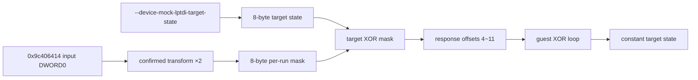

# LPTDI 적응형 target-state 응답 설계

관련 작업 지시: [LPTDI 적응형 target-state 응답 작업 지시](../work-orders/20260824-056-lptdi-adaptive-target-state.md)

## 근거

작업 55의 두 번째 IOCTL 복귀 trace는 `0x01ed4141`의 32비트 변환과 output 소비 loop를 완전히 드러냈다. `0x9c406414` input 첫 DWORD를 seed로 읽고 변환을 한 번 적용한 little-endian 4바이트를 response offset 4~7과 XOR한다. 같은 변환을 다시 적용한 다음 4바이트는 offset 8~11과 XOR한다. 결과 8바이트는 `[0x01ed7bf4]`가 가리키는 상태에 기록된다.

all-zero response는 실행별 seed가 달라질 때 내부 상태와 `.data` 결과도 바꾸므로, 정적 response profile만으로 특정 내부 상태를 반복 재현할 수 없다. target state `K[0..7]`를 고정하려면 실행 중 seed에서 mask `M[0..7]`를 계산하고 `response[4+i] = K[i] XOR M[i]`를 반환해야 한다.

## 확인된 변환

입력 `x`의 하위·상위 16비트를 `lo`, `hi`라 할 때 guest 명령과 같은 32비트 wraparound 계산을 수행한다.

```text
mixed = ((lo * 0x015a) & 0xffff)
if hi != 0:
    mixed += (hi * 0x4e35) & 0xffff
next = ((mixed & 0xffff) << 16) + lo * 0x4e35 + 1
```

첫 mask DWORD는 `next(seed)`, 두 번째 mask DWORD는 `next(next(seed))`다. trace 관찰값 `0x75ea31f1 → 0x446dc4e6 → 0xbb93d79f`와 `0x2656754c → 0xd05b70bd → 0x5eb9ed22`를 단위 테스트 기준으로 사용한다.

## 구조



플랫폼 공용 `device` 모듈은 변환, 8바이트 target-state hex parsing, 응답 payload encoding을 담당한다. Windows injected runtime은 별도 IOCTL mode에서 첫 IOCTL에 8바이트 zero를 반환하고, 두 번째 IOCTL input으로 적응형 104바이트 응답을 만든다. launcher는 target state를 runtime export에 주입한다. 기존 외부 profile은 그대로 유지하고 두 정책은 동시에 선택할 수 없게 한다.

## 검증 전략

1. 공용 단위 테스트로 두 trace seed의 연속 변환값, hex parser, target XOR encoding을 검증한다.
2. Windows x86 runtime probe에서 첫 IOCTL zero와 두 번째 104바이트 적응형 응답, bytes-returned, 오류 경계를 검증한다.
3. Windows x86 build와 CTest를 통과시킨다.
4. target state zero를 최소 두 번 canonical 실행한다. 서로 다른 challenge에서도 두 실행의 initializer AV와 `.data` window가 같아지는지 확인한다.
5. 결과가 결정적이면 target state와 `.data` 복원 결과의 관계를 다음 역산 단계의 입력으로 사용한다.

## 해석 경계

변환식은 보호 stub의 runtime 명령으로 확인됐지만, 이것을 HASP 또는 Hardlock의 공식 알고리즘으로 부르지 않는다. target-state mode는 분석을 위한 HLE 정책이며 실제 동글 응답을 재현한다고 주장하지 않는다. target state zero 또한 정상 키 후보가 아니라 결정성 확인값이다.

## 결과

공용 변환기와 `--device-mock-lptdi-target-state` 정책을 구현하고 Windows x86/x64 검증을 통과했다. zero target state 두 canonical 실행은 서로 다른 seed `0x7cd97507`, `0x5d7f6e64`에서 서로 다른 response payload를 만들었지만 guest 내부 8바이트 상태는 모두 zero가 됐다. 두 실행은 같은 initializer AV `0x19d521bd`와 같은 `.data` window를 재현했다. 따라서 이 8바이트 상태가 관찰된 `.data` 복원 결과의 실행별 변동을 결정적으로 제어한다.

---

# LPTDI Adaptive Target-State Response Design

Related work order: [LPTDI Adaptive Target-State Response Work Order](../work-orders/20260824-056-lptdi-adaptive-target-state.md)

## Evidence

Task 55's post-second-IOCTL trace fully exposed the 32-bit transform at 0x01ed4141 and the output-consumption loop. The guest reads the first DWORD of the 0x9c406414 input as a seed, applies the transform once, and XORs its four little-endian bytes with response offsets 4 through 7. It applies the transform again and XORs the next four bytes with offsets 8 through 11. The resulting eight bytes are written into the state addressed through [0x01ed7bf4].

An all-zero response changes the internal state and `.data` result whenever the per-run seed changes, so a static response profile cannot reproduce a chosen internal state. To hold target state K[0..7] constant, the runtime must calculate mask M[0..7] from the current seed and return `response[4+i] = K[i] XOR M[i]`.

## Confirmed transform

For input x, let lo and hi be its low and high 16-bit halves. Perform the formula above with 32-bit wraparound. The first mask DWORD is `next(seed)` and the second is `next(next(seed))`. Unit tests use the observed chains 0x75ea31f1 → 0x446dc4e6 → 0xbb93d79f and 0x2656754c → 0xd05b70bd → 0x5eb9ed22.

## Structure

The platform-neutral device module owns the transform, eight-byte target-state hex parser, and response-payload encoder. A distinct Windows injected-runtime IOCTL mode returns eight zero bytes for the first IOCTL and builds the adaptive 104-byte response from the second input. The launcher injects the target state through a runtime export. The existing external profile remains unchanged, and the two policies are mutually exclusive.

## Verification

Unit-test the two observed seed chains, parser, and XOR encoding; cover the first-zero and adaptive-second response contract in the Windows x86 runtime probe; pass the Windows x86 build and CTest; then run target state zero at least twice against the canonical executable. If different challenges produce the same initializer AV and `.data` window, use that deterministic mapping as input to the next key-inversion step.

## Interpretation boundary

The transform is confirmed from runtime guest instructions, but it is not identified as an official HASP or Hardlock algorithm. Target-state mode is an analysis HLE policy, not a claim of real dongle emulation. Zero target state is a determinism probe, not a valid-key candidate.

## Result

The shared transform and `--device-mock-lptdi-target-state` policy passed Windows x86 and x64 verification. Two canonical zero-target-state runs built different response payloads from seeds 0x7cd97507 and 0x5d7f6e64, yet both produced an all-zero eight-byte guest state. Both reproduced the same initializer AV at 0x19d521bd and the same `.data` window. The eight-byte state therefore deterministically controls the observed per-run variation in `.data` restoration.
