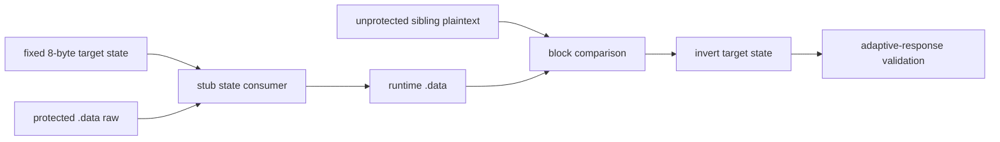

# LPTDI target state 역산 설계

관련 작업 지시: [LPTDI target state 역산 작업 지시](../work-orders/20260824-057-lptdi-target-state-inversion.md)

## 근거

작업 56은 실행별 challenge를 wire response에서 상쇄해 임의의 8바이트 guest target state를 결정적으로 만들 수 있게 했다. zero state 두 실행은 response가 달라도 같은 `.data` window와 initializer AV를 재현했다. 남은 문제는 정상 비보호 sibling의 initializer 배열을 만드는 고정 target state다.

보호 `.data` raw bytes, zero-state runtime 결과, 비보호 sibling plaintext는 서로 다르다. 단순 반복 XOR 가정은 작업 55의 두 결과 차이와 맞지 않았으므로, 임의 key brute force보다 보호 stub의 state 소비 함수와 block transform을 먼저 복원해야 한다.

## 분석 흐름



1. zero target state에서 기존 최대 4096-step post-IOCTL trace를 실행한다.
2. state DWORD가 전역·stack·함수 인자로 전달되는 지점과 main image `.data`를 처음 읽거나 쓰는 명령을 찾는다.
3. 보호 raw, zero-state runtime, 정상 plaintext의 동일 offset 블록을 대조한다.
4. trace 범위가 API watch, breakpoint collision, step limit로 끊기면 state 값 또는 `.data` write에 좁힌 diagnostic만 추가한다.
5. 복원한 transform에서 target-state 후보를 계산하고 적응형 mode로 최소 두 번 검증한다.

## 완료 조건

정상 initializer를 만드는 8바이트 target state를 도출해 두 실행에서 initializer AV를 제거하거나, 그 전에 필요한 state 소비 함수·block transform을 반복 가능한 runtime 명령과 주소로 좁혀 다음 역산 입력을 확정한다. 정상 배열을 확인하지 못한 후보는 올바른 동글 key로 부르지 않는다.

## 확정된 결과

4096-step trace는 `0x01ed2bd0`~`0x01ed2bd5`에서 target state 첫 DWORD를 전역 `0x01ed7296`에 seed하고, `0x01ed2742`가 작업 56과 같은 변환으로 이를 매 바이트 갱신하는 흐름을 드러냈다. `0x01ed26c1`~`0x01ed26ce`는 갱신된 상태의 하위 바이트를 보호 `.data` 바이트에서 뺀다.

```text
state = AdvanceLptdiChallenge(state)
plaintext[i] = protected_raw[i] - low8(state)
```

보호 raw와 비보호 sibling의 첫 64바이트 차이는 초기 seed 하위 바이트 `0x09`의 출력열과 64/64 일치했다. 최소 후보 `0900000000000000`은 두 실행에서 정상 initializer를 복원하고 기존 AV를 제거했다. 상위 24비트와 두 번째 DWORD가 이 관찰 경로에서 필요하다는 증거는 없으므로 모두 zero인 최소값을 사용한다. 이는 이 바이너리의 복원 상태이며 실제 동글 고유키나 공식 HASP/Hardlock 알고리즘으로 식별하지 않는다.

---

# LPTDI Target-State Inversion Design

Related work order: [LPTDI Target-State Inversion Work Order](../work-orders/20260824-057-lptdi-target-state-inversion.md)

## Evidence

Task 56 can cancel each per-run challenge in the wire response and deterministically produce any selected eight-byte guest target state. Two zero-state runs used different responses but reproduced the same `.data` window and initializer AV. The remaining value is the fixed target state that produces the known normal initializer array from the unprotected sibling.

Protected `.data` raw bytes, zero-state runtime output, and sibling plaintext all differ. A simple repeating-XOR assumption did not match Task 55's result differential, so the protection stub's state consumer and block transform must be recovered before attempting arbitrary key brute force.

## Analysis flow

Run the existing maximum 4096-step post-IOCTL trace with zero target state; locate propagation of the state DWORDs and the first reads or writes to main-image `.data`; compare matching protected-raw, zero-state-runtime, and normal-plaintext blocks; add only narrowly targeted diagnostics if API watches, breakpoint collisions, or the step limit block attribution; calculate a target-state candidate from the recovered transform; and validate it in at least two adaptive runs.

## Completion criteria

Either derive an eight-byte target state that removes the initializer AV in two runs, or narrow the required state consumer and block transform to repeatable runtime instructions and addresses that become the next inversion input. No candidate is called a valid dongle key until the normal initializer is observed.

## Confirmed result

The 4096-step trace shows the first target-state DWORD seeded into global `0x01ed7296` at `0x01ed2bd0`–`0x01ed2bd5`. Function `0x01ed2742` advances it once per byte with the Task 56 transform, and `0x01ed26c1`–`0x01ed26ce` subtracts its low byte from protected `.data`.

The protected-raw versus unprotected-sibling difference matches 64 of 64 generated bytes when the initial seed low byte is `0x09`. Minimal candidate `0900000000000000` restores the normal initializer and removes the old AV in two runs. There is no evidence that the upper 24 bits or second DWORD are required on this observed path, so the minimal value keeps them zero. This is a restoration state for this binary, not an identified physical-dongle secret or official HASP/Hardlock algorithm.
