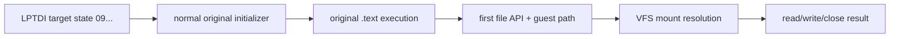

# 정상 초기화 후 첫 원본 자산 API 관찰 설계

관련 작업 지시: [정상 초기화 후 첫 원본 자산 API 관찰 작업 지시](../work-orders/20260824-058-first-original-asset-api.md)

## 근거

작업 57은 `--device-mock-lptdi-target-state 0900000000000000`으로 보호 `.data` initializer를 정상 복원하고 기존 access violation을 제거했다. 현재 TODO의 다음 경계는 정상 원본 `.text`가 요청하는 첫 자산 파일 API와 경로를 확인하여 Windows x86 VFS runtime의 실제 연결 대상을 정하는 것이다.

기존 `--api-trace`는 `CreateFileA`, `ReadFile`, `WriteFile`, `SetFilePointer`, `GetFileSize`, `GetFileType`, `CloseHandle` 중 일부를 이미 관찰하며 caller와 ANSI 경로를 기록한다. 우선 기존 기능으로 원본 이미지 caller만 분리하고, guest 파일 wrapper 때문에 host API watch에서 사라지는 호출이 있으면 주입 runtime의 좁은 진단 event를 추가한다.

## 관찰 경계

1. 기존 정상 상태 로그에서 caller가 원본 이미지 범위인 API만 추출한다.
2. `--api-trace --break-exit-process` baseline과 `--hle-vfs` 실행을 같은 target state로 비교한다.
3. 첫 자산 경로, API 종류, caller, access/disposition, 반환 흐름을 기록한다.
4. 현재 명령행 또는 working-directory 정책 때문에 자산 경계 전에 종료되면 마지막 원본 caller와 종료 이유를 좁혀 다음 입력으로 확정한다.
5. 진단 코드가 필요하면 원본 로직이나 자산을 바꾸지 않고 import-thunk 경계의 bounded JSONL 기록만 추가한다.

## 완료 조건

첫 원본 자산 파일 API와 guest 경로를 반복 확인하고 VFS가 이를 어떤 host read/overlay 경로로 해석해야 하는지 확정하거나, 그 전에 종료시키는 마지막 원본 초기화 조건을 caller·API·인자 수준으로 확정한다.

## 확정된 경계

host baseline과 `--hle-vfs` 실행 모두 창 생성 뒤 `SetCurrentDirectoryA("c:\\ez2dj")`와 640×480×16 `ChangeDisplaySettingsExA`까지 도달했다. display 요청은 성공 0/restart 1 이외의 분기로 돌아가 `PostQuitMessage(0)`를 호출했으며 파일 API는 없었다. 따라서 다음 HLE 경계는 VFS가 아니라 논리 guest display mode다.

---

# First Original Asset API After Stable Initialization

Related work order: [First Original Asset API Work Order](../work-orders/20260824-058-first-original-asset-api.md)

## Evidence

Task 57 restores the protected `.data` initializer with `--device-mock-lptdi-target-state 0900000000000000` and removes the old access violation. The next TODO boundary is the first asset-file API and path requested by normal original `.text`, which determines the real Windows x86 VFS integration target.

Existing API tracing already observes several file APIs with callers and ANSI paths. First isolate original-image callers using current facilities; if injected VFS wrappers hide a call from host API breakpoints, add only a narrow runtime diagnostic event.

## Observation boundary

Compare a normal-state `--api-trace --break-exit-process` baseline with an otherwise identical `--hle-vfs` run; record the first asset path, API, caller, access/disposition, and return flow; if command-line or working-directory policy exits first, identify the final original caller and exit reason; keep any new diagnostic at the import-thunk boundary without changing original logic or assets.

## Completion criteria

Repeatedly identify the first original asset-file API and guest path plus its intended VFS mapping, or identify the last pre-asset initialization condition at caller/API/argument level.

## Confirmed boundary

Both host-baseline and `--hle-vfs` runs create the window, request `SetCurrentDirectoryA("c:\\ez2dj")`, and reach a 640×480×16 `ChangeDisplaySettingsExA`. The display request returns through the branch that is neither success zero nor restart one and calls `PostQuitMessage(0)` without a file API. The next HLE boundary is therefore logical guest display mode, not VFS.
