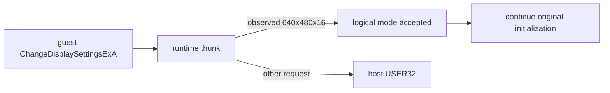

# 논리 display mode HLE 설계

관련 작업 지시: [논리 display mode HLE 작업 지시](../work-orders/20260825-059-logical-display-mode-hle.md)

## 근거

작업 58은 정상 복원된 원본 startup이 창 생성 뒤 640×480×16 `ChangeDisplaySettingsExA`를 호출하고, 현대 host의 실패 결과 때문에 첫 파일 API 전에 종료됨을 확인했다. 원본이 요구하는 것은 guest의 표시 모드 계약이며 실제 host desktop 해상도·색심도를 전환할 필요는 없다.

## 경계와 정책

`--hle-display-mode`는 주입 runtime을 사용해 원본 USER32 import thunk의 `ChangeDisplaySettingsExA`만 교체한다. wrapper는 관찰된 요청을 엄격히 판별한다.

- `device_name == nullptr`
- `dev_mode != nullptr`
- `dmPelsWidth == 640`, `dmPelsHeight == 480`, `dmBitsPerPel == 16`
- `flags == CDS_UPDATEREGISTRY`
- `reserved == nullptr`

일치하면 host display를 변경하지 않고 `DISP_CHANGE_SUCCESSFUL`을 반환한다. 다른 요청과 display restore 요청은 host API로 전달한다. 이 기능은 원본 그래픽 로직을 재작성하지 않고 Win32 import 경계만 HLE한다.

## 검증 전략

runtime probe에서 exact-match 성공과 non-match host fallback을 검증한다. canonical 실행은 정상 LPTDI state, `--hle-vfs`, `--hle-display-mode`, API trace를 함께 사용해 `PostQuitMessage` 조기 종료 제거와 첫 파일 API 진입 여부를 최소 두 번 확인한다.

## 완료 조건

관찰된 display 요청이 host mode 변경 없이 성공하고 원본이 표시 초기화 다음 단계로 진행해야 한다. 첫 자산 API가 나타나면 경로·caller·후속 파일 동작을 기록하며, 새 차단점이 나타나면 동일한 증거 수준으로 좁힌다.

## 확인된 결과

strict-match wrapper는 640×480×16 요청을 논리적으로 성공시켜 기존 `PostQuitMessage` 조기 종료를 제거했다. 두 canonical 실행은 모두 다음 표시 초기화까지 진행했으나 `0x00422f39`에서 동일한 null read access violation으로 종료했다. 이 주소는 초기화 실패 뒤 호출되는 정리 함수 `0x00422f20` 안이며, 전역 `IDirect3DDevice3` 포인터 `[0x01eb7cc0]`이 null인 상태에서 `SetTexture(0, nullptr)`를 호출하려는 지점이다. 따라서 이 AV는 display HLE 실패가 아니라 선행 Direct3D 초기화 실패의 2차 증상이다.

---

# Logical Display-Mode HLE Design

Related work order: [Logical Display-Mode HLE Work Order](../work-orders/20260825-059-logical-display-mode-hle.md)

## Evidence

Task 58 confirms that normal restored startup creates its window, requests 640×480×16 through `ChangeDisplaySettingsExA`, and exits before its first file API because the modern host rejects the mode. The original requires a guest display-mode contract, not a physical host desktop switch.

## Boundary and policy

`--hle-display-mode` replaces only the original USER32 `ChangeDisplaySettingsExA` import thunk. The injected wrapper returns `DISP_CHANGE_SUCCESSFUL` without host mutation only for the observed null-device, non-null 640×480×16 `CDS_UPDATEREGISTRY` request with null reserved pointer. Every other request, including restore, forwards to host USER32.

## Verification

Runtime-probe coverage checks exact-match success and non-match fallback. Canonical runs combine normal LPTDI state, `--hle-vfs`, `--hle-display-mode`, and API tracing at least twice, checking removal of the early PostQuitMessage path and recording the first file API or the next evidence-backed blocker.

## Completion criteria

Accept the observed logical mode without changing the host display and continue original initialization. Record the first asset API and its follow-up behavior when reached, or narrow the next blocker to the same evidence level.

## Confirmed result

The strict-match wrapper logically accepts 640×480×16 and removes the former `PostQuitMessage` exit. Both canonical runs advance into display initialization and then reproduce a null-read access violation at `0x00422f39`. That address belongs to cleanup function `0x00422f20`, which attempts `IDirect3DDevice3::SetTexture(0, nullptr)` through null global `[0x01eb7cc0]`. The AV is therefore a secondary symptom of an earlier Direct3D initialization failure, not a failure of display-mode HLE.
