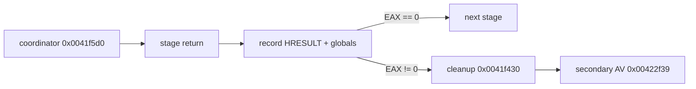

# Direct3D 초기화 실패 추적 설계

관련 작업 지시: [Direct3D 초기화 실패 추적 작업 지시](../work-orders/20260825-060-direct3d-init-failure-trace.md)

## 근거

작업 59는 논리 display mode를 통과한 뒤 `0x00422f39`에서 null `IDirect3DDevice3`를 역참조하는 2차 access violation을 반복 확인했다. 원본 초기화 coordinator `0x0041f5d0`은 다섯 함수를 순서대로 호출하고 각 반환값이 0이 아니면 `0x0041f430` 정리 경로로 이동한다.

| 단계 | callee | return site |
| --- | --- | --- |
| DirectDraw 생성·cooperative level | `0x0041f650` | `0x0041f5de` |
| Direct3D interface 초기화 | `0x0041f8e0` | `0x0041f5ee` |
| display/surface 초기화 | `0x0041f7c0` | `0x0041f5fe` |
| device 초기화 | `0x0041fa50` | `0x0041f60e` |
| 후속 그래픽 상태 초기화 | `0x0041fa90` | `0x0041f61e` |

단계 이름은 현재 정적 호출 형태에 따른 분석용 이름이며, 런타임 반환값과 객체 전역을 통해 보정한다.

## 관찰 경계

launcher에 target 전용 `--d3d-init-trace`를 추가한다. 이 옵션은 다섯 return site에 일회성 software breakpoint를 설치하고 원본 바이트를 보존한다. breakpoint마다 EAX와 주요 객체 전역을 기록한 뒤 원본 바이트를 복원하고 같은 주소에서 실행을 계속한다.

관찰할 전역은 Direct3D device 후보 `[0x01eb7cc0]`, 보조 interface `[0x01eb7cc4]`, Direct3D interface 후보 `[0x01eb7ce0]`, DirectDraw interface `[0x01eb7d00]`, 주요 surface `[0x01eb7d04]`, 보조 surface `[0x01eb7d08]`이다. `FindDevice` 뒤와 Z-buffer 열거 준비 뒤에만 기록되는 `[0x01eb7d48]`, `[0x01eb7d24]`도 phase marker로 함께 읽는다. 이 진단은 반환값을 바꾸거나 null AV를 우회하지 않는다.

## 완료 조건

최초 nonzero 반환 stage와 HRESULT를 반복 확인하고, 그 시점의 객체 전역 상태를 기록한다. 확인 결과에 따라 필요한 DirectDraw/Direct3D HLE 경계를 후속 작업으로 확정한다.

## 확인된 결과

두 최종 실행에서 `direct_draw` 단계는 0으로 성공했고 `[0x01eb7d00]`에 DirectDraw4 객체가 남았다. `direct_3d` 단계는 모두 `0x887600ff`(`DDERR_NOTFOUND`)를 반환했다. 이때 `[0x01eb7ce0]`의 Direct3D3 객체는 유효했지만 `[0x01eb7d48]`과 `[0x01eb7d24]` marker는 0이었다. 정적 흐름상 이는 `QueryInterface(IID_IDirect3D3)` 성공 뒤 `IDirect3D3::FindDevice`가 실패했고, Z-buffer format 열거에는 진입하지 않았음을 확정한다. 검색 구조는 `D3DFDS_HARDWARE`와 `bHardware=TRUE`를 요구한다.

---

# Direct3D Initialization-Failure Trace Design

Related work order: [Direct3D Initialization-Failure Trace Work Order](../work-orders/20260825-060-direct3d-init-failure-trace.md)

## Evidence and boundary

Task 59 repeatedly reaches a secondary null `IDirect3DDevice3` AV at `0x00422f39`. Coordinator `0x0041f5d0` calls five initialization functions and branches to cleanup on the first nonzero return. A target-specific `--d3d-init-trace` option will place one-shot software breakpoints at their five return sites, record EAX and the principal DirectDraw/Direct3D globals, restore each original byte, and continue without changing guest results.

## Completion criteria

Repeatedly identify the first nonzero stage return and HRESULT together with object-global state, then use that evidence to define the next graphics HLE boundary.

## Confirmed result

Both final runs record a successful `direct_draw` stage followed by `0x887600ff` (`DDERR_NOTFOUND`) from `direct_3d`. A valid Direct3D3 object exists while both post-FindDevice and Z-buffer markers remain zero. Combined with the static control flow, this confirms that `QueryInterface(IID_IDirect3D3)` succeeds, hardware-only `IDirect3D3::FindDevice` fails, and Z-buffer enumeration is never entered.
