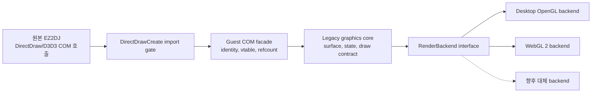
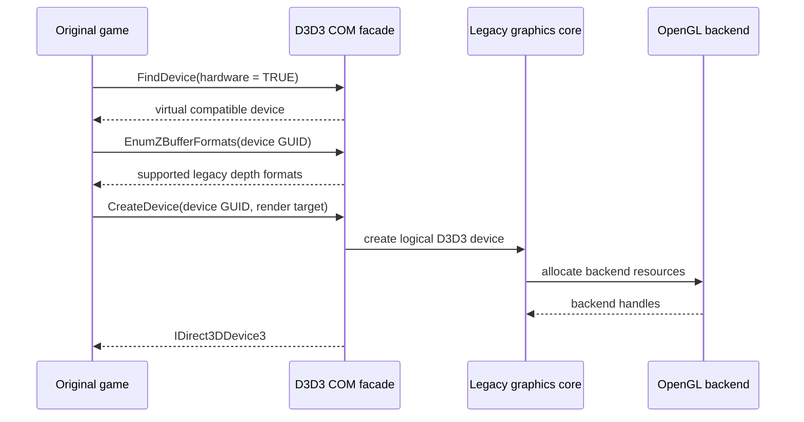

# Direct3D 3 OpenGL HLE 설계

관련 작업 지시: [Direct3D 3 OpenGL HLE 작업 지시](../work-orders/20260825-061-direct3d3-opengl-hle.md)

## 상태와 근거

**[부분 구현 — 초기화 HLE 완료, OpenGL draw 전]** 작업 60에서 1st SE 원본 실행 파일은 `DirectDrawCreate`로 얻은 객체에서 `IDirectDraw4`와 `IDirect3D3`를 획득하는 데 성공했다. 최초 그래픽 실패는 `D3DFDS_HARDWARE`, `bHardware=TRUE` 조건의 `IDirect3D3::FindDevice`가 현대 Windows에서 `DDERR_NOTFOUND`를 반환하는 지점이었다. 이후 `0x00422f39` access violation은 null `IDirect3DDevice3`를 정리하는 2차 실패였다.

따라서 system Direct3D 3 HAL 열거 결과에 의존하지 않고, 원본이 보는 DirectDraw/Direct3D 3 COM 계약을 HLE로 제공하며 실제 렌더링을 OpenGL 계열 backend로 변환한다. 원본 코드와 호출 순서는 수정하지 않는다.

## 목표와 비목표

목표는 다음과 같다.

1. `DirectDrawCreate` import에서 시작하는 guest 소유 COM 객체 그래프를 제공한다.
2. 원본의 `IDirectDraw`, `IDirectDraw4`, `IDirect3D3`, `IDirect3DDevice3` ABI와 수명 계약을 보존한다.
3. EZ2DJ가 실제 사용하는 DirectDraw surface와 Direct3D 3 fixed-function 명령만 플랫폼 중립 표현으로 변환한다.
4. Windows와 Linux는 OpenGL backend, Web은 같은 계약을 구현하는 WebGL 2 backend를 사용할 수 있게 한다.
5. 640×480×16 guest framebuffer를 host desktop mode 변경 없이 표시한다.

Direct3D 3 전체 구현, 임의의 구형 게임 지원, 원본 gameplay 재구현, host Direct3D 객체의 vtable 수정은 범위에 포함하지 않는다. OpenGL은 첫 backend일 뿐 공용 HLE의 ABI가 아니다.

## 계층과 책임

### Guest COM facade

게스트 주소 공간에 interface 객체와 vtable을 만들고 각 method slot을 HLE gate에 연결한다. 하나의 논리 객체가 여러 interface를 노출할 때 `QueryInterface` 결과, `IUnknown` identity, `AddRef`/`Release` 수명은 같은 객체 상태를 공유한다. 구조체와 포인터는 32비트 guest ABI로 읽고 쓰며 host C++ 객체 주소를 guest에 노출하지 않는다.

초기 interface 범위는 런타임 추적으로 확인된 호출부터 확장한다.

- `IDirectDraw` / `IDirectDraw4`: `QueryInterface`, cooperative level, display mode, surface 생성과 관련 method
- `IDirect3D3`: `FindDevice`, `EnumZBufferFormats`, `CreateDevice`
- `IDirect3DDevice3`: scene, transform, render state, texture, viewport, primitive draw와 확인되는 정리 method
- 관련 surface, texture, viewport interface: 실제 `QueryInterface`와 vtable 호출이 확인된 항목

지원하지 않는 method는 성공을 가장하지 않고 결정적인 오류를 반환하며 호출을 진단 로그에 남긴다.

### Legacy graphics core

공용 코어는 Direct3D enum과 host OpenGL 호출을 섞지 않는다. 다음 상태를 정규화해 소유한다.

- guest surface descriptor, pixel format, dimensions, pitch, capabilities
- primary/back/depth/texture surface 관계
- lock/unlock 중인 CPU-visible storage와 dirty region
- viewport, world/view/projection transform
- depth test/write, blend, cull, shade, fog, alpha test 등 관찰된 render state
- bound texture와 primitive vertex layout
- scene 및 present 상태

DirectDraw surface는 guest가 기대하는 pitch와 16비트 메모리 표현을 보존한다. OpenGL resource는 그 surface의 backend 표현이며 guest-visible pointer나 layout을 대체하지 않는다.

### RenderBackend와 OpenGL

`RenderBackend`는 resource 생성·갱신, render target/depth target 선택, 정규화된 pipeline state 적용, draw, present만 받는다. OpenGL context 생성과 swap은 platform 계층에 둔다. 공용 코어에서는 WGL, GLX, EGL 또는 Web API를 직접 호출하지 않는다.

첫 OpenGL backend는 legacy fixed-function API에 의존하지 않고 소수의 내부 shader 조합으로 Direct3D 3 상태를 재현한다. 좌표계, half-pixel, depth range, winding, alpha test와 texture combine 차이는 명시적 변환 정책으로 관리한다. RGB565, ARGB1555 등 guest 16비트 형식은 host가 직접 지원하면 대응 texture format을 사용하고, 그렇지 않으면 lossless CPU 변환 또는 shader unpack 경로를 사용한다.

구현 디렉터리는 책임별로 다음처럼 분리한다.

| 경로 | 책임 |
| --- | --- |
| `src/platform/windows/direct3d3_com_facade.*` | 현재 Windows x86 native guest ABI, COM facade와 method dispatch |
| `include/re2dj/hle/directx/`, `src/hle/directx/` | 향후 native helper/Web 공용 guest ABI와 dispatch 계약 |
| `include/re2dj/graphics/`, `src/graphics/` | legacy surface/state model과 `RenderBackend` interface |
| `src/graphics/opengl/` | platform window API를 포함하지 않는 공용 OpenGL resource·draw 변환 |
| `src/platform/windows/`, `src/platform/linux/` | native OpenGL context, window와 swap/present adapter |
| `src/platform/web/` | WebGL 2 context와 browser present adapter |

기존 `src/platform/windows/injected_runtime.cpp`에는 정책 wiring과 import 교체만 남기며 COM 객체와 renderer 구현을 누적하지 않는다.

### 첫 구현 결과

작업 61의 첫 구현 단위는 `--hle-d3d3`로 `DirectDrawCreate` IAT를 Windows x86 facade로 교체했다. 작업 66은 확인된 RGB565 texture surface, GDI bitmap upload, `IDirect3DTexture2`, color key와 color-fill Blt까지 surface 계약을 확장했다. 자산 load 뒤 기존 `0x0042292b` null surface와 `0x0042333b` null Blt slot AV는 제거됐으며, 다음 최초 경계는 `0x0042325c`의 `IDirect3DDevice3::DrawPrimitive` null slot execute AV다. OpenGL draw와 present는 아직 구현하지 않았다.

## 장치와 surface 정책

`FindDevice`는 host HAL 열거를 전달하지 않고 EZ2DJ profile이 지원하는 가상 hardware device를 반환한다. 반환되는 GUID, description과 capability는 이후 실제 구현 가능한 기능의 보수적인 부분집합이어야 하며, 아직 확인하지 않은 capability를 선언하지 않는다.

화면 표시에는 기존 `--hle-display-mode`의 논리 640×480×16 계약을 사용한다. primary/back buffer는 논리 surface이고 `Flip` 또는 확인된 present 지점에서 OpenGL framebuffer로 업로드·합성한 뒤 host window 크기로 확대한다. 원본 HDD 자산과 guest surface write는 원본 디렉터리 정책과 독립적이며 host desktop mode를 변경하지 않는다.

## 오류, 진단과 결정성

- 잘못된 guest pointer, 구조체 크기, 잠금 순서에는 해당 DirectDraw/Direct3D 오류를 반환하고 host crash를 일으키지 않는다.
- 지원하지 않는 GUID, pixel format, capability, render state는 method, caller, argument 요약을 기록한다.
- guest가 요청한 상태와 실제 backend 상태를 분리해 같은 입력이 플랫폼마다 같은 HLE 결과를 내도록 한다.
- OpenGL 오류는 guest HRESULT로 좁혀 반환하되 backend 상세는 진단 로그에 보존한다.
- system DirectDraw/Direct3D 객체와 HLE 객체를 한 그래프에서 혼합하지 않는다.

## 단계별 구현과 검증

1. **COM 골격:** `DirectDrawCreate`, interface identity, 32비트 vtable gate, reference count 단위 테스트
2. **초기화 통과:** 가상 `FindDevice`, Z-buffer format 열거, `CreateDevice`; `0x00422f39` 이전 최초 실패 제거
3. **Surface 계약:** 640×480×16 primary/back/depth surface, lock/unlock, pitch와 pixel-format 테스트
4. **최소 draw:** scene, transform, render state, texture와 관찰된 primitive를 offscreen OpenGL framebuffer에 실행
5. **Present:** 논리 framebuffer를 window에 표시하고 aspect/scaling 정책 검증
6. **확장:** unsupported-call 로그에 근거해 EZ2DJ가 실제 사용하는 method만 추가

각 단계는 원본 자산 없는 단위 테스트와 사용자가 지정한 HDD 경로를 이용한 canonical 실행을 분리한다. 최소 런타임 완료 조건은 `FindDevice` 성공만이 아니라 원본 초기화 coordinator의 다음 단계로 진입하고 새로운 최초 실패를 반복 식별하는 것이다. 최종 그래픽 완료 조건은 실제 game frame의 surface·draw·present 호출을 처리하고 두 번 이상 같은 경로를 재현하는 것이다.

## 미확정 사항

다음은 구현 전에 확정된 사실로 취급하지 않는다.

- 원본이 실제 선택하는 depth와 texture pixel format
- 사용하는 `IDirect3DDevice3` method와 primitive type의 전체 집합
- color key, palette, fog, lighting, texture blending의 사용 여부
- 16비트 framebuffer에 대한 정확한 readback 또는 lock 빈도
- 원본 화면과 일치시키는 half-pixel 및 filtering 정책

이 항목들은 COM 호출 trace와 실행 결과로 확인한 뒤 분석 문서와 capability profile에 누적한다.

---

# Direct3D 3 OpenGL HLE Design

Related work order: [Direct3D 3 OpenGL HLE Work Order](../work-orders/20260825-061-direct3d3-opengl-hle.md)

## Status and evidence

**[Partially implemented — initialization HLE complete, before OpenGL drawing]** Task 60 confirmed that the original 1st SE executable obtains `IDirectDraw4` and `IDirect3D3`, then first fails when hardware-only `IDirect3D3::FindDevice` returns `DDERR_NOTFOUND`. The AV at `0x00422f39` was a secondary null-device cleanup failure.

The HLE will therefore preserve the original DirectDraw/Direct3D 3 COM contract while translating rendering into an OpenGL-family backend instead of depending on system Direct3D 3 HAL enumeration. Original code and call order remain unchanged.

## Boundaries

The design has four replaceable layers: a `DirectDrawCreate` import gate, guest-owned 32-bit COM facades, a platform-neutral legacy graphics core, and a `RenderBackend`. Desktop OpenGL is the first backend and WebGL 2 implements the same backend contract for Web. OpenGL types and platform context APIs do not enter the common COM or graphics core.

The COM facade owns guest vtables, identity, `QueryInterface`, and shared reference counts without exposing host pointers. The legacy core owns guest surface layouts, CPU locks, normalized fixed-function state, resource relationships, drawing, and present state. Unsupported methods return deterministic failures and emit diagnostics rather than pretending success.

The first native ABI adapter lives in `src/platform/windows/direct3d3_com_facade.*`. Shared helper/Web ABI contracts will later live under `hle/directx`; the neutral surface/state model and backend contract under `graphics`; reusable OpenGL translation under `graphics/opengl`; and native context and present adapters under platform directories. The injected Windows runtime retains only policy wiring and import replacement.

The first Task 61 increment replaces the `DirectDrawCreate` IAT through `--hle-d3d3`. Task 66 extends the surface contract with the confirmed RGB565 texture surface, GDI bitmap upload, `IDirect3DTexture2`, color key, and color-fill Blt. After asset loading, the former null surface at 0x0042292b and null Blt slot at 0x0042333b are removed. The next boundary is a null `IDirect3DDevice3::DrawPrimitive` slot at 0x0042325c. OpenGL drawing and presentation remain pending.

## Rendering policy

`FindDevice` exposes a conservative virtual hardware device whose advertised capabilities are limited to implemented behavior. DirectDraw surfaces retain guest-visible pitch and 16-bit memory layout; OpenGL resources are backend representations. Fixed-function Direct3D 3 behavior is reproduced with internal shaders rather than deprecated host fixed-function OpenGL. Explicit policies handle coordinate, depth-range, winding, half-pixel, alpha-test, texture-combine, and legacy pixel-format differences.

The existing logical 640×480×16 display mode remains the guest contract. Primary and back buffers are logical surfaces, and the backend uploads or composites them at the observed present point without changing the host desktop mode.

## Delivery sequence

Implementation proceeds through COM identity and gate tests, virtual-device initialization, legacy surface contracts, minimal offscreen drawing, window presentation, and trace-driven expansion. Each stage separates asset-free unit tests from canonical runs against a user-supplied HDD directory. Unknown formats, methods, and render states remain unresolved until runtime evidence confirms them.
