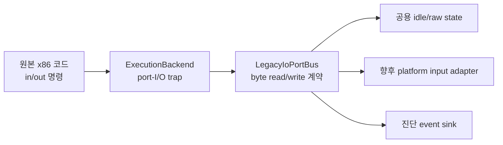

# 레거시 I/O 포트 HLE 설계

관련 작업 지시: [레거시 I/O 포트 HLE 작업 지시](../work-orders/20260825-062-legacy-io-port-hle.md)

## 상태와 근거

**[첫 구현 완료]** Task 61의 canonical 실행은 Direct3D 초기화 뒤 `0x00438987: in al,dx`에서 `0xc0000096` 예외를 냈다. 정적 확인 결과 byte 입력 helper `0x00438980`의 호출자는 port `0x101`~`0x106`을 사용하고, byte 출력 helper `0x004389a0`의 호출자는 port `0x100`~`0x103`, `0x106`을 사용한다. 16/32비트 helper도 원본에 있지만 확인된 호출자는 없다.

**[첫 구현 완료]** 공용 raw byte bus와 Windows x86 trap을 구현했고 두 canonical 실행에서 port 경계를 통과했다. 아래의 정적 근거와 미확정 범위는 그대로 유지한다.

`0x101`, `0x102`, `0x106` 입력은 bitwise NOT 뒤 24개의 boolean 입력으로 풀린다. 따라서 이 세 port는 **active-low 입력으로 확인됨**이다. `0x103`~`0x105` 입력은 이전값과 비교되고 세 번째 바이트는 modulo-256 누적값으로 쓰인다. 이 첫 구현 이후 Task 85가 공개 구현과 교차 확인한 의미 기반 board를 추가했다. 원본 확인과 외부 추정의 구분은 [I/O port map](../analysis/ez2dj-io-map.md)에 둔다.

## 경계

import thunk로 교체할 Win32 API가 없는 직접 x86 I/O 명령이므로 이 경계에는 instruction trap을 사용한다. Windows x86 bring-up launcher는 `EXCEPTION_PRIV_INSTRUCTION`을 받아 원본 image RVA와 opcode를 검증한 뒤 `EAX` 또는 출력 상태를 갱신하고 `EIP`를 정확히 한 명령만 진행한다. Linux helper와 Web execution backend는 같은 `LegacyIoPortBus` 계약을 각 실행 엔진의 port-I/O callback에 연결한다.

trap은 확인된 helper 내부 주소에만 허용한다. 임의의 privileged instruction, 알 수 없는 port, 알 수 없는 operand width는 guest에 다시 전달하여 오류를 숨기지 않는다. 원본 실행 파일 바이트는 수정하지 않는다.

## 첫 raw 상태 정책

첫 구현은 의미가 확인되지 않은 host key mapping을 만들지 않고 raw byte 상태를 제공한다.

| Port | 초기값 | 확인 상태 |
| --- | ---: | --- |
| `0x101` | `0xff` | active-low 8비트 입력, idle은 모든 bit 1 |
| `0x102` | `0xff` | active-low 8비트 입력, idle은 모든 bit 1 |
| `0x103` | `0x00` | 이전값 비교 대상; 물리 의미 미확정 |
| `0x104` | `0x00` | 이전값 비교 대상; 물리 의미 미확정 |
| `0x105` | `0x00` | modulo-256 delta 누적 대상; 물리 의미 미확정 |
| `0x106` | `0xff` | active-low 8비트 입력, idle은 모든 bit 1 |

`0x100`~`0x103`, `0x106`의 byte 출력은 마지막 값을 보존하고 진단 로그에 남긴다. 출력이 input bank 선택이나 램프 제어인지 아직 확인되지 않았으므로 읽기 상태에 자동 반영하지 않는다. 향후 입력 adapter는 raw bit/counter를 갱신할 수 있지만 공용 코어는 Win32 키 코드나 SDL event를 알지 않는다.

## 진단과 검증

각 처리된 명령은 `io_port_read` 또는 `io_port_write` event로 port, width, value, guest address를 기록한다. canonical 실행에서는 다음을 검증한다.

1. 기존 `0x00438987` privileged-instruction 예외가 사라진다.
2. 확인된 port read/write만 처리되고 알 수 없는 I/O는 삼키지 않는다.
3. 기존 `av_access`가 다시 나타나는지 계속 확인한다.
4. 동일 raw idle 상태로 두 번 실행했을 때 같은 다음 최초 경계에 도달한다.

첫 구현은 원본 asset API 도달을 위한 idle 입력 경계이며 실제 cabinet 배선, 키 매핑, coin/service 동작, 출력 장치 의미는 후속 관찰로 확정한다.

---

# Legacy I/O Port HLE Design

Related work order: [Legacy I/O Port HLE Work Order](../work-orders/20260825-062-legacy-io-port-hle.md)

## Status and evidence

**[First implementation complete.]** Canonical Task 61 execution raised `0xc0000096` at `0x00438987: in al,dx` after Direct3D initialization. Static inspection confirms byte reads from ports `0x101` through `0x106` and byte writes to `0x100` through `0x103` plus `0x106`. The executable also contains 16/32-bit helpers, but no callers have been confirmed.

Inputs `0x101`, `0x102`, and `0x106` are inverted and expanded into 24 booleans, confirming active-low semantics. Inputs `0x103` through `0x105` are compared with prior values; the third contributes a modulo-256 delta. Task 85 later added a semantic board based on cross-checking an independent public implementation. The [I/O port map](../analysis/ez2dj-io-map.md) keeps original confirmation separate from external inference.

## Boundary and policy

There is no Win32 import to replace for direct x86 I/O, so the execution backend uses a narrowly validated instruction trap. The Windows x86 launcher handles `EXCEPTION_PRIV_INSTRUCTION` only at confirmed helper RVAs and opcodes, updates the guest context, and advances exactly one instruction. Linux and Web backends will connect their execution-engine port callbacks to the same platform-neutral byte-bus contract. Unknown addresses, ports, or widths remain unhandled.

The first raw idle state is `ff ff 00 00 00 ff` for ports `0x101` through `0x106`: ones for confirmed active-low inputs and zero for unresolved counters. Writes preserve and diagnose their last raw byte without feeding it back into reads. No unverified cabinet button mapping is claimed.

## Verification

Unit tests cover accepted ports, idle values, writes, and rejection of unknown accesses. Two canonical runs must eliminate the old privileged-instruction boundary, continue checking for `av_access`, and reproduce the same next boundary. Physical wiring and host input mapping remain later work.
