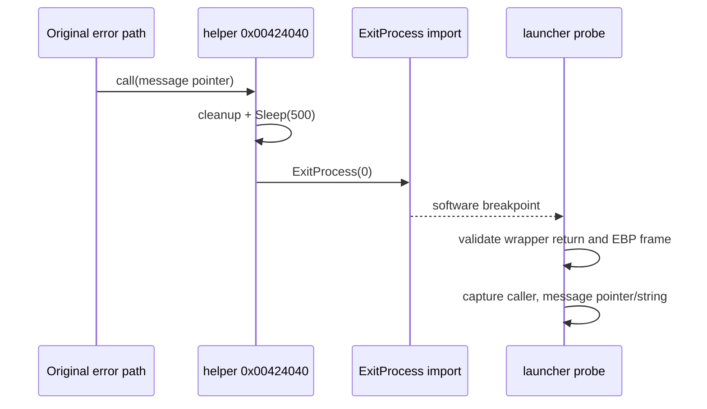

# 원본 controlled exit 원인 귀속 설계

관련 작업 지시: [controlled exit 원인 귀속 작업 지시](../work-orders/20260825-063-controlled-exit-attribution.md)

## 상태와 문제

**[구현·검증 완료]** Task 62의 최종 실행은 `ExitProcess` import에서 return address `0x00424061`을 기록했다. 정적 확인 결과 이는 원본 helper `0x00424040` 내부의 `ExitProcess(0)` 다음 주소다. 이 helper는 정리 함수와 500 ms sleep 뒤 종료하며, 원본 `.text`의 서로 다른 오류 경로 54곳이 공유한다. 따라서 직접 return address만으로 종료 원인을 구분할 수 없다.

helper는 표준 EBP frame을 유지하고 종료 전에 반환하지 않는다. `ExitProcess` breakpoint 시점에 다음 값이 남아 있다.

| 위치 | 의미 |
| --- | --- |
| `EBP+0` | helper caller의 saved EBP |
| `EBP+4` | helper를 호출한 원본 instruction 다음 주소 |
| `EBP+8` | caller가 전달한 오류 문자열 pointer |
| `EBP+12` | 오류 문자열의 첫 번째 가변 인자 pointer |
| `ESP+0` | `ExitProcess`의 직접 return `0x00424061` |
| `ESP+4` | exit code 0 |

## 진단 경계

launcher는 direct return이 target image의 확인된 wrapper return RVA `0x24061`과 일치할 때만 EBP frame을 해석한다. caller, message pointer/string, 첫 번째 가변 인자 pointer/string을 `controlled_exit_attribution` event로 기록한다. frame read가 실패하거나 pointer가 유효하지 않아도 종료 동작을 바꾸지 않고 validity를 false로 남긴다. 임의의 system `ExitProcess` 호출에 이 target-specific 해석을 적용하지 않는다.

이 작업은 원본 분기를 우회하거나 오류 반환값을 바꾸지 않는 관찰 작업이다. 귀속 결과가 sound, input, file 또는 다른 HLE 경계를 가리키면 별도 설계에서 대체 정책을 정한다.

## 검증

1. wrapper return RVA, EBP frame 길이와 main-image caller 범위를 명시적으로 검증한다.
2. Windows x86 build와 기존 CTest를 통과한다.
3. 동일 정책의 canonical 실행 두 번에서 caller와 message pointer/string이 일치해야 한다.
4. `av_access` 존재 여부를 계속 확인한다.

---

# Controlled Exit Cause Attribution Design

Related work order: [Controlled Exit Cause Attribution Work Order](../work-orders/20260825-063-controlled-exit-attribution.md)

## Status and boundary

**[Implemented and verified.]** Task 62 records ExitProcess return `0x00424061`, which is merely the instruction after `ExitProcess(0)` inside original helper `0x00424040`. Static inspection finds 54 distinct error paths calling this shared non-returning helper, so the direct return does not identify the failure.

The helper preserves a standard EBP frame. At the ExitProcess breakpoint, `[EBP+4]` is the original helper caller, `[EBP+8]` is its error-message pointer, and `[EBP+12]` is the first variadic argument pointer. The launcher interprets this frame only when the direct return matches confirmed wrapper RVA `0x24061`, then records the caller plus bounded ANSI message and detail text. Invalid reads remain diagnostic failures and never change guest control flow. Any resulting subsystem HLE is a later, separately designed change.

## Verification

Build and existing tests must pass. Two canonical runs must produce the same attributed caller and message while continuing to check for access violations.
