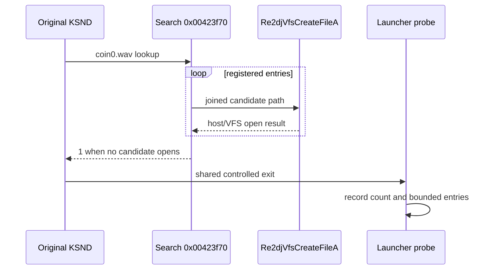

# KSND search-path와 파일 후보 관찰 설계

## 상태와 목적

**[구현 및 검증 완료.]** 작업 63은 원본 controlled exit를 caller `0x00424813`의 `KSND(ksndLoadSound)` 실패로 귀속했고 첫 detail 인자가 `coin0.wav`임을 확인했다. HDD에는 `System/Common/coin0.wav`가 존재하지만, search-path가 등록되지 않은 것인지 등록된 후보가 VFS에서 잘못 변환된 것인지는 아직 미확정이다.

이 작업은 원본의 확인된 search-path 상태와 실제 파일 API 후보만 관찰한다. search-path를 강제로 추가하거나 파일명을 재작성하지 않는다.

## 관찰 경계

1st SE 원본 이미지의 정적 확인값은 다음과 같다.

| 항목 | 값 | 확인 범위 |
| --- | --- | --- |
| search 함수 | `0x00423f70` | count만큼 entry를 순회하고 open을 시도 |
| entry 배열 | `0x01c4c0a0` | entry stride `0x104` |
| count | `0x01c4d0e0` | search 함수의 loop bound |
| KSND 실패 caller | `0x00424813` | search 반환 1 뒤 shared exit helper 호출 |

launcher는 확인된 shared-exit frame과 caller가 모두 일치할 때만 count와 entry를 읽는다. 원시 count를 항상 기록하고, launcher의 진단 상한을 넘는 경우 capped 상태만 남긴다. 각 entry는 기존 bounded ANSI reader로 읽어 JSON-safe 문자열로 기록한다.

실제 후보 path는 `--api-trace`가 주입 runtime의 `Re2djVfsCreateFileA` entry에서 기록하는 첫 인자와 대조한다. count가 0이면 CreateFile 후보가 없는 것이 정상이며, count가 양수인데 wrapper entry가 없다면 watch 준비 상태와 search 내부 분기를 다시 확인한다.

## 검증

- Windows x86 Debug build와 CTest를 통과한다.
- 같은 canonical 명령을 `--api-trace`와 함께 두 번 실행한다.
- search count/entry와 CreateFile 후보가 두 실행에서 일치하는지 확인한다.
- 모든 로그에서 `av_access`를 계속 확인한다.
- 원본 HDD와 실행 파일은 읽기 전용으로 취급한다.

---

# KSND Search-Path and File-Candidate Observation Design

## Status and purpose

**[Implemented and verified.]** Task 63 attributes the controlled exit to caller `0x00424813`, `KSND(ksndLoadSound)`, and detail `coin0.wav`. The HDD contains `System/Common/coin0.wav`, but missing search-path registration versus incorrect VFS mapping remains unresolved.

This task observes only the confirmed original search-path state and actual file-API candidates. It does not inject a search path or rewrite a filename.

For the confirmed 1st SE image, search routine `0x00423f70` iterates a count at `0x01c4d0e0` over entries beginning at `0x01c4c0a0` with stride `0x104`. The launcher reads these values only when both the shared controlled-exit wrapper and KSND caller `0x00424813` match. It records the raw count, applies a diagnostic-only cap, and decodes entries with the existing bounded JSON-safe ANSI reader.

Actual candidates are correlated with the first argument captured at the injected `Re2djVfsCreateFileA` entry under `--api-trace`. Two canonical runs must agree and remain free of `av_access`; the supplied HDD and executable remain read-only.
