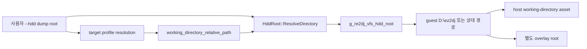

# target working directory 기반 VFS mount 설계

## 상태와 문제

**[구현 및 검증 완료.]** `--hdd`는 사용자가 제공한 덤프 전체 디렉터리다. target profile은 스캔 결과로 원본 실행 파일의 실제 상대 경로와 `working_directory_relative_path`를 이미 보유한다. 기존 Windows x86 launcher는 덤프 root 자체를 `g_re2dj_vfs_hdd_root`에 주입해, 1st SE의 guest `D:\ez2dj`와 상대 경로를 host의 `roms/ez2dj1stse`에 잘못 대응했다.

## mount 계약

- launcher는 target profile이 확정된 뒤 `working_directory_relative_path`를 `HddRoot::ResolveDirectory`로 해석한다.
- 빈 working directory는 dump root를 의미한다.
- 해석된 directory만 read/source mount로 주입한다.
- overlay root는 `overlays/<target-id>`를 유지하며 guest mount 내부 상대 경로만 저장한다.
- `C:\windows` support mount와 LPTDI virtual-device 분기는 변경하지 않는다.
- 경로를 찾을 수 없으면 launcher 준비 실패로 처리하며 상위 directory fallback을 하지 않는다.

## 검증

Windows x86 build와 CTest 뒤 canonical 실행을 두 번 수행한다. `coin0.wav`의 host 후보가 `.../ez2dj/System/Common/coin0.wav`로 바뀌고 open 이후 KSND controlled exit가 사라지는지 확인한다. 다음 경계가 access violation이면 주소와 접근 종류를 즉시 기록하고, AV가 아니면 다음 controlled exit/API를 귀속한다.

---

# Target Working-Directory VFS Mount Design

## Status and contract

**[Implemented and verified.]** `--hdd` denotes the complete user-supplied dump root, while a resolved target profile already carries the executable's actual `working_directory_relative_path`. The Windows x86 launcher previously injected the dump root directly, incorrectly mapping guest `D:\ez2dj` and relative paths one level above the 1st SE working directory.

After target resolution, the launcher resolves the profile working directory through `HddRoot::ResolveDirectory` and injects that directory as the read/source VFS mount. An empty profile working directory means the dump root. The overlay remains `overlays/<target-id>` and stores paths relative to the same guest mount. Windows support files and virtual devices are unchanged, and an invalid target working directory fails closed without a parent-directory fallback.

Verification builds and tests Windows x86, then runs the canonical path twice. It must confirm the corrected `.../ez2dj/System/Common/coin0.wav` candidate and continuously classify any next access violation or controlled exit.
