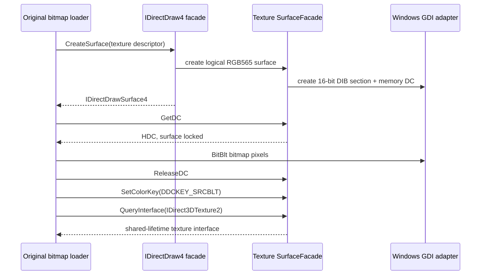

# texture surface GDI upload HLE 설계

## 상태와 확인 근거

**[구현 및 검증 완료.]** Task 65 뒤 반복 AV는 `0x0042292b`의 null read다. 정적 분석은 이를 `0x004228e0` bitmap-to-surface helper 내부로 귀속했다.

- `0x0042285e`: global `IDirectDraw4`의 vtable `+0x18`, 즉 `CreateSurface`
- descriptor flags `0x00101007`: caps, width, height, pixel format, texture stage
- caps `0x00001000`: `DDSCAPS_TEXTURE`
- `0x0042292b`: surface vtable `+0x44`, `GetDC`
- 이후 `+0x68` `ReleaseDC`, `+0x74` `SetColorKey`
- `0x004228cb`: IID `93281502-8cf8-11d0-89ab-00a0c9054129`, 즉 `IDirect3DTexture2` QueryInterface

현재 facade는 primary flip-chain surface만 만들고 texture 요청에는 `DDERR_UNSUPPORTED`와 null output을 반환한다. 원본이 HRESULT를 검사하지 않아 null interface AV로 이어진다.

## 구현 경계

1. `RootCreateSurface`는 기존 primary/back 경로와 확인된 texture 경로를 분리한다.
2. texture는 descriptor width/height와 RGB565 pixel format을 보존하고 독립 `SurfaceFacade`로 생성한다.
3. Windows 전용 facade는 top-down 16-bit BI_BITFIELDS DIB section을 memory DC에 선택한다. 이 메모리는 향후 공용 texture storage/OpenGL upload로 이전 가능한 CPU-visible backing이다.
4. `GetDC`/`ReleaseDC`는 단일 lock 상태와 HDC identity를 검증한다.
5. `SetColorKey`는 확인된 `DDCKEY_SRCBLT` 값을 surface 상태에 저장한다.
6. `IDirect3DTexture2`는 surface와 refcount를 공유하는 별도 interface identity를 제공한다. 아직 관찰되지 않은 texture method는 성공을 가장하지 않는다.
7. 첫 구현 뒤 실행에서 기존 AV는 제거됐고 다음 execute AV의 return `0x0042333e`는 같은 facade의 null `IDirectDrawSurface4::Blt` slot로 확인됐다. 원본 인자는 null source, `DDBLT_COLORFILL`, 유효한 `DDBLTFX`이므로 이 확인된 RGB565 rectangle fill을 같은 작업에 추가한다.
8. primary/back/texture surface가 같은 CPU-visible RGB565 backing 계약을 사용한다. GDI DC는 texture upload에만 노출되지만 color-fill은 backing pixel을 직접 갱신한다. release 시 생성된 DC와 bitmap을 정리한다.

공용 graphics core나 OpenGL draw/present는 이번 작업에서 추가하지 않는다. host GDI 호출은 Windows platform facade에만 남긴다. source blit, stretch, ROP 등 관찰되지 않은 Blt 조합은 `DDERR_UNSUPPORTED`를 반환한다.

## 검증

- Windows x86 Debug build와 CTest를 통과한다.
- canonical 실행 2회에서 `0x0042292b` AV 제거와 texture QueryInterface 진입을 확인한다.
- 새 최초 경계의 `av_access` 또는 controlled exit를 두 실행에서 비교한다.
- 원본 HDD와 실행 파일은 변경하지 않는다.

---

# Texture-Surface GDI Upload HLE Design

## Status and evidence

**[Implemented and verified.]** The repeated Task 65 AV at 0x0042292b belongs to bitmap-to-surface helper 0x004228e0. Static evidence identifies `IDirectDraw4::CreateSurface` at vtable +0x18 with a texture descriptor, followed by surface `GetDC` (+0x44), `ReleaseDC` (+0x68), `SetColorKey` (+0x74), and a confirmed `IDirect3DTexture2` QueryInterface. The previous facade rejected every non-primary surface and returned a null output, which the original caller did not check.

The facade will add only the confirmed RGB565 texture-surface path. A Windows-only top-down 16-bit DIB section and memory DC provide shared CPU-visible pixels for GetDC/ReleaseDC. Source-blit color-key state is retained, and a separate `IDirect3DTexture2` interface shares the surface lifetime. The first run removes the old AV and identifies the next null slot as `IDirectDrawSurface4::Blt` with a null source and `DDBLT_COLORFILL`; Task 66 therefore adds only that observed RGB565 rectangle fill and gives primary/back/texture surfaces the same CPU-visible backing. Unsupported texture methods and other Blt modes remain deterministic failures. Common graphics/OpenGL rendering remains outside this increment, and canonical runs continue to classify every next access violation.
