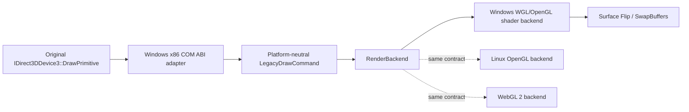

# DrawPrimitive OpenGL backend 설계

## 상태와 근거

**[구현·반복 검증 완료.]** Task 66의 최종 두 실행은 return `0x0042325f`에서 execute address 0 AV를 동일하게 기록했다. call site `0x0042325c`는 `IDirect3DDevice3` vtable `+0x70`, 즉 `DrawPrimitive`다.

확인된 첫 호출 인자는 다음과 같다.

| 항목 | 값 |
| --- | --- |
| primitive | `D3DPT_TRIANGLESTRIP` (`5`) |
| FVF | `0x1c4`: `XYZRHW | DIFFUSE | SPECULAR | TEX1` |
| vertex count | 4 |
| flags | 0 |
| vertex source | 원본 `.data`의 동적 screen-space quad |

## 계층

### 공용 draw command

`include/re2dj/graphics/`와 `src/graphics/`에 host API와 Direct3D header를 포함하지 않는 계약을 둔다.

- topology: triangle strip
- transformed/lit vertex: `x`, `y`, `z`, `rhw`, diffuse/specular ARGB, `u`, `v`
- viewport width/height
- optional RGB565 texture view와 source color key
- draw flags

공용 decoder는 32바이트 TL vertex stride와 유한 float, vertex count/byte-size overflow를 검증한다. Direct3D FVF 숫자를 공용 코어에 그대로 퍼뜨리지 않고 Windows ABI adapter가 확인된 layout으로 변환한다.

### Windows OpenGL backend

`src/platform/windows/`의 backend가 `RootSetCooperativeLevel`에서 보존한 HWND를 사용해 context를 지연 생성한다. facade 파일에는 COM orchestration만 남기고 WGL/OpenGL 함수 해석, shader, texture upload와 draw는 전용 파일로 분리한다.

- host desktop mode를 바꾸지 않는다.
- shader가 XYZRHW screen coordinate를 viewport 기준 NDC로 변환한다.
- diffuse ARGB를 vertex color로 전달한다.
- RGB565 DIB backing의 row pitch를 검증하고 texture로 업로드한다.
- 확인된 source color key는 fragment discard로 적용한다.
- 첫 topology는 triangle strip만 허용한다.
- `SurfaceFlip`에서 `SwapBuffers`를 호출한다.
- context/shader/texture 생성 실패는 명시적 HRESULT 실패이며 draw 성공을 가장하지 않는다.

OpenGL resource는 platform backend 소유이고 guest surface/refcount와 분리한다. texture의 CPU backing은 authoritative하며 초기 구현은 draw 직전에 업로드해 dirty tracking 추정을 피한다.

## 상태와 수명

DeviceFacade는 현재 viewport와 stage 0 texture를 AddRef로 보존한다. SetTexture 교체와 device release에서 대칭 Release한다. DrawPrimitive는 scene 상태, viewport, FVF, topology, vertex count와 pointer를 검증한 뒤 command를 제출한다. backend는 root/window 수명보다 길게 살아남지 않는다.

첫 통합 실행에서 DrawPrimitive 경계는 통과했고 다음 null slot은 return `0x00431f33`, call site `0x00431f2d`, device vtable `+0xa0`으로 이동했다. Windows SDK의 `IDirect3DDevice3` 순서와 대조하면 `SetTextureStageState(stage, state, value)`다. 같은 초기화 블록이 stage 0의 여러 texture-stage state를 연속 설정하므로 facade는 지원 범위의 stage/state 값을 보존하고 Get/Set을 대칭 제공한다. 아직 OpenGL 출력에 반영하지 않는 state도 성공을 가장해 폐기하지 않고 장치 상태로 보존하며, 실제 렌더 의미 적용은 관찰된 조합부터 backend state command로 확장한다.

## 검증

1. 원본 자산 없는 단위 테스트로 TL vertex decode, ARGB 변환, 잘못된 count/float 거부를 확인한다.
2. Windows x86 runtime probe에서 texture identity와 SetTexture 수명을 확인한다.
3. Windows x86 Debug build와 CTest를 통과한다.
4. canonical 실행 2회에서 `0x0042325c` null-slot AV 제거, draw 제출과 Flip/present를 확인한다.
5. 다음 access violation 또는 controlled exit를 두 실행에서 계속 비교한다.

런처는 handoff 대기 이후에도 ANSI `OUTPUT_DEBUG_STRING_EVENT`를 읽어 진단 로그에 남긴다. 이를 통해 원본이 HRESULT를 무시하더라도 `DrawPrimitive` 성공 표식과 OpenGL 실패 표식을 구분한다.

최종 두 실행은 각각 DrawPrimitive 성공 표식 201회, OpenGL 실패 0회, `av_access` 0회를 기록하고 동일한 `title.wav` KSND 제어 종료에 도달했다. 이는 backend 제출 성공과 기존 AV 제거를 확인하지만 실제 framebuffer의 시각 정확성은 아직 별도 검증 대상이다.

---

# DrawPrimitive OpenGL Backend Design

## Status and evidence

**[Implemented and repeatedly verified.]** Both final Task 66 runs stop at execute address zero with return 0x0042325f. Call site 0x0042325c is IDirect3DDevice3::DrawPrimitive vtable +0x70. The confirmed first call is a four-vertex D3DPT_TRIANGLESTRIP using FVF 0x1c4 (`XYZRHW | DIFFUSE | SPECULAR | TEX1`) and flags zero.

The Windows x86 ABI adapter converts that exact layout into a platform-neutral `LegacyDrawCommand` containing transformed/lit vertices, viewport, optional RGB565 texture view, source color key, and draw flags. The common layer contains no Direct3D, WGL, or host-window types.

A dedicated Windows backend lazily creates a WGL context from the HWND retained at SetCooperativeLevel, uses shaders to map screen-space XYZRHW vertices to NDC, uploads authoritative RGB565 CPU surface pixels with validated row pitch, applies diffuse color and source-color-key discard, and submits the confirmed triangle strip. Surface Flip performs SwapBuffers. Unsupported layouts and backend failures return explicit errors rather than pretending to draw. Linux OpenGL and WebGL 2 later implement the same common contract.

The first integrated run passes DrawPrimitive and moves the next null slot to return 0x00431f33, call site 0x00431f2d, device vtable +0xa0. The Windows SDK IDirect3DDevice3 order identifies this as SetTextureStageState(stage, state, value). Because the same initialization block sets several stage-zero values consecutively, the facade retains supported stage/state values and provides symmetric Get/Set methods. States not yet reflected in OpenGL output are retained as device state instead of being silently discarded; observed combinations will later be translated into backend state commands.

Verification combines asset-free decoder tests, Windows runtime lifetime checks, Windows x86 build/CTest, and two canonical runs that must remove the null DrawPrimitive slot while continuing to classify every next access violation or controlled exit.

The launcher records ANSI OUTPUT_DEBUG_STRING_EVENT payloads after runtime handoff as well as during handoff. This distinguishes the DrawPrimitive success marker from an OpenGL failure even if the original ignores the returned HRESULT.

Each of the two final runs records 201 DrawPrimitive success markers, zero OpenGL failures, and zero av_access events before reaching the same controlled KSND `title.wav` exit. This confirms successful backend submission and removal of the former AVs; visual framebuffer accuracy remains a separate verification item.
