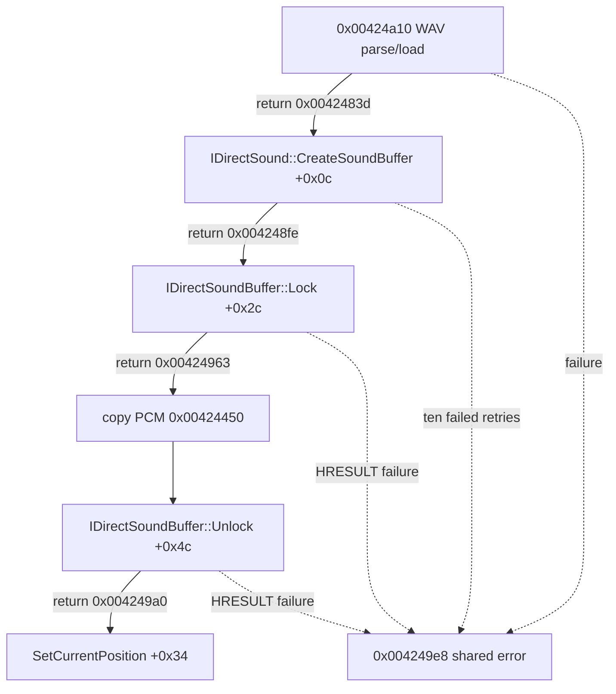

# KSND title.wav 로드 실패 귀속 설계

## 상태와 수정된 전제

**[구현·반복 검증 완료.]** 작업 67의 최종 실행은 caller `0x004249f6`에서 `ksnd: Cant Load Sound title.wav` 제어 종료에 도달했다. 기존 TODO는 이를 검색 경로 문제로 남겼지만, 같은 로그는 host 후보 `.../ez2dj/System/Title/title.wav`의 `CreateFileA` 성공 뒤 handle `0x98`에 대한 `ReadFile`까지 기록한다. HDD의 파일은 9,438,308바이트이며 RIFF/WAVE, PCM stereo 44.1 kHz 16-bit header와 파일 크기가 일치한다.

따라서 이 작업은 경로를 바꾸지 않고 원본 KSND 함수 `0x00424740` 내부에서 실패 단계와 HRESULT를 관찰한다.

## 정적 경계

launcher의 `--ksnd-load-trace`는 1st SE에서 확인한 네 return site에 software breakpoint를 설치하고 각 hit 뒤 원래 명령 한 개를 single-step한 다음 재무장한다. 따라서 앞선 효과음 load가 진단을 소진하지 않는다. 각 event는 원본 파일명, stage, EAX, sound slot, buffer pointer, parsed byte count와 retry index를 bounded read로 기록한다. 원본 명령과 반환값은 바꾸지 않으며 breakpoint 원래 바이트와 EIP를 복원한다.

## 결정 규칙

- parser EAX가 0이면 WAV/file-data 경계를 우선 분석한다.
- CreateSoundBuffer EAX가 0이 아니면 HRESULT와 descriptor를 다음 DirectSound HLE 설계의 근거로 사용한다.
- Lock 또는 Unlock만 실패하면 buffer ABI/flags 계약을 좁힌다.
- 모든 단계가 성공했는데 오류 분기로 가면 그 뒤 branch를 추가 관찰한다.

## 검증

Windows x86 build와 CTest 뒤 canonical 실행을 두 번 수행한다. 두 실행의 stage/result가 일치해야 하며 `av_access`를 계속 확인한다. 이 작업은 원본 HDD 파일을 읽기 전용으로 취급하고, 임의의 WAV 대체나 성공 반환 주입을 하지 않는다.

최종 로그 `20260826-001806-977.jsonl`, `20260826-001915-355.jsonl`은 모두 `title.wav` parser 성공과 payload 9,438,264바이트를 기록했다. 이어 `CreateSoundBuffer`가 retry 0~9에서 모두 `0x80004001`을 반환했고 buffer pointer는 null로 남았다. Lock/Unlock에는 도달하지 않았으며 `av_access`와 OpenGL 실패는 각각 0회였다.

---

# KSND title.wav Load-Failure Attribution Design

## Status and corrected premise

**[Implemented and repeatedly verified.]** Task 67 reaches a controlled `ksnd: Cant Load Sound title.wav` exit at caller 0x004249f6. Contrary to the prior TODO assumption, the same log records a successful CreateFileA for the resolved `.../ez2dj/System/Title/title.wav` candidate followed by ReadFile on handle 0x98. The 9,438,308-byte asset has a size-consistent RIFF/WAVE PCM stereo 44.1 kHz 16-bit header.

This task therefore leaves path policy unchanged and observes the failing stage and HRESULT inside original KSND function 0x00424740. Option `--ksnd-load-trace` installs breakpoints after WAV parse/load, IDirectSound::CreateSoundBuffer, IDirectSoundBuffer::Lock, and Unlock, then single-steps the restored instruction and rearms each site so earlier effect loads cannot consume the diagnostic. Each event records the original filename, stage, EAX, sound slot, buffer pointer, parsed byte count, and retry index through bounded reads without changing guest results.

Two canonical runs must agree and remain free of access violations. Parser failure directs later work to file/WAV handling; CreateSoundBuffer failure provides the exact HRESULT and descriptor boundary for a separate DirectSound HLE design; Lock or Unlock failures narrow the buffer ABI. Original assets remain read-only and this diagnostic does not inject replacement WAV data or success results.

Final logs 20260826-001806-977.jsonl and 20260826-001915-355.jsonl both record successful parsing of a 9,438,264-byte title.wav payload. CreateSoundBuffer then returns 0x80004001 for retries zero through nine and leaves the buffer pointer null. Lock and Unlock are not reached; both runs contain zero av_access and zero OpenGL failure events.
