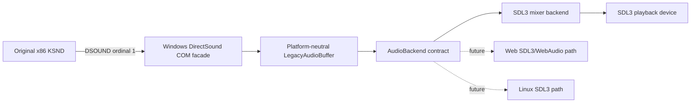

# DirectSound SDL3/SDL3_mixer HLE 설계

## 상태와 목표

**[구현 및 원본 실행 검증 완료.]** 원본 EZ2DJ의 KSND와 32비트 x86 호출 흐름은 그대로 유지하고 `DSOUND.dll` ordinal `#1`의 `DirectSoundCreate`와 그 COM 객체만 HLE facade로 교체한다. PCM 저장·재생 상태는 플랫폼 공용 모델에 두고, 첫 실제 출력 backend는 SDL 3.4.14와 SDL_mixer 3.2.4로 구현한다.

작업 68은 `title.wav`의 검색, read와 9,438,264바이트 PCM parse가 성공한 뒤 system `IDirectSound::CreateSoundBuffer`가 열 번 모두 `E_NOTIMPL`을 반환함을 확인했다. 이 작업은 성공값만 주입하지 않고 guest가 뒤이어 호출하는 buffer ABI를 완성한다.

## 확인된 원본 계약

원본 함수 `0x00424740`은 크기 `0x14`의 구형 `DSBUFFERDESC`를 stack에 만든다. `lpwfxFormat`은 KSND slot의 WAVEFORMATEX를 가리키고 `dwBufferBytes`는 parsed PCM 크기 또는 최대 `0x58000`이다. 관찰 경로의 flags는 다음 두 조합이다.

| 값 | 확인된 의미 |
| --- | --- |
| `0x140e2` | STATIC, CTRLFREQUENCY, CTRLPAN, CTRLVOLUME, STICKYFOCUS, GETCURRENTPOSITION2 |
| `0x140c6` | STATIC, LOCHARDWARE, CTRLPAN, CTRLVOLUME, STICKYFOCUS, GETCURRENTPOSITION2 |

`CreateSoundBuffer` 성공 뒤 원본은 `Lock(0, 0, ..., DSBLOCK_ENTIREBUFFER)`, PCM copy, `Unlock`, `SetCurrentPosition(0)`을 호출한다. `DSBCAPS_LOCHARDWARE`는 실제 host hardware allocation으로 전달하지 않고 HLE가 제공하는 가상 capability로 수용한다.

## 구조

- `audio/`: format, PCM storage, circular lock regions, cursor와 volume/pan/frequency/play state를 host API 없이 보존한다.
- `platform/windows/directsound_com_facade.*`: guest `__stdcall` COM ABI, refcount, HRESULT와 vtable을 제공한다.
- `audio/sdl3_mixer_audio_backend.*`: raw PCM을 `MIX_Audio`, buffer instance를 `MIX_Track`에 대응시키고 SDL3 device mixer로 출력한다.
- launcher `--hle-directsound`: ordinal import slot을 injected runtime export로 교체한다.

SDL_mixer에는 guest가 이미 해석한 raw PCM을 `MIX_LoadRawAudio`로 전달한다. 파일 경로나 원본 HDD 자산을 backend에 다시 전달하지 않는다. `Play`의 loop, 시작 frame, gain, stereo pan과 frequency ratio는 SDL_mixer track 상태로 변환한다.

## 첫 구현 범위

`IDirectSound`는 IUnknown, CreateSoundBuffer, SetCooperativeLevel과 보수적인 caps/config method를 제공한다. `IDirectSoundBuffer`는 전체 vtable을 유효한 함수로 채우고, 첫 실행에 필요한 Lock, Unlock, SetCurrentPosition, Play, Stop, status/cursor, volume, pan, frequency와 format/caps query를 구현한다. 미지원 aggregation, 3D와 effect 계약은 null 호출 대신 명시적인 DirectSound HRESULT를 반환한다.

Lock은 guest가 직접 쓸 수 있는 facade 소유 PCM memory를 최대 두 circular region으로 나눈다. Unlock은 pointer/length 쌍을 검증한다. Play 때 최신 PCM snapshot을 SDL_mixer raw audio로 생성하므로 guest write와 mixer thread의 수명을 분리한다.

## 의존성과 라이선스

SDL 3.4.14와 SDL_mixer 3.2.4를 commit/tag에 고정하고 둘의 zlib license notice를 보존한다. SDL_mixer의 raw decoder만 필요하므로 FLAC, GME, MOD, MP3, MIDI, Opus, Vorbis와 WavPack을 끄고 추가 codec library를 도입하지 않는다.

- [SDL repository and license](https://github.com/libsdl-org/SDL/tree/release-3.4.14)
- [SDL_mixer repository and license](https://github.com/libsdl-org/SDL_mixer/tree/release-3.2.4)

## 검증

공용 circular lock/state 단위 테스트, Windows x86 facade probe, 전체 Windows x86 build와 CTest를 수행한다. canonical 실행은 최소 두 번 반복하며 `title.wav`가 CreateSoundBuffer, Lock, Unlock과 SetCurrentPosition을 통과하는지, 새 access violation 주소, SDL backend 오류와 다음 안정 종료 경계를 기록한다. 원본 자산은 계속 읽기 전용이다.

최종 trace `20260826-005558-184.jsonl`은 실제 SDL playback device에서 primary buffer, 121개 secondary buffer, 299회 Lock/Unlock과 `title.wav`용 360,448바이트 looping Play를 기록했다. DirectSound HRESULT는 성공했고 headless fallback과 OpenGL failure는 없었다. 다음 AV는 execute address 0, return `0x00420276`이며 call site `0x00420273`의 global `IDirect3D3` vtable `+0x24` `CreateVertexBuffer`로 귀속된다.

---

# DirectSound SDL3/SDL3_mixer HLE Design

## Status and objective

**[Implemented and verified with the original executable.]** The original EZ2DJ KSND and x86 execution remain authoritative. Only DSOUND ordinal 1 DirectSoundCreate and its COM objects are replaced. Platform-neutral code owns PCM and legacy state, while SDL 3.4.14 plus SDL_mixer 3.2.4 provides the first output backend.

Task 68 confirms successful title.wav lookup, read, and parsing before system CreateSoundBuffer returns E_NOTIMPL ten times. This task implements the following buffer ABI instead of injecting a success code. Static analysis confirms a 20-byte legacy descriptor, flag combinations 0x140e2 and 0x140c6, PCM size capped at 0x58000 on the hardware path, and the sequence CreateSoundBuffer, whole-buffer Lock, PCM copy, Unlock, and SetCurrentPosition(0).

The Windows facade exposes guest-callable COM vtables and HRESULT behavior. A neutral LegacyAudioBuffer owns format, PCM, circular locks, cursors, controls, and playback state. The SDL3_mixer backend converts snapshots to MIX_Audio and maps each instance to a MIX_Track on an SDL3 playback-device mixer. Hardware placement is virtualized rather than forwarded to modern DirectSound. Unsupported aggregation, 3D, and effects fail explicitly instead of leaving null slots.

SDL and SDL_mixer are pinned to the zlib-licensed 3.4.14 and 3.2.4 releases. All optional compressed/module codec integrations are disabled; guest-decoded raw PCM is the only required input. Verification covers neutral state tests, the Windows facade probe, x86 build and CTest, then two canonical runs with continuous access-violation and SDL error observation.

Final trace 20260826-005558-184.jsonl uses a real SDL playback device and records one primary buffer, 121 secondary buffers, 299 successful Lock/Unlock pairs, and looping playback of the 360,448-byte title.wav streaming buffer. DirectSound HRESULTs succeed with no headless fallback or OpenGL failure. The next execute AV at address zero returns to 0x00420276 and is attributed to global IDirect3D3 vtable slot +0x24 CreateVertexBuffer at call site 0x00420273.
