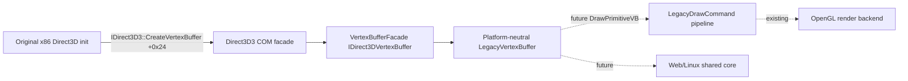

# Direct3D 3 정점 버퍼 HLE 설계

## 상태와 목표

**[완료.]** 원본 EZ2DJ의 Direct3D 초기화와 32비트 x86 호출 흐름을 유지하면서 global `IDirect3D3` vtable `+0x24` `CreateVertexBuffer`와 반환 `IDirect3DVertexBuffer` COM ABI를 facade로 완성했다. `Lock`은 게스트가 실제 사용하는 `lpdwSize=nullptr` 계약을 수용한다. 최종 canonical 두 실행은 121개 × stride 32인 3,872바이트 buffer의 Lock/Unlock, 정점 루프와 이후 렌더링을 AV 없이 통과하고 다음 안정 경계를 DirectSound duplicate 실패로 옮겼다.

작업 69 재검증 trace `20260826-014926-561.jsonl`은 audio 경계가 기준과 동일하게 통과한 뒤 execute AV address 0, return `0x00420276`, call site `0x00420273`에서 멈춘다. call site 직전 바이트는 `mov eax,[edx]`(vtable load)와 `call dword ptr [eax+0x24]`이며, DirectX 6 SDK `d3d.h`의 `IDirect3D3` 선언 순서(IUnknown 뒤 EnumDevices, CreateLight, CreateMaterial, CreateViewport, FindDevice, CreateDevice, **CreateVertexBuffer**, EnumZBufferFormats, EvictManagedTextures)에서 `+0x24`는 정확히 `CreateVertexBuffer`다. 현재 `Direct3dVtable()`은 이 슬롯을 null로 두므로 호출이 address 0으로 점프하고, `DBG_EXCEPTION_NOT_HANDLED`로 guest에 전달된 뒤 같은 thread·ESP의 두 번째 `c0000005`(미커밋 region)로 process가 붕괴한다.

## 확인된 원본 계약

SDK `d3d.h`(`DIRECT3D_VERSION 0x0600`) 기준 계약이다. descriptor 값과 caps/FVF 조합은 아직 원본 실행에서 관찰하지 않았으며 첫 구현 실행의 marker로 확정한다(아래 미확정 참조).

```c
typedef struct _D3DVERTEXBUFFERDESC {
    DWORD dwSize;          // >= sizeof(D3DVERTEXBUFFERDESC)
    DWORD dwCaps;          // D3DVBCAPS_SYSTEMMEMORY/WRITEONLY/OPTIMIZED/DONOTCLIP
    DWORD dwFVF;           // vertex format
    DWORD dwNumVertices;
} D3DVERTEXBUFFERDESC;

// IDirect3D3::CreateVertexBuffer(desc, &vertex_buffer, flags, outer)
```

반환 객체 `IDirect3DVertexBuffer`의 DX6 vtable 순서는 IUnknown 뒤 다음과 같다.

| 오프셋 | method | 첫 구현 |
| --- | --- | --- |
| `+0x0c` | `Lock(flags, &data, &size)` | 전체 buffer lock, facade 소유 memory 반환 |
| `+0x10` | `Unlock()` | lock 상태 해제 |
| `+0x14` | `ProcessVertices(...)` | marker + `E_NOTIMPL` 보수 경계 |
| `+0x18` | `GetVertexBufferDesc(desc*)` | 저장된 descriptor 복원 |
| `+0x1c` | `Optimize(device*, flags)` | marker + `E_NOTIMPL` 보수 경계 |

DX6 `Lock`은 offset/size 인자가 없고 항상 buffer 전체를 반환한다(DirectSound circular lock과 다름).

## 구조



- `graphics/`: `LegacyVertexBuffer`가 descriptor 4필드, FVF 유도 stride, 정점 storage와 lock 상태를 host API 없이 보존한다. stride 계산은 확인된 FVF 비트만 반영한다: `D3DFVF_XYZ`(12바이트), `D3DFVF_XYZRHW`(16바이트), `D3DFVF_NORMAL`(+12), `D3DFVF_DIFFUSE`(+4), `D3DFVF_SPECULAR`(+4), texture 좌표 세트당 +4(최대 8). 위치 비트가 없으면 stride 0으로 생성을 거절한다.
- `platform/windows/direct3d3_com_facade.cpp`: `VertexBufferFacade` struct와 완전한 `IDirect3DVertexBufferVtbl`, `D3dCreateVertexBuffer` 구현. aggregation(`outer != nullptr`)은 형제 facade와 동일하게 `DDERR_INVALIDPARAMS`. QI는 `IID_IUnknown`과 `IID_IDirect3DVertexBuffer`만 수용한다. `Lock`은 `lplpData`만 필수로 요구하며 `lpdwSize == nullptr`인 원본 호출도 성공시켜야 한다. 진입 marker는 검증보다 먼저 남겨 이후 잘못된 인자를 포함한 실제 호출도 관찰 가능하게 한다.
- 관찰 marker: `re2dj:hle:IDirect3D3::CreateVertexBuffer:caps=…:fvf=…:vertices=…:flags=…`, `re2dj:hle:IDirect3DVertexBuffer::Lock:size=…:flags=…`, `…:Unlock`, `…:GetVertexBufferDesc`, `…:ProcessVertices`, `…:Optimize`.
- device 연계는 유보한다. 게스트가 실제로 `DrawPrimitiveVB`/`DrawIndexedPrimitiveVB`를 호출하는 순간까지 device 쪽 VB 소비 슬롯은 의도적 미래 경계로 남긴다. 현재 렌더링은 `DrawPrimitive` 사용자 포인터 경로로 계속된다.

## 미확정

- ~~게스트가 요청하는 실제 `dwCaps`, `dwFVF`, `dwNumVertices` 조합과 buffer 개수~~ — **관측됨:** 첫 marker가 `caps=0, fvf=0x112(XYZ|NORMAL|TEX1), vertices=121(0x79), flags=0`을 기록했다. untransformed 파이프라인 사용이 확정됐다.
- ~~게스트는 생성 직후 `Lock(vb, 1, &local, NULL)`을 호출하는 정적 해독과 달리 실행 기록에 VbLock 마커가 없고 Lock 출력 local이 스택 잔재를 유지했다.~~ — **코드 검토로 원인 확인:** 현재 `VbLock`은 `size == nullptr`이면 marker와 `*data` 기록 전에 `DDERR_INVALIDPARAMS`를 반환한다. 게스트가 HRESULT를 검사하지 않아 local의 스택 잔재를 정점 주소로 사용했다. nullable size 계약을 probe와 원본 실행으로 재검증한다.
- 정점 버퍼 사용이 transformed(`XYZRHW`) 파이프라인인지 untransformed 파이프라인인지 — **확정됨:** untransformed(`XYZ|NORMAL`)다. transform/light state의 shader 의미가 후속 과제로 남는다.

## 검증

1. `legacy_vertex_buffer_test.cpp`: 생성·stride 계산·전체 lock/unlock·위치 비트 없는 FVF 거절을 검증하고 단위 스위트에 등록한다.
2. `windows_vfs_runtime_probe`에 `Re2djHleDirectDrawCreate` → QI(`IID_IDirect3D3`) → `CreateVertexBuffer` → `Lock(flags, &data, nullptr)` → Unlock/`GetVertexBufferDesc` → Release 흐름을 추가해 원본과 같은 nullable size guest ABI를 CI에서 점검한다.
3. `-DRE2DJ_WARNINGS_AS_ERRORS=ON` windows-x86 build + CTest 2/2, windows-x64 build + CTest 1/1(CI 동일 조건).
4. canonical 실행 두 번: `0x00420353` 쓰기 AV 소멸, Lock 진입/출력 marker 기록, 다음 경계 귀속. analysis 항목과 작업 로그를 갱신한다. 원본 자산은 읽기 전용이다.

---

# Direct3D 3 Vertex Buffer HLE Design

## Status and objective

**[Complete.]** The original EZ2DJ Direct3D initialization and x86 call flow remain authoritative while the global IDirect3D3 +0x24 CreateVertexBuffer boundary and returned IDirect3DVertexBuffer COM ABI are implemented behind the facade. Lock accepts the guest's observed null `lpdwSize` contract. Two final canonical runs pass the 3,872-byte buffer (121 vertices × stride 32), Lock/Unlock, the vertex loop, and later rendering without an AV, moving the next stable boundary to DirectSound duplication.

Re-verification trace 20260826-014926-561.jsonl passes the audio boundary identically to baseline and then stops at an execute AV at address zero returning to 0x00420276 from call site 0x00420273. The bytes before the call are `mov eax,[edx]` followed by `call dword ptr [eax+0x24]`, and in the DirectX 6 SDK d3d.h IDirect3D3 declaration order (IUnknown, EnumDevices, CreateLight, CreateMaterial, CreateViewport, FindDevice, CreateDevice, **CreateVertexBuffer**, EnumZBufferFormats, EvictManagedTextures), +0x24 is exactly CreateVertexBuffer. The current Direct3dVtable() leaves that slot null, so the call jumps to address zero; after delivery with DBG_EXCEPTION_NOT_HANDLED the process collapses through a second c0000005 on an uncommitted region with the same thread and ESP.

## Confirmed original contract

Contracts below come from the SDK d3d.h with DIRECT3D_VERSION 0x0600. The actual descriptor values and caps/FVF combinations have not been observed yet; the first instrumented run confirms them through markers (see Unresolved).

The returned IDirect3DVertexBuffer exposes Lock (+0x0c), Unlock (+0x10), ProcessVertices (+0x14), GetVertexBufferDesc (+0x18), and Optimize (+0x1c). The DX6 Lock has no offset or size arguments and always returns the whole buffer, unlike the DirectSound circular lock.

## Structure

- `graphics/`: a neutral LegacyVertexBuffer preserves the four descriptor fields, the FVF-derived stride, vertex storage, and lock state without host APIs. Stride reflects only confirmed FVF bits: XYZ (12 bytes), XYZRHW (16), NORMAL (+12), DIFFUSE (+4), SPECULAR (+4), plus 4 per texture-coordinate set up to 8. Creation rejects descriptors without a position bit (stride 0).
- `platform/windows/direct3d3_com_facade.cpp`: VertexBufferFacade plus a complete IDirect3DVertexBufferVtbl and D3dCreateVertexBuffer. Aggregation fails like sibling facades with DDERR_INVALIDPARAMS; QI accepts IID_IUnknown and IID_IDirect3DVertexBuffer only. Lock requires only `lplpData` and accepts the original call's null `lpdwSize`; its entry marker precedes validation so malformed calls remain observable.
- Observation markers follow the established `re2dj:hle:` naming with parameterized values.
- Device integration is deferred: DrawPrimitiveVB/DrawIndexedPrimitiveVB slots remain intentional future boundaries until the guest calls them; rendering continues through the existing DrawPrimitive user-pointer path.

## Unresolved

- Actual dwCaps/dwFVF/dwNumVertices combinations and buffer count, confirmed on the first marker-bearing run.
- Observed meaning of the CreateVertexBuffer flags argument.
- Whether vertex buffers feed the transformed (XYZRHW) or untransformed pipeline; the latter makes transform/light shader semantics a follow-up task.

## Verification

Unit tests for creation, stride computation, whole-buffer lock/unlock, and rejection of position-less FVF; a vfs-runtime-probe flow exercising DirectDrawCreate → QueryInterface(IDirect3D3) → CreateVertexBuffer → Lock with null size → Unlock/GetVertexBufferDesc → Release; warnings-as-errors builds and CTest on Windows x86 (2/2) and x64 (1/1); two canonical runs confirming the 0x00420353 write AV disappears, recording Lock entry/output markers, and attributing the next boundary before updating the analysis item and work log. Original assets stay read-only.
