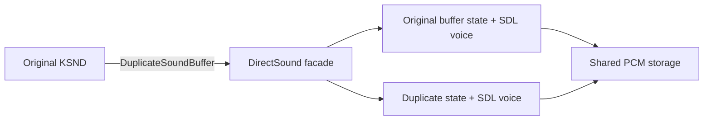

# DirectSound duplicate buffer HLE 설계

## 상태와 목표

**[완료.]** 작업 070의 `KSnd(ksndDuplicate)` 경계를 shared-PCM duplicate facade로 보완했다. final canonical 두 실행은 duplicate를 각각 70회/47회, Play를 84회/60회 처리한 뒤 AV, OpenGL 실패, SDL 오류 없이 메인 루프를 유지했다.

## 계약과 구조

Microsoft 계약에 따라 duplicate secondary buffer는 원본과 PCM memory를 공유한다. 생성 시 format, caps, cursor와 volume/pan/frequency 값을 이어받되 이후 cursor, controls, Play/Stop은 독립적이다. 어느 객체의 Lock으로 PCM을 바꾸어도 다른 객체에서 같은 변경을 보아야 하며 마지막 공유 객체가 해제될 때 storage를 해제한다. primary buffer와 null/외부 facade는 보수적으로 거절한다.

- 공용 `LegacyAudioBuffer`의 sample storage를 shared ownership으로 바꾸고 `Duplicate()`가 storage를 공유하면서 독립 상태를 복제한다.
- Windows `DirectSoundBufferFacade` duplicate는 새 COM refcount와 SDL mixer voice를 소유한다. source의 flags와 WAVEFORMATEX, 공용 buffer의 초기 state를 복제한다.
- `DuplicateSoundBuffer` marker는 source/result, flags와 byte count를 기록한다. 원본 자산 bytes나 PCM 내용은 기록하지 않는다.

## 검증

1. 공용 단위 테스트에서 양쪽 Lock의 write-through 공유와 cursor/control/play 상태 독립성을 확인한다.
2. Windows x86 probe에서 create → upload → duplicate → 독립 controls/play/stop → release를 검증한다.
3. warnings-as-errors Windows x86/x64 빌드와 CTest를 통과한다.
4. canonical 실행 두 번에서 duplicate 성공 marker, 기존 KSND 종료 소멸, AV/OpenGL/audio backend 오류와 다음 안정 경계를 기록한다.

근거: [IDirectSound::DuplicateSoundBuffer — Microsoft Learn](https://learn.microsoft.com/en-us/previous-versions/windows/desktop/mt708944%28v%3Dvs.85%29)

---

# DirectSound Duplicate Buffer HLE Design

## Status and objective

**[Complete.]** Shared-PCM duplication replaces the Task 070 `KSnd(ksndDuplicate)` boundary. Two final canonical runs process 70/47 duplicates and 84/60 Play calls, then remain in the main loop without access violations, OpenGL failures, or SDL errors.

Microsoft documents that a duplicated secondary buffer shares sample memory with the original. It initially inherits format, capabilities, cursor, volume, pan, and frequency, while later cursor/control and Play/Stop operations remain independent. The neutral LegacyAudioBuffer therefore uses shared sample ownership and an explicit Duplicate operation. Each Windows facade owns an independent COM reference count and SDL mixer voice. Primary buffers, null inputs, and foreign facades fail conservatively.

Verification covers shared write-through plus independent state in unit tests, a Windows x86 facade probe, warnings-as-errors x86/x64 builds and CTest, then two canonical runs attributing the next stable boundary without recording original PCM bytes.

Source: [IDirectSound::DuplicateSoundBuffer — Microsoft Learn](https://learn.microsoft.com/en-us/previous-versions/windows/desktop/mt708944%28v%3Dvs.85%29)
