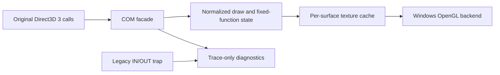

# 렌더링 정확성·성능 회복 설계

## 상태와 관찰

**[구현·자동 검증 완료, 사용자 화면 재검증 대기.]** 사용자가 메인 루프의 화면 출력을 확인했지만, 일부 그림이 나오지 않고 투명 영역의 테두리가 남으며 실행 성능이 매우 낮다고 확인했다. 이는 이전 작업에서 미확정으로 남긴 시각 정확성이 충족되지 않았다는 직접 관찰이다.

현재 구현을 대조하면 다음 문제는 코드로 확인된다.

- 모든 textured draw가 같은 OpenGL texture 하나에 전체 RGB565 bitmap을 `glTexImage2D`로 다시 올린다.
- 모든 성공한 `DrawPrimitive`가 `OutputDebugStringA`를 호출한다. debugger 기반 launcher에서는 각 호출이 debug event와 JSON 한 줄을 만든다.
- legacy I/O trap도 매 접근을 JSON으로 기록한다. 최근 사용자 실행은 draw 성공 18,503회와 I/O event 58,018회를 기록했다.
- `SetRenderState`와 `SetTextureStageState` 값은 배열에 저장되지만 backend 출력에는 전달되지 않는다.
- source color key는 inclusive low/high 범위가 아니라 low 값 하나만 RGB float tolerance로 비교한다.

이 항목들은 증상의 가능한 원인이지만, 누락된 각 그림의 구체적인 state 조합은 아직 확인되지 않았다.

## 경계와 단계

1. texture surface마다 안정적인 identity와 content revision을 둔다. GDI `ReleaseDC`와 surface color fill처럼 CPU backing을 바꿀 수 있는 경계에서 revision을 증가시킨다.
2. Windows OpenGL backend는 surface identity별 texture object를 보존하고 revision이 바뀔 때만 upload한다. 최초 할당은 `glTexImage2D`, 이후 변경은 `glTexSubImage2D`를 사용한다.
3. color key는 RGB565 packed 값의 inclusive low/high 범위를 정확히 판정한다. filtering으로 key 색과 이웃 색이 섞이지 않도록 관찰된 pixel-art 경로는 nearest sampling을 유지한다.
4. facade가 render state와 stage-zero texture state의 draw-time snapshot을 전달한다. 먼저 원본 실행에서 사용되는 고유 조합을 bounded trace로 관찰한 뒤, 확인된 color/alpha operation과 alpha test/blend만 shader/backend state로 구현한다. 관찰되지 않은 조합은 성공을 가장해 임의 해석하지 않는다.
5. 성공 draw와 I/O 접근의 per-call 진단은 기본 실행에서 제거하거나 요약하고 명시적 trace에서만 상세 기록한다. 실패 marker와 첫 성공 경계는 유지한다.
6. 로그 억제 뒤에도 debugger가 모든 privileged-instruction exception을 first chance로 받는 비용이 남았다. `--run-detached`는 초기 복원·runtime 주입·IAT 검증까지 debugger에서 수행한 뒤 debugger를 분리한다. injected runtime의 vectored exception handler가 확인된 두 helper RVA, opcode와 port만 처리한다. 원본 명령 바이트는 패치하지 않는다.

## 검증

- 공용 단위 테스트에서 texture identity/revision과 RGB565 color-key 범위 계약을 검증한다.
- Windows x86/x64 warnings-as-errors build와 CTest를 통과한다.
- canonical 실행에서 OpenGL 실패와 access violation이 없어야 한다.
- 같은 관찰 시간에 texture upload 수, draw 수, debug event 수와 wall-clock 진행량을 기록한다.
- 최종 시각 정확성은 사용자가 누락 그림, 투명 테두리, 애니메이션 속도를 다시 확인한다.
- 원본 HDD와 자산은 수정하거나 저장소에 추가하지 않는다.

자동 검증 결과 x86/x64 warnings-as-errors build와 CTest가 통과했다. 일반 debugger 실행 `20260826-184241-943.jsonl`은 첫 성공 draw만 기록하고 I/O 상세 로그, OpenGL 실패와 AV를 0회 기록했다. detached 실행 `20260826-183749-602.jsonl`은 runtime I/O handler 준비와 debugger 분리를 기록한 뒤 40초 동안 유지됐으며 검증 종료로 강제 종료했다. 누락 그림·테두리와 체감 속도가 실제로 해소됐는지는 사용자 재확인 항목으로 남긴다.

---

# Rendering Correctness and Performance Recovery Design

## Status and observation

**[Implementation and automated verification complete; user-visible revalidation pending.]** The user confirms that the original main loop produces visible output, but some images are missing, transparent borders remain, and performance is very poor. This directly resolves the prior uncertainty: the current visual result is not accurate.

Code inspection confirms that every textured draw reuploads the complete RGB565 bitmap into one OpenGL texture, every successful DrawPrimitive emits a debugger event, per-port I/O is logged individually, fixed-function render and texture-stage states are retained but ignored by the backend, and source color keys compare only the low value with a floating-point tolerance instead of the inclusive packed RGB565 range. These are supported causes, while the exact state combination behind each missing image still requires bounded observation.

Each surface receives a stable texture identity and content revision. The Windows backend caches one OpenGL texture per identity and uploads only when its revision changes. Packed RGB565 color-key ranges become texture alpha before linear filtering. The confirmed fixed-function state applies modulated texture/diffuse color, alpha test, alpha blending, and observed blend factors. High-frequency success diagnostics are bounded. Because a debugger receives exceptions before vectored handlers, `--run-detached` completes restoration, injection, and IAT verification first, then detaches and lets the injected target-limited handler process the confirmed I/O helper instructions without patching original bytes.

Warnings-as-errors x86/x64 builds and CTest pass. Debugger-mode log `20260826-184241-943.jsonl` records one bounded draw-success marker with zero detailed I/O events, OpenGL failures, and access violations. Detached log `20260826-183749-602.jsonl` records runtime I/O preparation and debugger detachment; the process remained alive for 40 seconds until the verification run forcibly stopped it. User confirmation of missing sprites, transparent borders, and animation speed remains pending.
