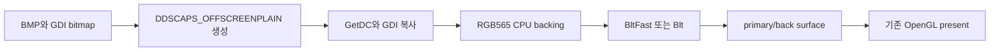

# DirectDraw 오프스크린 합성 복구 설계

## 상태와 근거

**[구현·자동 검증 완료, 사용자 화면 재검증 대기]** 사용자 재검증 실행은 `ez2dj.exe+0x88d6`의 읽기 접근 위반으로 종료됐다. Windows Error Reporting 덤프에서 `ECX=0`, 접근 주소 `0x00000008`, 게임 객체 `+0x2c8=0`이 확인됐다. 정적 호출 흐름은 이 멤버가 `1p_meter_back` 조회 결과이며, 원본의 조회 함수가 `%s.bmp`를 `DDSCAPS_OFFSCREENPLAIN` surface로 지연 로드함을 보여준다.

현재 DirectDraw HLE는 texture와 primary/flip-chain surface만 만들고 offscreen-plain 요청에는 `DDERR_UNSUPPORTED`를 반환한다. 또한 surface vtable의 `BltFast`가 비어 있고 `Blt`는 color fill만 지원한다. 따라서 동적 BMP surface 등록 수가 0에 머물고, 누락된 이미지 포인터를 원본이 역참조하면서 크래시한다.

## 설계

1. `DDSD_CAPS | DDSD_WIDTH | DDSD_HEIGHT`와 `DDSCAPS_OFFSCREENPLAIN` 요청을 공용 RGB565 GDI backing surface로 생성한다. 명시적 pixel format이 없으면 현재 16비트 display mode의 RGB565 형식을 사용한다.
2. source/destination rectangle을 검증하고 같은 RGB565 backing 간 행 단위 복사를 수행한다.
3. `BltFast`의 관찰된 `DDBLTFAST_WAIT`와 선택적 `DDBLTFAST_SRCCOLORKEY`를 지원한다. source color key가 요청되면 packed RGB565 inclusive 범위를 건너뛴다.
4. `Blt`는 기존 `DDBLT_COLORFILL`과 함께 source-copy 경로를 지원한다. 관찰되지 않은 stretch, ROP, destination color key 조합은 성공으로 추정하지 않고 `DDERR_UNSUPPORTED`를 유지한다.
5. 쓰인 destination surface의 revision을 증가시켜 기존 texture cache와 일관성을 유지한다.
6. 원본 명령과 자산은 수정하지 않는다.

## 검증

- 사각형 경계, 동일 크기 복사, source color-key 포함/미포함을 단위 테스트 가능한 공용 RGB565 복사 계약으로 분리한다.
- Windows x86/x64 warnings-as-errors 빌드와 CTest를 실행한다.
- `--run-detached`로 기존 `ez2dj.exe+0x88d6` 크래시가 재발하지 않고 메인 루프가 유지되는지 확인한다.
- 누락 이미지, 테두리, 최종 화면 정확성은 사용자 재검증 항목으로 남긴다.

x86/x64 warnings-as-errors build와 CTest가 통과했다. 수정된 detached 실행 `20260826-201731-528.jsonl`은 기존 약 76초 크래시 지점을 넘어 120초 동안 응답 상태를 유지했고 검증 종료를 위해 강제 종료됐다. 같은 시간대에 새 WER crash는 없다.

---

# DirectDraw Offscreen Composition Recovery Design

## Status and evidence

**[Implementation and automated verification complete; user-visible revalidation pending.]** The user's revalidation run terminated with a read access violation at `ez2dj.exe+0x88d6`. The Windows Error Reporting dump confirms `ECX=0`, access address `0x00000008`, and game-object member `+0x2c8=0`. Static flow identifies that member as the `1p_meter_back` lookup result and shows that the original lookup lazily loads `%s.bmp` into a `DDSCAPS_OFFSCREENPLAIN` surface.

The current DirectDraw HLE creates only texture and primary/flip-chain surfaces, returns `DDERR_UNSUPPORTED` for offscreen-plain requests, leaves `BltFast` unset, and supports only color-fill `Blt`. Dynamic BMP surface registration therefore remains at zero and the original dereferences the missing image pointer.

## Design

Create RGB565 GDI-backed offscreen surfaces for the observed caps/size descriptor, copy validated equal-sized rectangles between RGB565 backings, implement observed `BltFast` wait and optional source-color-key behavior, and extend `Blt` with source copying while retaining the existing color-fill path. Unsupported stretch, ROP, and destination-key combinations remain explicit failures. Every destination write advances its revision so the existing texture cache stays coherent. Original instructions and assets remain unchanged.

## Verification

Extract a platform-neutral RGB565 copy contract for rectangle and inclusive color-key unit tests, run x86/x64 warnings-as-errors builds and CTest, and repeat a detached runtime long enough to confirm that `ez2dj.exe+0x88d6` no longer recurs. User-visible sprite, border, and final screen accuracy remain revalidation items.

x86/x64 warnings-as-errors builds and CTest pass. Updated detached run `20260826-201731-528.jsonl` remains responsive for 120 seconds beyond the former roughly 76-second crash point and is then forcibly stopped for verification. No new WER crash appears in the same interval.
