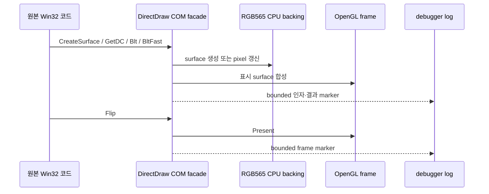

# 누락 이미지 합성 추적 및 복구 설계

## 상태

**[진단 진행 중]** 작업 073 재검증에서 RGB565 source color key와 투명 마스킹은 정상화됐지만, 사용자 화면에는 여전히 배경 또는 일부 그림 계층이 표시되지 않는다. 표시된 offscreen sprite가 있으므로 offscreen surface 생성과 기본 source-key 복사는 동작하지만, 모든 누락을 같은 원인으로 설명할 수는 없다.

현재 detached 실행은 debugger를 분리한 뒤 `OutputDebugStringA`를 수집하지 않는다. 따라서 최신 로그에는 실제 `CreateSurface`, `Blt`, `BltFast`, `Flip` 호출 인자와 반환 경로가 없다. 화면만 보고 미관찰 stretch, ROP, destination key 또는 합성 순서 중 하나를 확정하면 원본 바이너리로 확인하지 않은 내용을 사실로 만드는 문제가 있다.

## 진단 경계

1. 진단은 DirectDraw facade 내부에 두고 원본 instruction과 자산을 변경하지 않는다.
2. surface에는 실행 중에만 유효한 작은 진단 ID를 부여한다. pointer나 원본 자산 내용 대신 ID, caps, 크기, 사각형, flags와 HRESULT만 기록한다.
3. `CreateSurface`, `GetDC`/`ReleaseDC`, `Blt`, `BltFast`, `Flip`의 처음 제한된 횟수만 `OutputDebugStringA`로 보낸다. 정상 실행 성능을 계속 저하시키는 무제한 trace는 만들지 않는다.
4. 지원하지 않는 flags, 서로 다른 source/destination 크기, 잘못된 rectangle은 성공처럼 처리하지 않고 기존 HRESULT를 유지하면서 이유를 marker에 남긴다.
5. debugger 실행에서 호출 조합을 확인한 뒤에만 공용 RGB565 연산 또는 backend 합성 계약을 확장한다. 확인된 수정에는 단위 테스트와 x86/x64 build 검증을 적용한다.

## 성공 조건

- 최신 debugger 로그에서 누락 화면이 나타나는 구간의 surface 생성과 2D 합성 호출을 bounded 형태로 재현한다.
- 누락 원인을 확인됨·추정·미확정으로 구분해 분석 문서에 반영한다.
- 확인된 경계만 구현하고 마스킹·컬러키가 정상화된 현재 동작을 회귀시키지 않는다.
- 사용자 detached 재검증에서 이전에 누락된 그림이 표시되는지 확인한다.

---

# Missing-image Composition Trace and Recovery Design

**[Diagnosis in progress.]** Task 073 revalidation confirms that RGB565 source color keying and transparency masking are corrected, while a background or other image layers remain absent. Some offscreen sprites are visible, so offscreen creation and basic source-key copying work, but they do not explain every remaining omission.

Detached execution stops collecting `OutputDebugStringA` after the debugger leaves. The latest log therefore contains no actual `CreateSurface`, `Blt`, `BltFast`, or `Flip` arguments. The runtime must not declare stretch, ROP, destination keying, or composition order as the cause from the screenshot alone.

Add a bounded trace at the DirectDraw facade. Assign runtime-only diagnostic surface IDs and report only IDs, capabilities, dimensions, rectangles, flags, and HRESULTs—never original asset contents. Bound markers for `CreateSurface`, `GetDC`/`ReleaseDC`, `Blt`, `BltFast`, and `Flip`; preserve explicit failures for unsupported combinations. Extend the neutral RGB565 operation or rendering backend only after debugger evidence confirms the missing contract. Verification includes focused unit tests, x86/x64 builds, and detached user revalidation without regressing the corrected mask and color key.

## BMP 파일 열기 진단 보강

사용자 피드백에 따라 surface 생성 이전의 실패도 확인한다. VFS `CreateFileA` 경계는 BMP 요청에 한해 게스트 요청 경로, 매핑된 호스트 경로, 성공 여부와 Win32 오류 코드를 별도 bounded 로그에 기록한다. 파일 내용은 기록하지 않으며 로그는 저장소에 커밋하지 않는다. 이 증거로 파일 부재·경로 매핑 실패와 후속 그래픽 합성 실패를 구분한다.

## BMP File-open Diagnostic Extension

Following user feedback, diagnosis also covers failures before surface creation. For BMP requests only, the VFS `CreateFileA` boundary records the guest request path, mapped host path, success status, and Win32 error in a separate bounded log. It never records file contents, and the log is not committed. This evidence distinguishes missing files or path-mapping failures from later graphics-composition failures.

## AMUSEWORLD 로고 구간

사용자가 누락 위치를 `System\CompanyLogo\AMUSEWORLD_OBJ256.bmp`로 특정했다. HDD에는 이 BMP와 `AMUSEWORLD_OBJ256` 객체를 포함하는 `System\CompanyLogo\logo.str`가 함께 존재한다. 초기 로고 구간의 파일 API, texture surface 내용 유무, draw 좌표와 원본 render-state 변경을 bounded trace로 연결한다.

## AMUSEWORLD Logo Segment

The user identifies the missing visual as `System\CompanyLogo\AMUSEWORLD_OBJ256.bmp`. The HDD contains both this BMP and `System\CompanyLogo\logo.str`, which includes an `AMUSEWORLD_OBJ256` object. The diagnosis correlates file APIs, texture-surface contents, draw bounds, and original render-state changes in the early logo segment with a bounded trace.

### 확인된 경계와 수정 계약 *(아래 「`LoadImageA` 경계 검증 결과」에서 일부 기각됨)*

강제 디렉터리 열거로 `System\CompanyLogo\AMUSEWORLD_OBJ256.bmp`와 같은 로고 BMP들이 실제 HDD에 존재함을 확인했다. PE import에는 `USER32!LoadImageA`와 GDI bitmap 함수가 있으며, 현재 VFS는 `KERNEL32!CreateFileA`만 교체한다. BMP VFS 로그에 회사 로고 요청이 전혀 없고 첫 Direct3D texture는 크기가 일치하는 `WarningMsg.bmp`이므로, 회사 로고 로더가 `CreateFileA` 경계를 우회한다는 증거와 일치한다.

Windows injected runtime은 `LoadImageA` wrapper를 추가한다. 문자열 이름, `IMAGE_BITMAP`, `LR_LOADFROMFILE`인 상대경로 요청만 기존 읽기 전용 HDD/overlay VFS 매핑을 적용하고, 그 외 resource ID·image type·flag 조합은 원래 `LoadImageA`에 그대로 전달한다. 매핑된 로고 BMP는 원본 디렉터리에서 읽기만 하며 저장소나 overlay로 복사하지 않는다.

### Confirmed Boundary and Fix Contract *(partly superseded by the `LoadImageA` boundary verification result below)*

A forced directory enumeration confirms that logo BMPs including `System\CompanyLogo\AMUSEWORLD_OBJ256.bmp` exist on the HDD. The PE imports `USER32!LoadImageA` and GDI bitmap functions, while the current VFS replaces only `KERNEL32!CreateFileA`. No company-logo request appears in the BMP VFS log, and the first Direct3D texture instead matches `WarningMsg.bmp`, which is consistent with the company-logo loader bypassing the `CreateFileA` boundary.

The Windows injected runtime adds a `LoadImageA` wrapper. It applies the existing read-only HDD/overlay VFS mapping only to relative string paths requested as `IMAGE_BITMAP` with `LR_LOADFROMFILE`. Resource IDs, other image types, and other flag combinations pass through unchanged to the native `LoadImageA`. Mapped logo BMPs are read from the original directory without copying them into the repository or overlay.

### `LoadImageA` 경계 검증 결과 / `LoadImageA` boundary verification result

`LoadImageA` wrapper는 구현·검증됐고 원인이 아니다. 상세는 [자산 로딩 경로 분석](../analysis/ez2dj-asset-loading-path.md)에 누적했다.

* **확인됨.** 원본 `.text`는 `LoadImageA`를 두 지점(`0x0041ffc0`, `0x00422c0c`)에서만 호출하며, 두 곳 모두 인자가 `LoadImageA(NULL, path, IMAGE_BITMAP, 0, 0, LR_LOADFROMFILE | LR_CREATEDIBSECTION)`이다. 현재 wrapper의 게이트 조건과 일치한다.
* **확인됨.** `%s.bmp` 포맷 문자열의 참조처가 이 두 지점뿐이므로 이름으로 여는 모든 BMP는 wrapper를 지난다.
* **확인됨.** wrapper 도입 전후 실행 로그를 비교하면 성공 BMP 1건당 로그 줄이 1에서 2로 늘고 실패 항목은 1로 유지된다. IAT 패치가 실제로 원본 호출을 가로챈다.
* **확인됨.** 그럼에도 `System\CompanyLogo\` 요청은 실행 전체에서 0건이고, `title.str`이 참조할 `System\Title\` 자산도 0건이다. 실제 로드되는 것은 `.str`과 무관한 공용 패널 오버레이와 ClubMix 플레이 자산뿐이다.

따라서 최초 가설이었던 "회사 로고 로더가 `CreateFileA` 경계를 우회한다"는 **기각한다.** 로고 자산은 우회되는 것이 아니라 애초에 요청되지 않는다.

* **추정.** 누락 경계는 이미지 로더 앞단의 `.str` 스크립트 로딩·해석이다. `.str`이 없는 단일 BMP 그룹 `System\WarningMsg`만 정상 표시된다는 관찰과 일치한다.
* **미확정.** `System\CompanyLogo\logo.str`이 열리는지, 열리고 실패하는지, 요청 자체가 없는지. 현재 VFS 진단이 `.bmp` 확장자만 기록하기 때문에 구분할 수 없다.

The `LoadImageA` wrapper is implemented, verified, and not the cause; details accumulate in the [asset loading path analysis](../analysis/ez2dj-asset-loading-path.md). Confirmed: the original `.text` calls `LoadImageA` at only two sites with identical `IMAGE_BITMAP` / `LR_LOADFROMFILE | LR_CREATEDIBSECTION` arguments matching the wrapper's gate; the `%s.bmp` format string is referenced only by those two sites, so every name-resolved BMP passes through the wrapper; and comparing runs from before and after the wrapper shows each successful BMP going from one log line to two while failures stay at one, proving the IAT patch intercepts the original call. Yet `System\CompanyLogo\` is requested zero times across the whole run, as are the `System\Title\` assets that `title.str` would reference, leaving only `.str`-independent panel overlays and ClubMix play assets. The original hypothesis that the company-logo loader bypasses the `CreateFileA` boundary is therefore rejected: the logo assets are never requested at all. Inferred: the missing boundary is `.str` script loading and interpretation upstream of the image loader, consistent with `System\WarningMsg` — the one screen group with no `.str` — being the group that renders. Unresolved: whether `System\CompanyLogo\logo.str` is opened, opened and rejected, or never requested, which the current `.bmp`-only VFS diagnostic cannot distinguish.

### 진단 확장 계약 (완료) / Diagnostic extension contract (done)

`.str` 경계를 관찰 가능하게 만드는 단계는 완료했다. 원본 instruction과 자산은 계속 변경하지 않는다.

1. VFS 진단 필터를 `.bmp`와 `.str` 두 확장자로 넓힌다.
2. 각 marker에 호출 API(`CreateFileA` / `LoadImageA`)를 명시해 존재 확인과 실제 로딩을 로그에서 직접 구분한다. 현재는 줄 중복 패턴으로 간접 추론해야 한다.
3. 상한을 확장자별로 분리한다. 단일 공용 상한은 어트랙트 루프의 BMP 스윕(고유 경로 776개)에 모두 소진돼 뒤늦은 `.str` 요청을 가릴 수 있다.
4. `Re2djVfsCreateFileA`의 매핑 실패 분기에서 진단 파일 I/O가 게스트가 볼 last error를 덮어쓰지 않도록 보고와 `SetLastError` 순서를 정상 경로와 맞춘다.
5. 런처의 `LoadImageA` IAT 패치 실패가 뒤따르는 `DeviceIoControl` 목 패치를 조용히 건너뛰지 않도록 준비 상태를 분리하고, 실패를 진단 이벤트로 남긴다.

Making the `.str` boundary observable is done: widen the VFS diagnostic filter to both `.bmp` and `.str`; name the calling API (`CreateFileA` or `LoadImageA`) in every marker so existence probes and real loads are distinguishable directly instead of by inferring from duplicated lines; give each extension its own bound, since one shared bound is exhausted by the attract loop's 776-path BMP sweep and can hide a later `.str` request; align the report and `SetLastError` order in the mapping-failure branch of `Re2djVfsCreateFileA` so diagnostic file I/O cannot overwrite the guest-visible last error; and separate the launcher's `LoadImageA` IAT patch readiness from the following `DeviceIoControl` mock patch, recording any failure as a diagnostic event instead of silently skipping it.

### 확인된 `.str` 원인과 수정 계약 / Confirmed `.str` cause and fix contract

진단 확장 후 detached 실행 `20260827-015256`이 결론을 냈다.

* **확인됨.** `System\CompanyLogo\logo.str`과 `System\Title\title.str`은 각각 존재 확인과 실제 열기 모두 `success=1`로 성공한다. 파일 부재도 경로 매핑 실패도 아니다.
* **확인됨.** `.str` 로더는 `CreateFileA(..., OPEN_EXISTING, 0x20000080)` → `GetFileSize` → 파일 크기 전체 `ReadFile` → `CloseHandle` 순서로 동작한다. flags `0x20000080`은 `FILE_ATTRIBUTE_NORMAL | FILE_FLAG_NO_BUFFERING`이다.
* **확인됨.** 호스트에서 실제 `logo.str`(52,892 B)로 같은 인자를 재현하면 open은 성공하지만 `ReadFile`이 `ERROR_INVALID_PARAMETER`(87)로 0바이트를 전송한다. `FILE_FLAG_NO_BUFFERING`만 제거하면 52,892바이트가 전부 읽힌다.
* **추정.** 원본이 대상으로 삼은 Windows 9x VFAT은 이 정렬 요구를 강제하지 않았고, NT 커널은 강제한다.

빈 버퍼를 파싱하면 오브젝트가 하나도 만들어지지 않으므로 그 이름이 `%s.bmp`로 이어지지 않고 `LoadImageA`도 호출되지 않는다. 로고와 Title 장면 그래픽이 동시에 비는 관찰이 이것으로 설명된다.

수정은 게스트가 기대한 OS 의미를 복원하는 것이다. VFS `CreateFileA` 경계에서 `FILE_FLAG_NO_BUFFERING`만 제거하고 나머지 flag는 그대로 전달한다. 캐싱 정책만 달라지고 읽히는 데이터는 동일하다. 원본 instruction과 자산은 변경하지 않는다.

*Detached run `20260827-015256`, taken after the diagnostic extension, settles the cause. Confirmed: `System\CompanyLogo\logo.str` and `System\Title\title.str` both succeed at the existence probe and the real open, so neither a missing file nor a path-mapping failure is involved. Confirmed: the `.str` loader runs `CreateFileA(..., OPEN_EXISTING, 0x20000080)`, `GetFileSize`, a whole-file `ReadFile`, then `CloseHandle`, and those flags are `FILE_ATTRIBUTE_NORMAL | FILE_FLAG_NO_BUFFERING`. Confirmed: reproducing the same arguments on the host against the real 52,892-byte `logo.str` opens successfully but fails `ReadFile` with `ERROR_INVALID_PARAMETER` and zero bytes transferred, while stripping only `FILE_FLAG_NO_BUFFERING` reads all 52,892 bytes. Inferred: the Windows 9x VFAT the original targets did not enforce those alignment rules that the NT kernel enforces. Parsing an empty buffer yields no objects, so none of their names reach `%s.bmp` and `LoadImageA` is never called, which explains the logo and Title scene graphics being absent together. The fix restores the OS semantics the guest expects: the VFS `CreateFileA` boundary strips `FILE_FLAG_NO_BUFFERING` and forwards every other flag unchanged, changing only the caching policy while the data read stays identical, without modifying original instructions or assets.*

