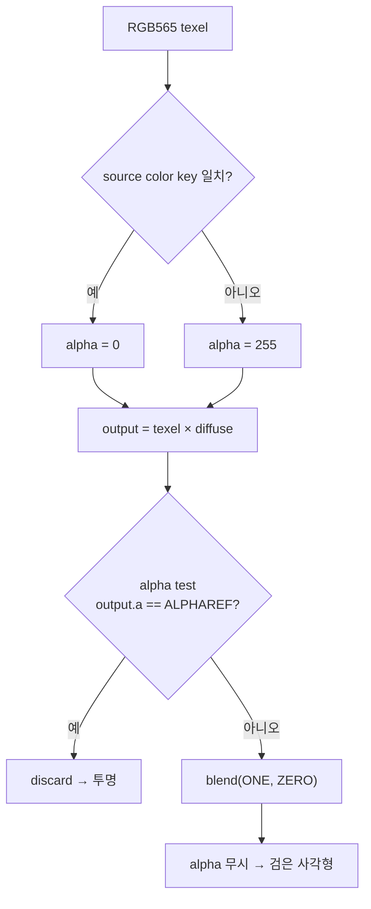
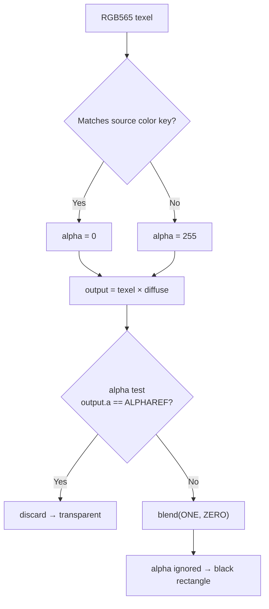

# 컬러키 discard 의미 복구 설계

관련 분석: [자산 로딩 경로](../analysis/ez2dj-asset-loading-path.md)

## 상태

**[완료]** 작업 074에서 `.str` 장면 스크립트가 복구된 뒤 Title 화면이 표시된다. 그러나 EZ2DJ 로고 sprite 뒤에 원본 BMP의 검은 배경이 불투명한 사각형으로 남는다. 배경 `bg.bmp`는 정상 표시되므로 합성 순서나 texture 내용 문제가 아니다.

## 확인된 원인

원본 자산 `System\Title\logo.bmp`는 24bpp 256×256이고 배경이 순수 검정 `(0, 0, 0)`이다. RGB565로 변환하면 `0x0000`이고, 실행 로그의 source color key도 `keylow=0x0000:keyhigh=0x0000`이다. 즉 키 값 자체는 맞다.

현재 OpenGL backend는 컬러키를 **alpha 채널에 굽는 방식**으로만 표현했다. texture upload에서 키에 일치하는 texel의 alpha를 `0`으로, 나머지를 `255`로 쓴다. 그리고 실제로 그 texel을 버리는 것은 fragment shader의 `u_alpha_test_enabled` 분기뿐이었다. 이 분기는 게스트의 `D3DRENDERSTATE_ALPHATESTENABLE`로 gate되고, 비교 대상이 **diffuse로 변조된 뒤의 alpha**이며, `ALPHAREF`와의 **부동소수 정확 일치**로 판정한다.

즉 컬러키라는 개념이 backend에 독립적으로 존재하지 않고, 게스트가 켠 alpha test의 부수 효과에 의존했다. 게스트가 blend factor를 `srcblend=D3DBLEND_ONE(2)`, `dstblend=D3DBLEND_ZERO(1)`인 단순 복사로 두면 alpha는 결과에 전혀 관여하지 않으므로, alpha test가 걸러내지 못한 keyed texel은 화면에 **검정 그대로 기록된다.**

DirectDraw `Blt` 경로는 이 문제가 없었다. `state.color_key_enabled`와 `state.alpha_test_enabled`를 둘 다 같은 값으로 설정했기 때문이다. 문제는 Direct3D `DrawPrimitive` 경로가 두 상태를 게스트가 준 대로 독립적으로 전달한다는 데 있다.

### 관찰된 게스트 상태 / Observed guest state

수정 후 실행 `20260827-022538-514`에서 `colorkey=`·`alphatest=` 진단으로 확인한 값이다.

| render state | 값 |
| --- | --- |
| `D3DRENDERSTATE_COLORKEYENABLE` (41) | `1` |
| `D3DRENDERSTATE_ALPHATESTENABLE` (15) | `1` (초기 `0`에서 전환) |
| `D3DRENDERSTATE_ALPHAREF` (24) | `0` |
| `D3DRENDERSTATE_ALPHAFUNC` (25) | `6` = `D3DCMP_NOTEQUAL` |

**미확정.** `ALPHAREF`가 `0`이므로 keyed texel의 변조 후 alpha도 `0`이 되어 기존 alpha test가 이론적으로는 걸러냈어야 한다. 그런데 실제 화면에는 불투명한 사각형이 남았다. 남은 후보는 magnification linear filter가 만드는 alpha 보간과 부동소수 정확 일치 판정의 상호작용, 그리고 변조 후 alpha를 쓰는 것과 texel 자신의 alpha를 쓰는 것의 차이다. 확정하려면 두 경로를 나눠 계측한 A/B 실행이 필요하다. 어느 쪽이든 컬러키를 alpha test의 부수 효과로 두는 구조 자체가 원인 조건이며, 수정은 그 구조를 없앤다.

## 수정 계약

Direct3D의 컬러키는 alpha blending이 아니다. `D3DRENDERSTATE_COLORKEYENABLE`이 켜져 있으면 키에 일치하는 texel은 **blend factor와 무관하게 버려진다.** 따라서 backend는 컬러키를 alpha 값 표현이 아니라 discard 조건으로 구현해야 한다.

1. fragment shader에 컬러키 활성 uniform을 추가하고, 활성일 때 **texel alpha**(diffuse 변조 전)가 임계값 미만이면 `discard`한다.
2. 이 discard는 게스트의 alpha test와 독립적이다. alpha test 분기는 기존 의미 그대로 남긴다.
3. 컬러키가 꺼진 draw는 동작이 바뀌지 않는다. 특히 `srcblend=ZERO`, `dstblend=SRCCOLOR`인 곱셈 mask pass는 keyed texel을 버리면 mask 자체가 무의미해지므로, 반드시 게스트의 `COLORKEYENABLE` 상태로만 gate한다.
4. `Blt` 경로가 컬러키를 alpha test로 흉내내던 설정을 제거하고 컬러키 상태만 남긴다. 같은 의미를 두 경로에서 한 가지 방식으로 표현한다.
5. `LateDraw` 진단에 게스트의 `COLORKEYENABLE` 값을 추가한다. 현재 로그의 `key=` 필드는 surface에 키가 붙어 있는지만 뜻하고 그 draw에서 키가 적용되는지는 알려주지 않는다.

원본 instruction과 자산은 변경하지 않는다. 공용 core의 컬러키 일치 판정은 그대로 쓴다.

## 검증

- x86/x64 warnings-as-errors build와 CTest로 회귀가 없는지 확인한다.
- 사용자 detached 재실행에서 로고 sprite의 검은 사각형이 사라지는지, 배경·mask 계층과 기존 마스킹이 회귀하지 않는지 확인한다.
- 새 로그의 `colorkey=` 필드로 sprite pass와 mask pass의 게스트 상태를 구분해 기록한다.

---

# Color-key Discard Semantics Design

Related analysis: [Asset Loading Path](../analysis/ez2dj-asset-loading-path.md)

## Status

**[Complete]** After Task 074 recovered `.str` scene scripts, the Title screen renders. However, the black background of the original BMP remains as an opaque rectangle behind the EZ2DJ logo sprite. The background `bg.bmp` renders correctly, so this is neither a composition-order nor a texture-content problem.

## Confirmed cause

The original asset `System\Title\logo.bmp` is a 24bpp 256×256 image whose background is pure black `(0, 0, 0)`. When converted to RGB565, it becomes `0x0000`, and the execution log reports the source color key as `keylow=0x0000:keyhigh=0x0000`. That is, the key value itself is correct.

The OpenGL backend expressed color keying **only by baking it into the alpha channel**: texture upload wrote alpha `0` for key-matching texels and `255` otherwise. The only thing that actually dropped such a texel was the fragment shader's `u_alpha_test_enabled` branch. This branch is gated on the guest's `D3DRENDERSTATE_ALPHATESTENABLE`, compares the **diffuse-modulated** alpha rather than the texel's own, and decides by **exact floating-point equality** with `ALPHAREF`.

In other words, the concept of color keying did not exist independently in the backend and depended on a side effect of an alpha test enabled by the guest. When the guest sets the blend factors to `srcblend=D3DBLEND_ONE(2)` and `dstblend=D3DBLEND_ZERO(1)` (a plain copy), alpha does not participate in the result at all; thus, keyed texels not filtered out by the alpha test are written to the screen **as black**.

The DirectDraw `Blt` path did not have this problem because it set both `state.color_key_enabled` and `state.alpha_test_enabled` to the same value. The issue lies in the Direct3D `DrawPrimitive` path forwarding the two states independently exactly as given by the guest.

### Observed guest state

Values confirmed through `colorkey=` and `alphatest=` diagnostics in post-fix execution `20260827-022538-514`.

| Render State | Value |
| --- | --- |
| `D3DRENDERSTATE_COLORKEYENABLE` (41) | `1` |
| `D3DRENDERSTATE_ALPHATESTENABLE` (15) | `1` (switched from initial `0`) |
| `D3DRENDERSTATE_ALPHAREF` (24) | `0` |
| `D3DRENDERSTATE_ALPHAFUNC` (25) | `6` = `D3DCMP_NOTEQUAL` |

**Unresolved.** Because `ALPHAREF` is `0`, a keyed texel's modulated alpha is also `0`, so in theory the existing alpha test should have filtered it out. However, an opaque rectangle remained on the actual screen. The remaining candidates are the interaction between alpha interpolation under the magnification linear filter and exact floating-point equality testing, and the difference between using modulated alpha vs. the texel's own alpha. Settling this would require an A/B run instrumented to measure both paths separately. Either way, the structure of treating color keying as a side effect of alpha test is the root condition, and the fix removes that structure.

## Fix contract

Direct3D color keying is not alpha blending. When `D3DRENDERSTATE_COLORKEYENABLE` is turned on, key-matching texels are **discarded regardless of blend factors**. Therefore, the backend must implement color keying as a discard condition rather than an alpha value representation.

1. Add a color-key active uniform to the fragment shader, and when active, `discard` if the **texel alpha** (before diffuse modulation) is below a threshold.
2. This discard is independent of the guest's alpha test. The alpha test branch retains its original semantics.
3. Draws with color keying turned off do not change behavior. In particular, multiplicative mask passes using `srcblend=ZERO` and `dstblend=SRCCOLOR` become meaningless if keyed texels are discarded, so they must be gated strictly on the guest's `COLORKEYENABLE` state.
4. Remove the configuration where the `Blt` path emulated color keying as an alpha test, leaving only the color-key state. Express the same meaning in one way across both paths.
5. Add the guest's `COLORKEYENABLE` value to the `LateDraw` diagnostic. The current log's `key=` field indicates only whether a key is attached to the surface, not whether the key is applied during that draw.

Original instructions and assets are not modified. The shared core's color-key match logic is reused as-is.

## Verification

- Confirm no regression with x86/x64 warnings-as-errors builds and CTest.
- Confirm in user detached re-runs that the logo sprite's black rectangle disappears and that background/mask layers and existing masking do not regress.
- Record guest state separately for sprite pass and mask pass using the new log's `colorkey=` field.
