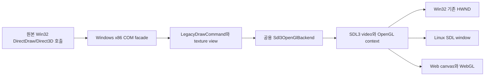

# SDL3/OpenGL 공용 백엔드 설계

## 상태

**구현 완료.** Windows x64 제품 빌드 설정을 제거하고, Win32 런타임의 WGL 전용 렌더러를 SDL3가 창·OpenGL 컨텍스트·함수 해석·present를 담당하는 공용 백엔드로 교체했다. 같은 백엔드 소스는 Win32, Linux, Web 빌드에 포함된다. Win32와 X11·Wayland가 활성화된 Linux desktop build·CTest, Linux x86-64/i386 helper 통합 probe가 통과했다. Web 전체 build에는 Emscripten SDK가 필요하다.

## 배경과 범위

현재 `Direct3d3OpenGlBackend`는 Windows 전용 디렉터리에서 `HWND`, `HDC`, `HGLRC`, WGL과 `opengl32`를 직접 사용한다. 이 구현은 플랫폼 중립 draw command를 받지만 context와 present 경계가 Windows에 고정되어 있어 Linux와 Web에서 재사용할 수 없다. SDL3는 이미 DirectSound HLE의 오디오 경계에 고정 버전으로 도입되어 있으므로, 같은 허용 라이선스 의존성을 비디오/OpenGL 경계에도 사용한다.

이 작업에서 제거하는 x64 설정은 별도 Windows x64 제품·CI 경로다. 64비트 Windows 호스트 지원은 WOW64에서 Win32 런타임을 실행하는 현재 경로로 유지한다. Linux x86-64 host와 i386 helper 검증 경로는 Linux 지원에 필요하므로 제거하지 않는다. x64 관찰용 소스는 역사적 분석 근거로 보존하되 기본 CMake target과 반복 실행 script에서는 제외한다.

## 구조

- 공용 backend header/source는 `include/re2dj/graphics/`와 `src/graphics/`에 둔다. Win32 또는 WGL type을 공개 계약에 넣지 않는다.
- 초기화 설정은 선택적 native window handle, 논리 창 크기와 제목만 전달한다. Win32에서는 SDL3의 `SDL_PROP_WINDOW_CREATE_WIN32_HWND_POINTER`로 원본이 만든 HWND를 감싼다. Linux와 Web은 native handle 없이 SDL window를 만들 수 있는 같은 경로를 사용한다.
- SDL3가 video subsystem, pixel/context attribute, `SDL_GLContext`, `SDL_GL_GetProcAddress`, drawable pixel size와 `SDL_GL_SwapWindow`를 소유한다. backend는 host OpenGL import library를 직접 링크하지 않는다.
- 데스크톱은 OpenGL 2.1 compatibility와 GLSL 1.20을 요청한다. Web은 OpenGL ES 2.0/WebGL 호환 context와 GLSL ES 1.00 shader를 선택한다. legacy draw/state/texture 변환 의미는 기존 구현과 동일하게 유지한다.
- platform-neutral legacy graphics state는 별도 static library로 분리해 `re2dj_core`, 공용 SDL backend와 Win32 injected runtime이 같은 구현을 링크하도록 한다.

## 빌드 정책

- SDL3 source pin과 zlib license 기록은 유지한다. SDL video/OpenGL 기능을 활성화하고 SDL_mixer는 Win32 x86 audio runtime에서만 가져온다.
- `windows-x64-debug`, `windows-x64-ninja`, Windows x64 CI와 이에 종속된 x64 helper 실행 script를 제거한다.
- Windows CI는 `Win32`를 구성해 실제 injected runtime과 SDL3/OpenGL backend를 검증한다.
- Linux와 Web 구성은 공용 backend target을 항상 컴파일하여 Windows type이나 WGL 의존성이 다시 유입되는 것을 막는다.

## 실패 정책과 수명

SDL video 초기화, window wrapping/creation, context creation, GL symbol loading, shader compile/link, draw와 swap 실패는 기존처럼 명시적 오류로 facade에 반환한다. SDL wrapper와 context는 backend가 소유하며, 외부 Win32 HWND는 SDL의 external-window 계약에 따라 파괴하지 않는다. texture cache는 context가 current인 동안 삭제하고 그 뒤 context와 SDL wrapper를 해제한다.

## 검증

1. Windows Win32 warnings-as-errors build와 CTest로 실제 facade 연결과 SDL static linkage를 확인한다.
2. Linux warnings-as-errors build와 CTest로 공용 backend가 WGL/Win32 header 없이 컴파일되는지 확인한다.
3. Emscripten Web build로 OpenGL ES shader/API 분기와 SDL video 구성을 확인한다.
4. 가능한 환경에서 기존 Win32 runtime probe를 dummy audio driver로 실행해 COM facade 회귀를 확인한다. 실제 원본 자산 실행과 시각 정확성은 별도 사용자 검증으로 남긴다.

Linux desktop 후속 검증에서 공용 graphics와 무관한 기존 VFS overlay 대소문자 테스트가 드러났다. Win32 게스트 경로는 host가 Linux여도 대소문자를 구분하지 않아야 하므로, 읽기 우선순위의 overlay 파일도 원본 HDD 해석과 같이 구성요소별 exact-match 우선·ASCII case-insensitive fallback으로 찾는다. 또한 보존되는 Linux i386 helper preset은 C와 C++ compiler check가 모두 32비트로 실행되도록 두 언어에 `-m32`를 지정한다.

---

# SDL3/OpenGL Shared Backend Design

## Status

**Implementation complete.** The Windows x64 product build configuration is removed, and the Win32 runtime's WGL-only renderer is replaced by a shared backend where SDL3 owns window integration, the OpenGL context, function resolution, and presentation. The same source is part of Win32, Linux, and Web builds. Win32 verification, the X11/Wayland-enabled Linux desktop build and CTest, and the Linux x86-64/i386 helper integration probe pass. A full Web build still needs the Emscripten SDK.

## Background and Scope

The current `Direct3d3OpenGlBackend` lives under the Windows platform directory and directly uses `HWND`, `HDC`, `HGLRC`, WGL, and `opengl32`. Although it consumes platform-neutral draw commands, its context and presentation boundary cannot be reused on Linux or the Web. SDL3 is already pinned under a permitted license for the DirectSound HLE audio boundary, so the same dependency will also provide the video/OpenGL boundary.

The x64 configuration removed here is the separate Windows x64 product and CI path. Support for a 64-bit Windows host remains through the current Win32 runtime running under WOW64. The Linux x86-64 host and i386 helper validation path remains because it is required by the Linux target. Historical x64 observation sources remain as analysis evidence but are no longer default CMake targets or repeatable scripts.

## Structure

The shared backend header and source live under `include/re2dj/graphics/` and `src/graphics/`, with no Win32 or WGL types in the public contract. Initialization accepts only an optional native window handle, logical dimensions, and a title. On Win32, SDL wraps the original HWND through `SDL_PROP_WINDOW_CREATE_WIN32_HWND_POINTER`; Linux and Web can use the same path without a native handle to create an SDL window.

SDL3 owns video initialization, context attributes, `SDL_GLContext`, `SDL_GL_GetProcAddress`, drawable pixel-size queries, and `SDL_GL_SwapWindow`. Desktop builds request OpenGL 2.1 compatibility with GLSL 1.20, while Web requests an OpenGL ES 2.0/WebGL-compatible context with GLSL ES 1.00 shaders. The existing legacy draw, state, texture-cache, color-key, and blending semantics remain unchanged. Platform-neutral legacy graphics code becomes a dedicated static library shared by `re2dj_core`, the SDL backend, and the Win32 injected runtime.

## Build Policy

Keep the pinned SDL3 source and zlib-license record, enable SDL video/OpenGL, and fetch SDL_mixer only for the Win32 x86 audio runtime. Remove the `windows-x64-debug` and `windows-x64-ninja` presets, Windows x64 CI job, and scripts tied to that helper build. Windows CI configures `Win32` so it validates the actual injected runtime. Linux and Web always compile the shared backend target to prevent Win32 or WGL dependencies from returning.

## Failure Policy and Lifetime

SDL video, window wrapping/creation, context creation, GL symbol loading, shader compilation/linking, drawing, and swapping return explicit errors to the facade. The backend owns its SDL wrapper and context; SDL's external-window contract preserves the wrapped HWND. Cached textures are deleted while the context is current, followed by context and SDL-wrapper teardown.

## Verification

Verify a warnings-as-errors Win32 build and CTest, a warnings-as-errors Linux build and CTest, and an Emscripten Web build. Run the existing Win32 runtime probe with the dummy audio driver where the host environment permits it. Original-asset execution and visual accuracy remain separate user validation.

Follow-up Linux desktop verification exposed a pre-existing VFS overlay case test unrelated to graphics. Guest Win32 paths must remain case-insensitive on a Linux host, so overlay lookup uses exact component matches first and an ASCII case-insensitive fallback, matching original-HDD resolution. The retained Linux i386 helper preset also applies `-m32` to both C and C++ compiler checks.
