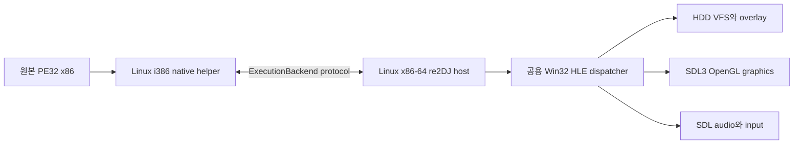

# Linux 원본 실행 경로 설계

## 상태

**구현 진행 중.** Linux x86-64 host와 production i386 helper의 합성 PE32 실행, import gate IPC와 CLI 제품 진입점이 검증됐다. 다음 단계는 Win32 process bootstrap과 공용 Win32 HLE를 추가해 원본 `ez2dj1.exe`와 최종적으로 보호된 `ez2dj.exe`를 실행하는 것이다.

## 목표와 대상 순서

Linux에서도 원본 32비트 x86 코드를 실행 주체로 유지한다. Linux x86-64 host는 HDD/VFS, Win32 HLE와 SDL 서비스를 소유하고, 별도 i386 helper가 PE32 코드와 guest thread를 native x86로 실행한다. Wine, QEMU 또는 게임 로직 재구현은 사용하지 않는다.

첫 bring-up 대상은 보호되지 않은 `ez2dj1.exe`다. 고정 image base, Win32 ABI, import, callback, thread와 DirectX HLE를 이 대상에서 안정화한 뒤 캐비닛 실행 대상인 보호된 `ez2dj.exe`의 self-modifying code, LPTDI 환경과 raw I/O 경계를 추가한다. `ez2dj1.exe` 관찰을 원본 캐비닛 동작으로 오인하지 않는다.

## 선택한 구조

- i386 helper는 requested-base PE mapping, section protection, guest stack/TEB/PEB, FS, guest thread와 fault context를 소유한다.
- x86-64 host는 guest address를 host pointer로 해석하지 않는다. 모든 문자열·구조체·buffer 접근은 `ExecutionBackend` memory API를 사용한다.
- 공용 HLE dispatcher는 `{module, name/ordinal, calling convention, ABI signature, handler}` table과 guest handle/object registry를 소유한다.
- USER32 handle과 DirectX COM object는 guest-visible 32비트 token과 vtable로 표현하고 host-side object state에 연결한다.
- SDL3/OpenGL과 audio device는 x86-64 host에 유지한다. i386 SDL package 의존성을 추가하지 않으며 같은 service 경계를 향후 Web backend에서도 재사용한다.
- Windows 전용 facade는 확인된 의미와 회귀 기준으로 사용하되 Windows type과 host pointer를 공용 HLE에 복사하지 않는다.

## 단계

1. **제품 실행 진입점.** probe helper를 production target으로 분리하고 Linux CLI의 `--run`을 `NativeHelperBackend`에 연결한다. 원본 image를 선호 주소에 mapping하고 첫 import, fault 또는 process exit를 구조화해 보고한다.
2. **Win32 process bootstrap.** guest stack, TEB/PEB, FS selector, process parameters, environment와 last-error/TLS 기본값을 만든다. section protection과 signal fault event를 적용한다.
3. **공용 import HLE.** 7 DLL·144 import의 metadata table, 안전한 ABI marshalling, guest memory allocation/protection, handle과 virtual module registry를 구현한다. 미구현 import는 이름과 guest context를 남기고 통제 종료한다.
4. **kernel32·USER32·VFS·GDI.** CRT 시작, command line, heap, 파일/INI, directory enumeration, logical window/message queue와 display-mode HLE를 구현해 창과 첫 자산 접근까지 진행한다.
5. **callback과 multithreading.** guest WndProc 호출, nested import, `CreateThread`, TLS, critical section, event/wait/sleep과 thread별 pending context를 구현한다.
6. **DirectX·audio·input.** guest COM vtable/gate를 공용 facade로 만들고 기존 legacy graphics/audio 상태를 SDL3/OpenGL, SDL audio와 input service에 연결한다. 정확성 검증 뒤 IPC 병목만 측정해 최적화한다.
7. **보호된 `ez2dj.exe`.** self-modifying section, LPTDI `DeviceIoControl` 환경 응답, 확인된 raw I/O와 dynamic import/fault 경계를 지원하고 Windows 진행 지점과 비교한다.
8. **제품화.** helper 자동 탐색·staging, overlay CLI, 종료/로그 정책, synthetic CI와 원본 자산 없는 회귀 테스트, 사용자 실행 가이드를 완성한다.

## protocol과 backend 확장 원칙

현재 protocol v3의 단일 pending event와 4 KiB stack window는 bootstrap probe에는 충분하지만 원본 실행에는 부족하다. 확장은 capability handshake 뒤에 version을 올리고 다음 계약을 독립적으로 추가한다.

- 검증된 mapped range의 chunked read/write
- reserve/commit/protect/free guest memory
- guest function callback과 callback 중첩 import
- thread create/exit와 event별 completion routing
- signal fault, privileged instruction과 stop reason

공용 HLE는 전송 방식이나 POSIX handle을 알지 않는다. 초기 구현은 정확성을 위해 pipe와 bounded copy를 사용하고, frame/texture 전송이 실제 병목으로 측정된 뒤에만 shared-memory command transport를 검토한다.

## 완료 기준

- Linux command가 사용자가 지정한 HDD와 overlay만 사용해 `ez2dj1.exe`, 이후 `ez2dj.exe`를 실행한다.
- 원본 x86 instruction이 helper에서 실행되고 모든 Win32/DirectX 경계는 import gate 또는 확인된 raw-I/O trap으로만 HLE에 진입한다.
- 같은 dump의 Windows/Linux 실행이 같은 안정 진행 지점, 핵심 API 순서와 frame 상태를 보인다.
- 창, 자산 읽기, overlay 쓰기, 그래픽, 오디오와 입력이 Linux에서 동작하며 원본 HDD는 변경되지 않는다.
- synthetic fixture와 단위 테스트는 원본 자산 없이 CI에서 통과한다.

---

# Linux Original-Executable Path Design

## Status

**Implementation in progress.** Synthetic PE32 execution, import-gate IPC, and the CLI product entry point between the Linux x86-64 host and production i386 helper are verified. The next step adds Win32 process bootstrap and shared Win32 HLE to execute the original `ez2dj1.exe`, followed by the protected `ez2dj.exe`.

## Goal and Target Order

Original 32-bit x86 code remains the executing subject on Linux. The x86-64 host owns HDD/VFS, Win32 HLE, and SDL services; a separate i386 helper executes PE32 code and guest threads natively. Wine, QEMU, and gameplay reimplementation are excluded.

The unprotected `ez2dj1.exe` is the bring-up target. Fixed-base mapping, Win32 ABI state, imports, callbacks, threads, and DirectX HLE are stabilized there before adding the protected cabinet executable's self-modifying code, LPTDI environment, and raw-I/O boundaries. Observations from the bring-up build are not automatically treated as cabinet behavior.

## Selected Structure

The i386 helper owns requested-base mapping, section protections, guest stack/TEB/PEB and FS state, guest threads, and fault contexts. The x86-64 host never treats guest addresses as host pointers; all marshalling goes through `ExecutionBackend`. A shared HLE dispatcher owns module/function ABI tables and guest handle/object registries. Guest-visible USER32 and DirectX objects use 32-bit tokens and vtables backed by host-side state. SDL graphics, audio, and input stay in the x86-64 host so no i386 SDL dependency is introduced and the service boundary can later be reused by Web.

## Phases

1. Promote the helper to a product target, connect Linux `--run`, and report the first import, fault, or process exit.
2. Add guest stack, TEB/PEB, FS, process parameters, section protection, and signal fault events.
3. Add the seven-DLL/144-import shared dispatcher, ABI marshalling, guest memory operations, and handle/module registries.
4. Implement kernel32, USER32, VFS, INI, directory, GDI, window, message, and display bootstrap through the first asset read.
5. Add guest callbacks, nested imports, threads, TLS, critical sections, events, waits, and sleeps.
6. Connect shared guest COM facades to SDL3/OpenGL, SDL audio, and input, optimizing transport only after measurement.
7. Add protected-`ez2dj.exe` self-modification, LPTDI environment behavior, confirmed raw I/O, dynamic imports, and fault handling.
8. Complete helper discovery/staging, overlay CLI, diagnostics, asset-free CI, and the user execution guide.

## Backend Evolution

Protocol v3's single pending event and 4 KiB stack window are insufficient for the original. A capability-negotiated version adds validated chunked memory access, guest allocation/protection, callback invocation with nested imports, multi-thread completion routing, and fault/privileged-instruction events. Shared HLE remains independent of transport and POSIX handles. Pipes and bounded copies come first; shared-memory transport is considered only after a measured rendering or texture bottleneck.

## Completion Criteria

Linux executes user-supplied `ez2dj1.exe` and then `ez2dj.exe` with original x86 instructions in the helper and only import gates or confirmed raw-I/O traps crossing into HLE. Windows and Linux reach the same stable boundary with comparable API order and frame state. Windowing, assets, overlay writes, graphics, audio, and input work without modifying the HDD, while asset-free synthetic and unit tests remain green in CI.
