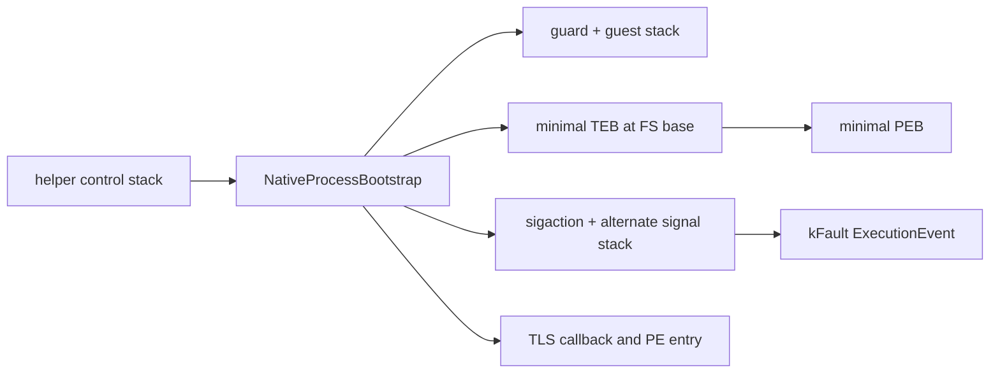

# Linux guest process bootstrap 설계

## 상태

**구현 완료.** production helper의 main guest thread에 guard-page stack, 최소 TEB/PEB, FS selector와 구조화된 signal fault 경계를 적용했다.

## 목표

i386 helper 안에 단일 main guest thread용 process bootstrap을 만들고, 원본 x86 entry와 TLS callback을 guard page가 있는 전용 stack에서 실행한다. Win32 startup code가 기대하는 최소 TEB/PEB와 FS selector를 제공하고, guest 실행 중 발생한 CPU fault를 protocol v3 `kFault` event의 signal/status, EIP와 ESP로 보고한다.

## 구조

- 별도 Linux 전용 subsystem이 guest stack, TEB/PEB mapping, FS descriptor, alternate signal stack과 handler lifetime을 소유한다.
- TEB는 `ExceptionList`, `StackBase`, `StackLimit`, `Self`, `ProcessEnvironmentBlock`, `LastErrorValue`의 확인된 Win32 x86 offset만 채운다. 나머지는 0으로 둔다.
- PEB는 `ImageBaseAddress`와 자기 process parameters pointer를 위한 최소 storage만 제공한다. command line과 environment의 실제 layout은 공용 kernel32 bootstrap 작업에서 추가한다.
- TLS callback과 entry는 같은 guest stack과 FS 환경에서 순차 실행한다. helper control/IPC 코드는 원래 Linux stack에서만 실행한다.
- `SIGSEGV`, `SIGBUS`, `SIGILL`, `SIGFPE`, `SIGTRAP`은 alternate signal stack에서 register context를 저장하고 helper control stack으로 복귀한 뒤 event를 전송한다. signal handler 안에서는 pipe I/O를 하지 않는다.
- protocol packet layout은 바꾸지 않는다. 기존 `ExecutionEvent`의 `status_code`, `instruction_pointer`, `stack_pointer`를 사용한다.

## 안전 경계

초기 범위는 main guest thread 하나뿐이다. callback 중첩, guest-created thread와 structured exception handling은 후속 protocol/thread 작업으로 남긴다. fault 뒤에는 guest 실행을 재개하지 않고 helper가 event를 보낸 다음 종료한다. TEB/PEB의 미확인 field를 실제 Windows 값처럼 꾸미지 않는다.

## 검증

기존 synthetic PE32 TLS callback이 FS self pointer와 TEB stack bounds 안의 ESP를 확인하도록 확장한다. 기존 named/ordinal import와 result 51 회귀를 유지하고, Linux 전용 fault fixture가 invalid instruction의 정확한 EIP, nonzero guest ESP와 `SIGILL`을 받는지 검증한다.

---

# Linux Guest Process Bootstrap Design

## Status

**Implemented.** The production helper's main guest thread now uses a guarded stack, minimal TEB/PEB, an FS selector, and structured signal-fault reporting.

## Goal

Create a single-main-thread process bootstrap inside the i386 helper. Execute original x86 entry code and TLS callbacks on a dedicated guarded stack, provide the minimal TEB/PEB and FS selector expected by Win32 startup code, and report CPU faults through protocol-v3 `kFault` events with signal/status, EIP, and ESP.

## Structure

A dedicated Linux-only subsystem owns the guest stack, TEB/PEB mappings, FS descriptor, alternate signal stack, and handler lifetime. The TEB populates only the confirmed x86 Win32 offsets for `ExceptionList`, `StackBase`, `StackLimit`, `Self`, `ProcessEnvironmentBlock`, and `LastErrorValue`; all other fields remain zero. The PEB provides `ImageBaseAddress` and minimal storage for a future process-parameters pointer. Actual command-line and environment layouts belong to the later shared kernel32 bootstrap task.

TLS callbacks and entry code execute sequentially under the same guest stack and FS environment, while helper control and IPC stay on the Linux stack. `SIGSEGV`, `SIGBUS`, `SIGILL`, `SIGFPE`, and `SIGTRAP` capture registers on an alternate signal stack and return to the helper control stack before sending IPC. The protocol layout does not change.

## Safety Boundary

This phase supports only the main guest thread. Nested callbacks, guest-created threads, and structured exception handling remain later protocol/thread work. Guest execution never resumes after a fault. Unverified TEB/PEB fields are not fabricated as Windows facts.

## Verification

Extend the synthetic PE32 TLS callback to validate the FS self pointer and that ESP lies within TEB stack bounds. Preserve named/ordinal imports and result 51, and add a Linux-only fault fixture that verifies the exact invalid-instruction EIP, a nonzero guest ESP, and `SIGILL`.
