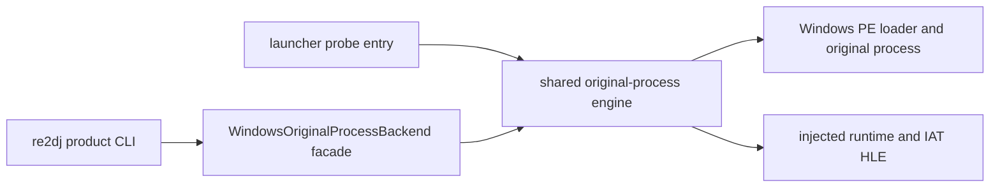

# Win32 제품 loader 통합 설계

## 상태

**구현 완료.** 원본-process 실행 engine을 공용 static backend로 추출하고, 일반 `re2dj --run`과 진단 launcher가 같은 engine을 사용하도록 연결했다.

## 목표

사용자는 `re2dj.exe --hdd <dir> --target ez2dj1stse --run`으로 원본을 실행한다. 내부에서는 Windows가 원본 PE를 main image로 적재하는 검증된 방식을 유지하고, `WindowsOriginalProcessBackend`가 runtime 주입, HLE 준비, IAT 검증, debugger detach와 종료 대기를 조율한다. 원본 x86 코드가 계속 주 실행 경로이며 custom manual mapping으로 바꾸지 않는다.

## 선택한 구조

- 기존 거대 launcher source를 static backend library로 옮긴다. process/debug/runtime injection 동작은 이번 단계에서 변경하지 않는다.
- 기존 `re2dj_windows_x86_launcher_probe`는 진단 옵션 호환성을 위해 얇은 `main` entry로 유지하고 shared engine을 호출한다.
- 제품 facade는 filesystem path와 target ID를 받는 typed API다. 기존 engine의 진단 parser는 library 내부 compatibility boundary로 남기고 facade가 현재 canonical 실행 옵션을 구성한다.
- 첫 제품 지원 profile은 실제 캐비닛 대상과 현재 detached runtime이 검증된 `ez2dj1stse`로 제한한다. 다른 target은 추정 실행하지 않고 명시적 오류를 반환한다.
- canonical 정책은 command line, Windows directory, VFS/overlay, DirectDraw/Direct3D 3, DirectSound, legacy I/O port, detached runtime과 확인된 LPTDI target state를 활성화한다.
- CLI가 이미 수행하는 scan 결과와 engine 내부 검증은 초기 단계에서 중복될 수 있다. 다음 구조 작업에서 resolved target/config object를 engine에 직접 전달해 제거한다.

## 오류와 종료 계약

typed facade의 입력 검증 실패는 실행 전에 오류 문자열로 반환한다. engine이 시작된 뒤에는 기존 launcher exit code와 JSONL 진단을 보존하며 제품 CLI가 그 code를 그대로 반환한다. 원본 HDD는 계속 읽기 전용이고 write는 `overlays/<target-id>`로 간다.

## 검증

- Windows Win32 warnings-as-errors 전체 build와 CTest를 실행한다.
- `re2dj --help`가 Windows `--run` 지원과 현재 target 제한을 표시하는지 확인한다.
- 원본 자산 없이 facade의 argument construction과 unsupported-target 오류를 단위 검증한다.
- 실제 원본 실행은 사용자 제공 HDD에서 기존 canonical command와 `re2dj --run`의 화면·로그·종료를 비교하는 후속 사용자 검증으로 둔다.

---

# Win32 Product Loader Integration Design

## Status

**Implemented.** The original-process engine is now a shared static backend used by both ordinary `re2dj --run` and the diagnostic launcher.

## Goal

Users launch the original through `re2dj.exe --hdd <dir> --target ez2dj1stse --run`. Internally, Windows continues to map the original PE as the main image. `WindowsOriginalProcessBackend` orchestrates runtime injection, HLE preparation, IAT verification, debugger detach, and process completion. Original x86 remains the executing subject; this task does not replace the path with custom manual mapping.

## Selected Structure

Promote the existing launcher source into a static backend library without changing its process/debug/injection behavior. Keep `re2dj_windows_x86_launcher_probe` as a thin diagnostic-compatible entry calling the shared engine. Add a typed facade accepting a filesystem path and target ID; it constructs the currently canonical execution policy while the legacy diagnostic parser remains an internal compatibility boundary.

Initial product support is limited to the verified cabinet profile `ez2dj1stse`. Other targets fail explicitly rather than inheriting an unverified policy. The canonical policy enables command-line and Windows-directory HLE, VFS/overlay, DirectDraw/Direct3D 3, DirectSound, legacy I/O ports, detached execution, and the confirmed LPTDI target state. Duplicate CLI and engine scanning is accepted for this first extraction and removed later by passing resolved configuration directly.

## Error and Exit Contract

Typed-facade validation failures return an error before execution. Once the engine starts, existing launcher exit codes and JSONL diagnostics remain intact and the product CLI returns that code unchanged. The original HDD remains read-only and writes continue under `overlays/<target-id>`.

## Verification

Run the warnings-as-errors Win32 build and CTest. Verify Windows help text, asset-free argument construction, and unsupported-target handling. Comparing actual display, logs, and exit behavior between the canonical launcher command and `re2dj --run` remains a user-supplied-HDD validation.
