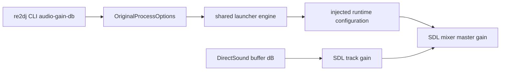

# Win32 오디오 master gain 설계

## 상태

**구현 완료.** 실제 제품 loader 실행에서 확인된 낮은 출력 음량에 대해 독립 master gain과 CLI 조절 경로를 추가했다.

## 원인 경계

DirectSound buffer volume은 1/100 dB 단위이며 현재 backend의 `10^(volume/2000)` 변환은 이 계약과 일치한다. 이 값을 임의로 바꾸면 buffer별 상대 음량이 깨진다. 반면 원본은 별도의 WINMM mixer API로 캐비닛 master volume도 제어하지만, 현재 SDL 출력에는 이에 대응하는 독립 master gain 계층이 없다.

이번 작업은 WINMM mixer 구조 전체를 추정 구현하지 않는다. DirectSound buffer gain을 보존한 채 SDL mixer 최종 출력에 host master gain을 추가한다. 실제 WINMM 호출 순서와 control ID는 별도 trace로 확인한 뒤 HLE한다.

## 제품 정책과 전달 구조

`re2dj --audio-gain-db <dB>`를 Win32 제품 실행 옵션으로 추가한다. 기본값은 보수적인 `+6 dB`이며 허용 범위는 `-24`에서 `+18 dB`다. `0`은 보정 없음이다.

제품 facade는 dB 값을 기존 launcher의 내부 option으로 전달한다. launcher는 이를 linear gain으로 변환해 runtime export에 기록한다. DirectSound backend가 처음 생성될 때 `MIX_SetMixerGain`으로 master gain을 적용한다. track gain, pan, frequency와 duplicate buffer 계약은 변경하지 않는다.

## 검증

- asset-free product policy probe가 기본 `+6 dB`와 사용자 지정 값을 전달하는지 검사한다.
- runtime probe가 설정된 linear master gain이 SDL mixer에 적용되는지 dummy audio driver로 검사한다.
- Win32 warnings-as-errors build와 CTest를 실행한다.
- 사용자는 실제 HDD에서 기본 `+6 dB`를 듣고 필요하면 `0`, `12` 등으로 조절해 클리핑과 체감 음량을 확인한다.

---

# Win32 Audio Master Gain Design

## Status

**Implemented.** Independent master gain and CLI adjustment are implemented for the low output volume observed in a user product-loader run.

## Cause Boundary

DirectSound buffer volume uses hundredths of a decibel, and the current `10^(volume/2000)` conversion matches that contract. Changing it would corrupt relative per-buffer levels. The original separately uses WINMM mixer APIs to control cabinet master volume, but the current SDL output has no corresponding independent master-gain layer.

This task does not guess the complete WINMM mixer structure. It adds host master gain to the final SDL mix while preserving DirectSound buffer gain. WINMM call order and control IDs remain subject to a separate runtime trace before HLE implementation.

## Product Policy and Transport

Add `re2dj --audio-gain-db <dB>` as a Win32 product option. The conservative default is `+6 dB`, the accepted range is `-24` through `+18 dB`, and `0` disables compensation.

The product facade forwards the dB value through an internal launcher option. The launcher converts it to linear gain and writes a runtime export. When the DirectSound backend is first created, it applies the value with `MIX_SetMixerGain`. Track gain, pan, frequency, and duplicate-buffer contracts remain unchanged.

## Verification

Verify default `+6 dB` and custom argument transport in the asset-free product policy probe. Verify application of configured linear master gain in the runtime probe with the dummy audio driver. Run the warnings-as-errors Win32 build and CTest. A user run then checks perceived loudness and clipping at the default, with `0` and `12` available for comparison.
