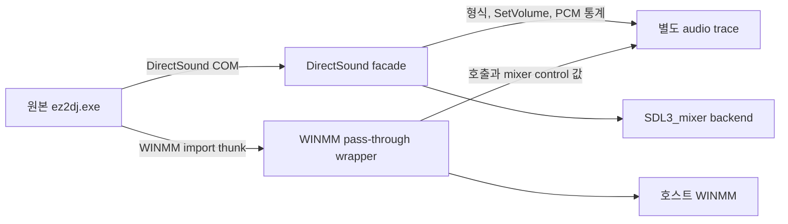

# Win32 오디오 음량 추적 설계

## 한국어

### 목적

원본 WAV를 직접 재생했을 때보다 현재 DirectSound HLE 출력이 작게 들리는 원인을 추정이 아니라 실행 증거로 구분한다. 원본 실행 파일의 코드는 변경하지 않고 Win32 import thunk와 DirectSound COM facade 경계에서 관찰한다.

### 관찰 범위

- DirectSound buffer 생성 시 primary/secondary 구분, 크기, PCM 형식을 기록한다.
- `IDirectSoundBuffer::SetVolume`의 원본 1/100 dB 값과 변환된 선형 gain을 기록한다.
- buffer 최초 재생 시 HLE에 전달된 PCM의 peak와 RMS를 기록한다. 샘플 전체나 원본 자산 바이트는 기록하지 않는다.
- 원본 실행 파일의 WINMM mixer import를 동작을 보존하는 runtime wrapper로 교체하고 호출 결과, control ID/type/bounds, 읽고 쓴 scalar 값을 제한적으로 기록한다.

### 추적 파일과 안전성

`--audio-volume-trace`를 지정하면 launcher 진단 로그 옆에 별도 `.audio.log` 파일을 만든다. injected runtime export로 경로만 전달하며, 원본 HDD 디렉터리에는 쓰지 않는다. 로그는 호출별 요약만 남기고 전체 행 수와 배열 원소 수를 제한한다. 잘못된 guest 포인터는 현재 프로세스에 대한 안전한 복사 결과로 판별하고 역참조 실패 자체만 기록한다.

### 제품 실행 통합

제품 CLI와 `OriginalProcessOptions`에 `--audio-volume-trace`를 추가한다. 이 옵션은 DirectSound HLE를 사용하는 Win32 제품 실행에만 적용하며 detached 실행에서도 유지한다. launcher는 runtime export 준비와 WINMM IAT 교체가 모두 성공한 경우에만 추적 준비 완료로 판단한다.

### 판정 기준

- PCM peak/RMS가 원본 WAV와 일치하지만 `SetVolume`이 음수이면 원본 게임의 buffer 감쇠 경로를 우선 원인으로 본다.
- `SetVolume`이 0 dB인데 PCM 자체가 작으면 로드/변환 전 단계 또는 자산 자체의 레벨을 추가 비교한다.
- WINMM이 큰 master 값을 쓰지만 현재 SDL 출력에 동등한 의미가 없으면 WINMM master-volume 의미 누락을 원인 후보로 본다.
- 여러 경로가 동시에 나타나면 각각을 분리하여 기록하고, +12 dB를 고정 정답으로 간주하지 않는다.

### 검증

자산 없는 runtime probe에서 DirectSound 생성, volume 설정, 재생 후 trace 필드를 검사한다. Win32 전체 빌드와 CTest를 수행한 뒤 사용자가 지정한 HDD 경로에서 실제 타이틀을 한 번 실행하여 관찰값을 분석 문서에 반영한다.

## English

### Purpose

Distinguish, using runtime evidence rather than assumptions, why the current DirectSound HLE output sounds quieter than direct playback of the original WAV. The original executable remains unchanged; observation occurs at Win32 import thunks and the DirectSound COM facade boundary.

### Observation scope

- Record primary/secondary classification, size, and PCM format when a DirectSound buffer is created.
- Record the original hundredth-decibel value passed to `IDirectSoundBuffer::SetVolume` and its converted linear gain.
- Record PCM peak and RMS on the first playback of each buffer. Never record complete samples or original asset bytes.
- Replace the original executable's WINMM mixer imports with behavior-preserving runtime wrappers and record bounded call results, control IDs/types/bounds, and scalar values read or written.

### Trace file and safety

With `--audio-volume-trace`, the launcher creates a separate `.audio.log` beside its diagnostic log. Only the path is passed through an injected-runtime export, and nothing is written to the original HDD directory. Logs are bounded by line and array-element limits. Guest pointers are inspected through safe current-process copies; failed reads are logged without direct unsafe dereferencing.

### Product integration

Add `--audio-volume-trace` to the product CLI and `OriginalProcessOptions`. It applies only to Win32 product execution using DirectSound HLE and remains active for detached execution. The launcher considers tracing ready only after both the runtime export and WINMM IAT replacements are prepared.

### Interpretation

- Matching PCM statistics plus negative `SetVolume` values indicate the game's per-buffer attenuation path.
- A 0 dB buffer with already-low PCM points to an earlier load/conversion stage or the asset level itself.
- A large WINMM master value without equivalent SDL semantics indicates a missing WINMM master-volume meaning.
- If multiple paths occur, record them separately instead of treating +12 dB as a fixed answer.

### Verification

An asset-free runtime probe checks trace fields after DirectSound creation, volume changes, and playback. After a full Win32 build and CTest, run the real title once from the user-supplied HDD directory and record observations in the analysis documentation.
