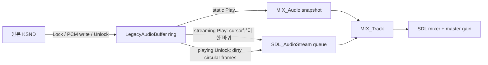

# DirectSound streaming/ring-buffer 동기화 설계

## 한국어

### 상태와 목적

**구현 및 원본 실행 검증 완료.** 작업 082는 원본 `title.wav`의 전체 RMS가 `-9.29 dBFS`인 반면 현재 SDL backend가 반복하는 첫 360,448바이트 snapshot은 `-22.44 dBFS`임을 확인했다. 원본은 Play 뒤에도 같은 DirectSound ring buffer를 계속 `Lock/Unlock`하여 더 큰 후속 PCM을 기록하지만 backend는 최초 `MIX_Audio` 복사본을 갱신하지 않았다.

이번 작업은 원본 WAV decode와 DirectSound buffer별 volume을 바꾸지 않는다. 정적 효과음과 streaming buffer를 분리하고 재생 중 ring write를 SDL 출력 순서에 반영한다.

### 확인 상태와 분류

- **확인됨:** 관찰된 streaming descriptor는 `DSBCAPS_LOCHARDWARE`를 포함한 flags `0x140c6`, 360,448바이트, 44.1 kHz stereo 16-bit이며 `DSBPLAY_LOOPING`으로 재생된다.
- **확인됨:** 정적 sound bank descriptor는 flags `0x140e2`이며 최초 전체 upload 뒤 재사용된다.
- **확인됨:** 첫 작업 083 실행에서 원본은 play cursor가 약 44–46KB씩 전진하는 동안 매번 `DSBLOCK_ENTIREBUFFER`로 전체 360,448바이트를 Lock/Unlock했다. 따라서 Unlock 인자 길이는 실제 새 PCM 길이가 아니다.
- **추정:** 원본 streaming writer는 전체 lock 안에서 play cursor보다 앞선 일부 ring frame을 시간 순서대로 갱신한다. 이전 committed snapshot과 비교한 dirty circular 구간 및 queue 크기로 이를 확인한다.
- **미확정:** 다른 게임 버전이 `DSBCAPS_LOCHARDWARE` 없이 같은 streaming 계약을 사용하는지 여부다. 따라서 첫 구현은 관찰된 descriptor에 한정한다.

### backend 구조

각 voice는 정적 `MIX_Audio` 또는 streaming `SDL_AudioStream` 중 하나만 소유한다. streaming Play는 pending queue를 비우고 현재 DirectSound cursor부터 ring 끝, ring 시작부터 cursor 직전까지 한 바퀴를 복사하며 committed snapshot을 남긴다. 이후 성공한 Unlock은 현재 ring과 snapshot을 PCM frame 단위로 비교한다. 변경 frame 사이의 가장 큰 원형 unchanged gap을 제외한 최소 circular 구간만 시간 순서대로 stream에 추가하고 snapshot을 갱신한다. 이 방식은 전체-buffer Lock 안의 실제 부분 write와 wrap-around를 함께 보존한다. `SDL_PutAudioStreamData`가 자체 복사하므로 guest write memory와 mixer thread가 같은 바이트를 동시에 읽지 않는다.

streaming track에는 SDL 자체 파일 loop를 사용하지 않는다. 원본 writer가 공급하는 연속 PCM queue가 loop 의미를 대신한다. 일시적으로 공급이 늦어지면 stream은 silence를 내고 다음 Unlock에서 계속되며, 오래된 ring snapshot을 임의로 반복하지 않는다.

### cursor와 상태

- `GetCurrentPosition`은 track이 소비한 frame 수에 Play 시작 cursor를 더하고 buffer 크기로 나눈 play cursor를 반환한다.
- streaming `SetCurrentPosition`은 다음 Play의 시작점을 바꾼다. 재생 중이면 queue와 track을 현재 위치에서 다시 시작한다.
- `Stop`은 backend cursor를 neutral buffer에 보존한 뒤 track을 멈춘다. restart는 보존 cursor에서 ring 한 바퀴를 다시 큐잉한다.
- duplicate buffer는 shared PCM과 독립 cursor/volume/pan/frequency/Play 상태라는 기존 계약을 유지한다. 각 duplicate voice의 stream queue는 독립적이다. 한 facade의 이미 큐잉된 PCM을 다른 facade의 write로 소급 교체하는 것은 이번 관찰 범위에 포함하지 않으며 별도 증거가 생기면 확장한다.

### 실패와 제한

stream 생성, track 연결, initial queue 또는 Unlock queue 추가가 실패하면 DirectSound facade는 `DSERR_GENERIC`을 반환하고 SDL 오류를 bounded trace에 남긴다. queue 크기와 Unlock 진단은 제한적으로 기록하며 PCM 원문은 기록하지 않는다. 원본 HDD는 계속 읽기 전용이다.

### 검증

1. neutral ring lock의 wrap 순서와 duplicate 상태 회귀를 단위 테스트한다.
2. dummy audio runtime probe에서 static snapshot과 streaming queue를 구분하고 Play, Unlock, cursor, Stop/restart를 검증한다.
3. Windows x86 전체 build와 CTest를 수행한다.
4. 사용자 제공 HDD를 `--audio-gain-db 0 --audio-volume-trace`로 실행하여 lock offset 진행, queue 반영, 후속 PCM peak/RMS와 전체 곡 진행을 확인한다.
5. 0 dB 실제 청취 결과 뒤 임시 기본 `+6 dB` master gain의 유지·축소·제거를 결정한다.

최종 실행 `20260828-151817-074.audio.log`는 64회 streaming Unlock 중 57회를 정확히 45,056바이트 dirty 청크로 분리했다. offset은 0부터 315,392까지 45,056바이트 간격으로 순환했고 SDL queue는 251,160–358,684바이트로 안정됐다. 같은 실행의 AV와 OpenGL 오류는 0건이다. 자동·실행 증거가 현재 `+6 dB` 기본값 자체의 회귀를 보이지 않으므로 값을 유지하되, 더 큰 보정은 적용하지 않고 사용자 청취 재검증 항목으로 남긴다.

## English

### Status and purpose

**Implemented and verified with the original executable.** Task 082 confirmed that the complete `title.wav` measures `-9.29 dBFS` RMS while the first 360,448-byte snapshot repeated by the SDL backend measures `-22.44 dBFS`. After Play, the original keeps writing louder subsequent PCM through `Lock/Unlock` on the same DirectSound ring buffer, but the old backend never refreshed its initial `MIX_Audio` copy.

This task does not alter original WAV decoding or per-buffer DirectSound volume. It separates static effects from streaming buffers and preserves the temporal order of ring writes in SDL output.

### Evidence and classification

- **Confirmed:** the observed streaming descriptor has flags `0x140c6`, including `DSBCAPS_LOCHARDWARE`, is 360,448-byte stereo 44.1 kHz 16-bit PCM, and plays with `DSBPLAY_LOOPING`.
- **Confirmed:** static sound-bank buffers use flags `0x140e2` and are reused after an initial whole-buffer upload.
- **Confirmed:** the first Task 083 run shows whole-buffer `DSBLOCK_ENTIREBUFFER` Lock/Unlock calls while the play cursor advances by roughly 44–46 KB, so the Unlock argument size is not the amount of new PCM.
- **Inferred:** the writer changes a subset of frames ahead of the play cursor. A committed-snapshot comparison identifies the actual dirty circular interval and queue size.
- **Unresolved:** whether another game version streams without `DSBCAPS_LOCHARDWARE`; the first implementation is limited to the observed descriptor.

### Backend structure

Each voice owns either a static `MIX_Audio` or a streaming `SDL_AudioStream`. Streaming Play clears pending input, copies one ring revolution beginning at the current DirectSound cursor, and stores a committed snapshot. Each successful Unlock compares PCM frames with that snapshot and appends the smallest circular interval outside the largest unchanged gap. This preserves partial writes made through whole-buffer locks and wrap-around. `SDL_PutAudioStreamData` copies the bytes, avoiding concurrent mixer reads from guest-write memory.

The streaming track does not use SDL file looping. The original writer's continuous PCM queue provides the loop semantics. If supply is temporarily late, the stream produces silence until a later Unlock instead of repeating stale initial audio.

### Cursor and state

`GetCurrentPosition` adds consumed track frames to the Play start cursor and wraps by buffer size. Streaming `SetCurrentPosition` changes the next start and, while playing, restarts the queue there. Stop preserves the backend cursor before stopping; restart queues one ring revolution from that cursor. Duplicate buffers retain shared PCM and independent controls and playback state, with independent stream queues. Retroactively replacing bytes already queued by another facade is outside the observed scope.

### Verification

Verify neutral wrap order and duplicate-state regressions, then distinguish static and streaming paths in the dummy-audio runtime probe and cover Play, Unlock, cursor, and Stop/restart. Run the full Windows x86 build and CTest. Finally run the user-supplied title with `--audio-gain-db 0 --audio-volume-trace` to verify lock progression, queued updates, later PCM levels, complete-song progression, and whether the temporary default `+6 dB` master gain should remain.

Final run `20260828-151817-074.audio.log` classifies 57 of 64 streaming Unlocks as exact 45,056-byte dirty chunks. Offsets cycle from 0 through 315,392, the SDL queue remains bounded between 251,160 and 358,684 bytes, and the corresponding run has no AV or OpenGL failure. The existing `+6 dB` default is retained because no automated or runtime evidence shows it regressing this fix; larger compensation is not added, and audible revalidation remains a user-facing check.
