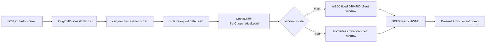

# Win32 창 모드와 메시지 pump 설계

## 한국어

### 목적과 사용자 의도

기본 Win32 제품 실행을 현재 borderless 창에서 운영체제 제목 표시줄이 있는 일반 창으로 바꾼다. 제목은 사용자가 제시한 rePIU 계열의 간결한 프로젝트 브랜드 의도를 따라 `re2DJ`로 표시한다. 참고 영상은 현재 인앱 브라우저가 제공되지 않아 직접 frame 확인은 못 했으므로 아이콘·부제·정확한 typography는 확정하지 않는다.

fullscreen 여부는 원본 `ez2dj.ini`나 원본 EXE를 수정하지 않고 외부 host 설정으로 주입한다. 첫 구현은 제품 CLI의 `--fullscreen` flag와 `OriginalProcessOptions::fullscreen`을 공식 설정 경계로 삼는다. 기본값은 windowed다.

### 현재 경계와 원인

원본은 `CreateWindowExA`로 HWND를 만든 뒤 DirectDraw `SetCooperativeLevel`에 전달한다. 공용 SDL3/OpenGL backend는 그 HWND를 wrapping하지만 창 style이나 제목을 바꾸지 않는다. 따라서 원본의 popup style이 host 창에 그대로 남는다.

현재 renderer는 frame마다 `SDL_GL_SwapWindow`만 호출하고 SDL event queue를 pump하지 않는다. SDL3 문서는 `SDL_PollEvent`가 내부적으로 `SDL_PumpEvents`를 호출하며 main thread에서 매 frame event를 처리하는 일반 계약임을 명시한다. 사용자 관찰처럼 창 상호작용 뒤 Windows가 무응답으로 판단하는 현상과 일치한다.

### 설정 전달과 창 정책

windowed mode는 `WS_OVERLAPPED | WS_CAPTION | WS_SYSMENU | WS_MINIMIZEBOX`를 사용한다. client area가 정확히 논리 640×480이 되도록 `AdjustWindowRectEx`로 outer size를 계산하고 현재 monitor work area 중앙에 배치한다. title은 `re2DJ`다. 임의 resize와 maximize는 첫 구현에서 제공하지 않아 고정 논리 surface와 host client size의 관계를 단순하게 유지한다.

fullscreen mode는 `WS_POPUP`과 monitor bounds를 사용한다. host desktop display mode는 바꾸지 않으며 기존 strict `ChangeDisplaySettingsExA` HLE 계약을 유지한다. mode 적용 뒤 `SWP_FRAMECHANGED`로 non-client frame을 갱신한다.

### 메시지 처리

공용 SDL backend의 `Present`는 swap 전에 `SDL_PollEvent`를 queue가 빌 때까지 호출한다. 이는 SDL이 wrapping한 native window의 Win32 queue를 같은 rendering/main thread에서 pump하게 한다. event를 host gameplay/input으로 재구현하지 않으며 원본 게임 로직과 legacy input은 계속 주 실행 경로다. 이 작업 당시 보류한 close-request 종료 전달은 사용자 관찰 뒤 [작업 090](20260829-090-window-close-process-exit.md)에서 별도 구현했다.

### 검증

- 제품 loader probe에서 기본 windowed와 `--fullscreen` 전달을 검사한다.
- runtime probe는 전용 test HWND를 만들고 windowed 적용 뒤 title, style과 640×480 client size를 검사한다.
- SDL backend probe 또는 runtime Present를 반복 호출해 event pump가 실패하지 않는지 확인한다.
- Windows x86 warnings-as-errors 전체 build와 CTest를 수행한다.
- 실제 원본을 windowed로 실행해 title bar, 640×480 client, 클릭·이동 시 응답 유지와 rendering/audio 무회귀를 확인한다.
- fullscreen 실행은 monitor-sized borderless 전환과 host display-mode 무변경을 확인한다.

## English

### Purpose and user intent

Change the default Win32 product run from the current borderless window to a normal operating-system window with a title bar. The title is `re2DJ`, following the concise project-brand intent of the user-provided rePIU reference. The in-app browser is currently unavailable, so exact video-frame typography, iconography, and subtitle details are not claimed.

Fullscreen selection is injected from host configuration without changing the original `ez2dj.ini` or executable. The first implementation makes product CLI flag `--fullscreen` and `OriginalProcessOptions::fullscreen` the official configuration boundary; windowed is the default.

### Current boundary and cause

The original creates an HWND and passes it to DirectDraw SetCooperativeLevel. The shared SDL3/OpenGL backend wraps that HWND without changing its title or style, preserving the original popup style. The renderer calls `SDL_GL_SwapWindow` but never pumps SDL events. SDL3 documents per-frame `SDL_PollEvent` processing, which implicitly pumps platform messages. Missing that work is consistent with Windows marking the clicked window unresponsive.

### Policy

Windowed mode applies `WS_OVERLAPPED | WS_CAPTION | WS_SYSMENU | WS_MINIMIZEBOX`, sets title `re2DJ`, computes an outer rectangle for an exact 640x480 client area, and centers it in the current monitor work area. Fullscreen mode uses `WS_POPUP` and the monitor bounds without changing the host display mode. `SWP_FRAMECHANGED` applies non-client changes.

Before each swap, Present drains `SDL_PollEvent` so the wrapped native window's Win32 queue is pumped on the rendering/main thread. This does not replace gameplay or legacy input logic; the original remains authoritative. Close-request exit forwarding, deferred by this task, was implemented separately in [Task 090](20260829-090-window-close-process-exit.md) after user observation.

Verification covers product option transport, window title/style/client size in a dedicated runtime-probe HWND, repeated Present event pumping, the full Windows x86 build and CTest, then real windowed and fullscreen runs for responsiveness and rendering/audio regression.
