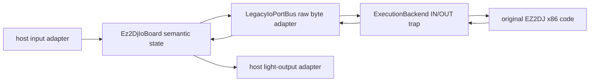

# EZ2DJ I/O board 에뮬레이션 설계

관련 기존 설계: [레거시 I/O 포트 HLE](20260825-062-legacy-io-port-hle.md)

## 한국어

### 목적과 근거

기존 `LegacyIoPortBus`는 원본 1st SE에서 확인한 byte `IN`/`OUT` 범위와 active-low 특성만 보존하고 물리 의미를 선언하지 않았다. 2EZConfig-V2의 공개 구현은 EZ2DJ 계열을 위한 동일한 `IN AL,DX`/`OUT DX,AL` VEH 경계와 포트별 입력·조명 의미를 제공한다. 해당 저장소 README는 이를 full I/O emulation과 HID input/output으로 설명한다. 분석 기준은 commit `a7346e066bb569643e0cb25f41cfdc079126fbc6`이다.

2EZConfig-V2는 GPL-3.0이므로 코드를 복사하거나 링크하지 않는다. 이 작업은 원본 바이너리에서 이미 확인한 port access와 공개 구현에서 관찰한 외부 프로토콜 사실을 문서화하고, re2DJ의 BSD-3-Clause 코드로 독립 구현한다. 외부 근거는 [프로젝트 README](https://github.com/ben-rnd/2EZConfig-V2/tree/a7346e066bb569643e0cb25f41cfdc079126fbc6), [입력 port 구현](https://github.com/ben-rnd/2EZConfig-V2/blob/a7346e066bb569643e0cb25f41cfdc079126fbc6/src/2ez-dll/ez2dj-io/ez2dj_io_input.cpp), [출력 port 구현](https://github.com/ben-rnd/2EZConfig-V2/blob/a7346e066bb569643e0cb25f41cfdc079126fbc6/src/2ez-dll/ez2dj-io/ez2dj_io_output.cpp), [GPL-3.0 선언](https://github.com/ben-rnd/2EZConfig-V2/blob/a7346e066bb569643e0cb25f41cfdc079126fbc6/LICENSE)이다.

### 계층

`Ez2DjIoBoard`는 플랫폼 중립 공용 상태다. 버튼, 두 턴테이블의 8비트 위치, rising-edge로 증가하는 8비트 coin counter, 23개 조명 상태를 소유한다. `LegacyIoPortBus`는 기존 raw injection/diagnostic API를 보존하면서 semantic board를 기본 입력·출력 구현으로 사용한다. Windows/Linux/Web adapter는 semantic API만 호출하며 x86 port 번호를 알지 않는다.

첫 host adapter는 Windows keyboard다. 제품 `--io-config <path>`가 외부 INI 경로를 launcher에 전달하고 injected runtime export에 절대 경로를 기록한다. runtime은 첫 I/O read 전에 설정을 한 번 읽고 `GetAsyncKeyState`로 구성된 키를 갱신한다. 설정이 없으면 cabinet idle 상태만 제공한다. 이는 즉시 사용할 수 있는 입력 경로이며, USB HID·SDL gamepad adapter는 같은 board API 뒤에 후속 추가한다.

### 입력 port 계약

모든 button bit는 active-low다.

| Port | 의미 | bit |
| --- | --- | --- |
| `0x101` | system | 0 P1 Start, 1 P2 Start, 2..5 Effector 1..4, 6 Service, 7 Test |
| `0x102` | P1 controls | 0..4 key 1..5, 7 pedal |
| `0x103` | P1 turntable | 8비트 절대 위치, idle/center `0x80` |
| `0x104` | P2 turntable | 8비트 절대 위치, idle/center `0x80` |
| `0x105` | coin | 새 press마다 modulo-256 counter +1, read 뒤에도 현재값 유지 |
| `0x106` | P2 controls | 0..4 key 1..5, 7 pedal |

작업 087의 실제 검증과 원본 계산 재분석으로 초기 one-read pulse 모델을 폐기했다. coin은 false→true마다 누적 counter를 1 증가시키며 같은 press를 유지하거나 port를 읽어도 값을 유지한다. 원본은 current/previous의 modulo-256 delta를 credit에 더한다. 턴테이블 keyboard binding은 설정된 음/양 방향을 누르는 동안 8ms 이상 간격으로 configurable step을 modulo-256 적용한다.

### 출력 port 계약

출력 bit는 active-high light state다.

| Port | bit 0.. |
| --- | --- |
| `0x100` | red lamp L/R, blue lamp L/R, neons |
| `0x101` | P1/P2 Start, Effector 1..4 |
| `0x102` | P1 key 1..5, P1 turntable |
| `0x103` | P2 key 1..5, P2 turntable |

원본 정적 분석에서 관찰했지만 외부 구현이 의미를 선언하지 않은 `0x106` write는 기존 last-byte 보존만 유지한다. 알 수 없는 bit도 버리지 않고 raw output byte에 남긴다. `Ez2DjIoBoard::GetLight`는 향후 HID·network·cabinet adapter가 semantic output을 소비하는 경계다.

### Windows keyboard 설정

INI는 `[buttons]`에 `test`, `service`, `coin`, `effector1..4`, `p1_start`, `p2_start`, `p1_1..5`, `p1_pedal`, `p2_1..5`, `p2_pedal`을 둔다. `[turntables]`에는 `p1_negative`, `p1_positive`, `p2_negative`, `p2_positive`, `step`을 둔다. 값은 한 글자 `A..Z`, `0..9`, `F1..F24`, `ENTER`, `SPACE`, `LSHIFT`, `RSHIFT`, `LEFT`, `RIGHT`, `UP`, `DOWN`, `NUMPAD0..9`, `DECIMAL`, 또는 `NONE`이다. 누락 항목은 unbound다. `step`은 1..32, 기본 4다.

설정 파일은 host 입력이며 HDD/VFS 자산이 아니다. launcher가 process 생성 전에 regular file 여부를 검증하고 absolute path를 injected runtime에 전달한다. runtime parsing 실패는 I/O를 idle로 유지하고 debugger message를 남기며 guest instruction은 계속 처리한다.

### 검증

- 공용 unit test가 모든 button bit, coin counter edge/hold/read/wrap, turntable 초기값·wrap, 모든 light bit와 기존 raw API를 검증한다.
- Windows runtime probe가 config-path export transport를 검증하고 Windows x86 warnings-as-errors build가 INI parser와 `GetAsyncKeyState` adapter를 함께 검증한다. 실제 key press 동작은 예제 INI를 사용한 원본 실행에서 확인한다.
- product loader probe가 `--io-config` argument 전달과 default omission을 검증한다.
- Windows x86 warnings-as-errors build와 CTest를 통과한다.
- 실제 원본 실행은 idle bytes `ff ff 80 80 00 ff`로 graphics/audio main loop를 유지하고 privileged instruction/AV/OpenGL 오류가 없는지 확인한다.
- 실제 키 입력과 물리 HID light 출력은 사용자 장치 binding이 필요한 별도 검증으로 남긴다.

## English

### Purpose and evidence

The existing `LegacyIoPortBus` preserves only the byte `IN`/`OUT` range and active-low properties confirmed in the original 1st SE executable. Public 2EZConfig-V2 code exposes matching EZ2DJ VEH handling plus concrete input and light meanings, describing the feature as full I/O emulation with HID input/output. Analysis uses commit `a7346e066bb569643e0cb25f41cfdc079126fbc6` and the linked README, input, output, and license files above.

Because 2EZConfig-V2 is GPL-3.0, re2DJ neither copies nor links its code. It records externally observable protocol facts and independently implements them under the repository's BSD-3-Clause policy.

### Architecture and contract

Platform-neutral `Ez2DjIoBoard` owns semantic buttons, two absolute 8-bit turntable positions, an eight-bit coin counter incremented on rising edges, and 23 light states. `LegacyIoPortBus` retains raw injection and diagnostics while adapting port bytes to the semantic board. Platform adapters know semantic controls only; execution backends retain the narrowly validated x86 instruction trap.

Input ports are active-low: 0x101 carries starts, four effectors, service, and test; 0x102 and 0x106 carry five keys plus pedal for P1 and P2; 0x103 and 0x104 carry absolute turntable positions centered at 0x80. Task 087 replaces the disproven one-read coin pulse: 0x105 is a stable modulo-256 counter incremented once per rising edge, matching the original current-minus-previous credit delta. Active-high outputs map 0x100 to cabinet lamps/neons, 0x101 to starts/effectors, and 0x102/0x103 to player keys and turntable lights. The observed but externally unexplained 0x106 write remains raw-only.

The first host adapter is configurable Windows keyboard input. Product `--io-config <path>` injects an absolute host INI path. The runtime loads it once and updates configured keys through a small `GetAsyncKeyState` seam before reads; absent or invalid configuration retains idle input. Keyboard turntable directions apply a configurable modulo-256 step no more often than every 8 ms. Future SDL/HID/network adapters and physical light sinks use the same semantic board boundary.

Verification covers complete semantic port mapping, stable coin-counter edges and wrap, turntable wrap, light decoding, raw compatibility, configuration-path transport, the INI parser and keyboard adapter in the warnings-as-errors Windows x86 build, CTest, and a real original run using idle bytes `ff ff 80 80 00 ff`. Physical HID output remains a later adapter rather than a GPL-derived dependency.
