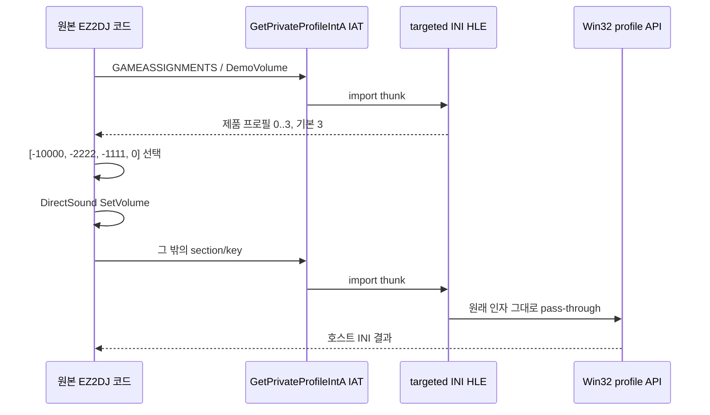

# DirectSound 데모 음량 설정 HLE 설계

관련 분석: [EZ2DJ 데모 음량 프로필 분석](../analysis/ez2dj-demo-volume.md)

## 한국어

### 배경과 확인된 원인

작업 083의 streaming queue 반영은 정상 동작하지만, 사용자 재검증에서는 title/demo 음량이 여전히 작았다. 약 60초의 실제 실행 trace와 대응 unprotected binary 분석으로 다음 사실을 확인했다.

- 44.1 kHz title streaming buffer는 재생 전에 `SetVolume(-10000)`을 한 번 받고 이후 다른 volume 호출을 받지 않는다.
- 호출자 RVA `0x3120f`는 전역 데모 음량 인덱스로 `[-10000, -2222, -1111, 0]` 테이블을 조회해 `SetVolume`에 전달한다.
- 전역 인덱스는 `GetPrivateProfileIntA("GAMEASSIGNMENTS", "DemoVolume", 3, ...)`의 반환값으로 설정된다.
- 사용자 HDD의 `ez2dj.ini`에는 `DemoVolume=0`이 있으며, 따라서 원본이 의도대로 `-10000` 프로필을 선택한다.
- streaming queue와 `+6 dB` master gain은 정상 적용됐으며, 낮은 음량은 PCM 손실이나 dB 변환 오류가 아니다.

원본 HDD는 읽기 전용으로 취급하므로 INI를 직접 수정하지 않는다. 제품 실행 경계에서 데모 음량만 기본 3(0 dB)으로 재정의하고, 사용자가 `0..3` 프로필을 명시적으로 선택할 수 있게 한다. 전역 master gain의 제품 기본값은 0 dB로 되돌려 이중 증폭과 clipping을 피한다.

### HLE 경계

- injected runtime은 `Re2djHleGetPrivateProfileIntA`와 설정 export를 제공한다.
- launcher는 원본 main image의 `KERNEL32.dll!GetPrivateProfileIntA` IAT slot만 runtime thunk로 교체한다.
- section이 `GAMEASSIGNMENTS`, key가 `DemoVolume`일 때만 `0..3`으로 검증된 제품 값을 반환한다.
- 다른 section/key는 Win32 `GetPrivateProfileIntA`로 그대로 전달한다.
- 원본 실행 파일의 명령, 코드 바이트, HDD의 INI 파일은 변경하지 않는다.

### 진단 경계

`SetVolume` trace는 원본 main-image base를 받아 caller RVA와 실제 track/master gain을 기록한다. 이 추적은 원인 분석 증거로 유지하되 PCM과 원본 코드 바이트는 기록하지 않는다. targeted INI HLE도 audio trace가 활성화됐을 때 선택된 `DemoVolume` scalar만 기록한다.

### 검증

runtime probe에서 데모 음량 override와 다른 키의 pass-through를 검사한다. product probe에서 기본 `DemoVolume=3`, 기본 master 0 dB, 사용자 선택과 범위 검증을 검사한다. Windows x86 warnings-as-errors build와 CTest를 통과시키고, 실제 HDD 실행 trace에서 `SetVolume(0)`과 bounded streaming queue를 확인한다.

## English

### Background and confirmed cause

Task 083 correctly forwards streaming writes, but user revalidation still found the title/demo audio quiet. A roughly 60-second runtime trace and analysis of the corresponding unprotected binary confirmed the cause. The 44.1 kHz title stream receives one `SetVolume(-10000)` call. Caller RVA `0x3120f` indexes `[-10000, -2222, -1111, 0]` with a global value loaded from `GetPrivateProfileIntA("GAMEASSIGNMENTS", "DemoVolume", 3, ...)`. The user HDD contains `DemoVolume=0`, so the original deliberately selects the `-10000` profile. Streaming and the former +6 dB master gain were both working; this is not PCM loss or an incorrect dB conversion.

Keep the original HDD read-only. Override only the demo-volume setting at the product execution boundary, defaulting to profile 3 (0 dB), while allowing an explicit `0..3` selection. Restore the product master-gain default to 0 dB to avoid double amplification and clipping.

### HLE boundary

The injected runtime exports `Re2djHleGetPrivateProfileIntA` and a configured profile value. The launcher replaces only the original main image's `KERNEL32.dll!GetPrivateProfileIntA` IAT slot. The thunk returns the validated product value only for section `GAMEASSIGNMENTS` and key `DemoVolume`; all other requests pass through unchanged to the host Win32 API. Original commands, code bytes, and HDD INI files remain unchanged.

### Diagnostic boundary

Retain bounded `SetVolume` caller-RVA and applied track/master-gain tracing as analysis evidence. Log only the selected `DemoVolume` scalar when audio tracing is enabled; never log PCM or original code bytes.

### Verification

The runtime probe covers the targeted override and unrelated-key pass-through. The product probe covers default profile 3, default master 0 dB, explicit selection, and range validation. Pass the Windows x86 warnings-as-errors build and CTest, then confirm `SetVolume(0)` and a bounded streaming queue in a real-HDD trace.
