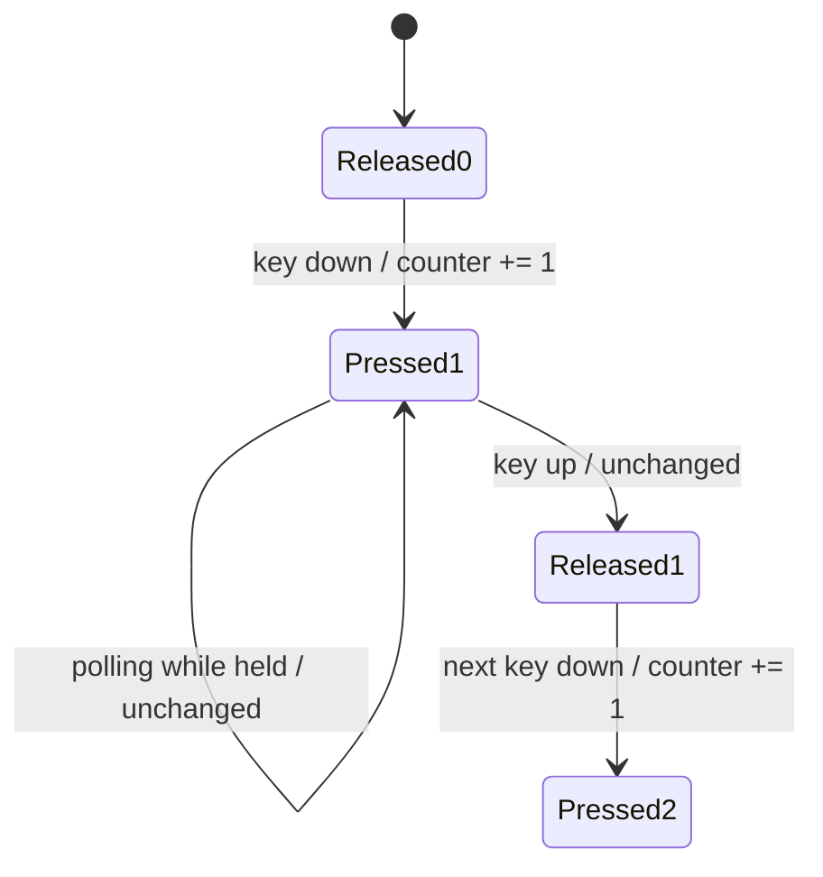

# 키보드 코인 누적 카운터 수정 설계

관련 I/O 설계: [EZ2DJ I/O board 에뮬레이션](20260828-085-ez2dj-io-board-emulation.md)

관련 분석: [EZ2DJ I/O 포트 맵](../analysis/ez2dj-io-map.md)

## 한국어

### 문제와 확인된 원인

사용자 실제 실행에서 `F3` 코인 키를 한 번 누르면 크레딧이 계속 증가해 99에 도달했다. 공용 board의 key rising-edge 판정은 유지되고 있었지만, port `0x105`를 한 read 동안 `0xfe`, 이후 `0xff`로 돌려놓는 pulse 계약이 잘못됐다.

대응 unprotected binary의 VA `0x004175c5`부터 `0x105`를 읽고, VA `0x0041764c`부터 `current - previous`를 계산한다. 결과가 음수이면 `0x100`을 더하고, VA `0x00417675`부터 이 modulo-256 delta를 여러 credit 관련 누적값에 더한다. 따라서 `0xfe → 0xff` 복귀는 새 변화 1 또는 큰 역방향 변화로 다시 관찰될 수 있으며, pulse를 idle 값으로 되돌리는 모델은 원본 counter 계약과 맞지 않는다.

### 수정 계약

- port `0x105`는 8비트 누적 카운터이며 초기값은 `0x00`이다.
- coin key의 false→true 전이마다 counter를 modulo-256으로 1 증가시킨다.
- port read는 현재 counter를 반환할 뿐 값을 소비하거나 idle 값으로 복귀시키지 않는다.
- 키를 계속 누르거나 떼는 동작은 counter를 바꾸지 않는다.
- 다른 active-low button과 turntable, output light 계약은 변경하지 않는다.

### 검증

공용 unit test는 초기 0, 첫 press 1, held/read 반복 1, release 1, 다음 press 2와 255→0 wrap을 검증한다. Windows x86 전체 build와 CTest를 통과시킨 뒤 실제 제품 실행에서 F3 press/release 한 번마다 credit이 정확히 1 증가하는지 사용자가 확인한다.

## English

### Problem and confirmed cause

In the user's real run, one F3 coin press continuously raises credit until it reaches 99. The shared board preserves keyboard rising-edge state, but its port `0x105` contract incorrectly emits `0xfe` for one read and then returns to `0xff`.

The corresponding unprotected binary reads `0x105` starting at VA `0x004175c5`. Starting at VA `0x0041764c`, it computes `current - previous`, adds `0x100` when negative, and from VA `0x00417675` adds that modulo-256 delta to several credit-related accumulators. Returning a pulse to an idle byte therefore creates another counter delta and does not match the original contract.

### Corrected contract

Port `0x105` is an eight-bit cumulative counter initialized to zero. Each false-to-true coin-key transition increments it once modulo 256. Reads return the stable current counter without consuming or resetting it. Holding or releasing the key does not change the counter. Other active-low buttons, turntables, and output lights remain unchanged.

### Verification

Shared unit tests cover initial zero, first press one, repeated held reads one, release one, next press two, and 255-to-zero wrap. Pass the complete Windows x86 build and CTest, then user-verify that each F3 press/release cycle adds exactly one credit in the product run.
