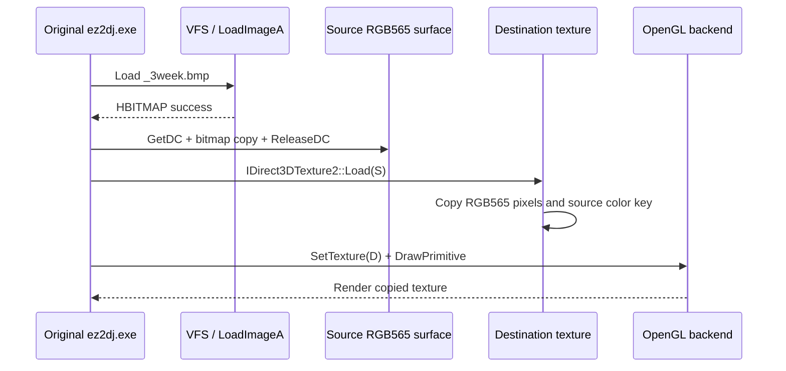

# Direct3D 3 texture Load 복사 설계

## 상태와 근거

**[구현·자동 검증 완료, 사용자 화면 재검증 대기.]** 사용자가 Music Select 화면에서 원형 프레임 안의 곡 그림이 검은색으로 남는다고 확인했다. 최신 실행의 VFS 로그는 `System\MusicSelect\disc\_3week.bmp`를 포함한 곡 그림을 원본 HDD에서 정상적으로 읽었음을 보여 준다. 따라서 관찰된 현상은 파일 탐색 실패만으로 설명되지 않는다.

**후속 재검증:** 수정본에서도 화면 변화가 없었으며 `20260829-015640-892.ddraw.log`에는 `TextureLoad` 호출이 한 번도 없다. 따라서 아래 장면 직접 원인 가설은 기각됐고, 구현 자체는 일반 Direct3D 3 호환 경계로 유지한다. 실제 장면의 다음 경계는 [변환 전 정점 draw 작업 089](20260829-089-untransformed-direct3d-draw.md)로 이관했다.

현재 Windows Direct3D COM facade는 `IDirect3DTexture2::Load` vtable slot을 연결하지만 구현은 모든 호출에 `DDERR_UNSUPPORTED`를 반환한다. Direct3D 3의 managed-texture 이전 경로에서는 게임이 GDI로 채운 source texture surface를 별도의 destination texture surface로 `Load`한 뒤 destination을 draw에 사용할 수 있다. 이 경계가 비어 있으면 자산과 source surface가 정상이어도 destination의 RGB565 backing은 생성 시의 검은색으로 남는다.

## 설계

1. `TextureLoad(destination, source)`는 두 COM 포인터와 facade identity를 검증한다.
2. source와 destination은 모두 `DDSCAPS_TEXTURE`, 유효한 RGB565 backing, 동일한 width와 height를 가져야 한다. 현재 facade가 노출하는 texture format은 RGB565 하나이므로 형식 변환이나 축소는 수행하지 않는다.
3. destination의 전체 row를 source pitch에서 destination pitch로 복사한다. padding은 화면 픽셀이 아니므로 width×2 바이트만 복사하고 destination padding은 0으로 정규화한다.
4. Direct3D texture `Load` 계약에 따라 source의 `DDCKEY_SRCBLT` 상태와 범위를 destination에도 복사한다.
5. 성공 시 destination revision을 증가시켜 OpenGL texture cache가 다음 draw에서 다시 upload하도록 한다.
6. bounded DirectDraw 진단에 source/destination surface ID, revision과 결과를 기록한다. 자산 바이트나 원본 경로는 기록하지 않는다.
7. 기존 변환 전 정점 FVF 실패는 별도의 미구현 경계로 남긴다. 이번 화면 결손은 정상 로드된 곡 BMP와 비어 있는 texture-copy 경계가 직접 연결되므로 작업 범위를 `Texture2::Load`에 한정한다.

## 검증

- Windows facade probe에서 padding이 있는 RGB565 row의 전체 pixel 복사와 color key 전달을 검증한다.
- null, 자기 자신, 크기 불일치 입력이 안전한 HRESULT를 반환하는지 검증한다.
- Windows x86 warnings-as-errors build와 CTest를 통과한다.
- 실제 원본 실행에서 `_3week.bmp`가 검은색 중앙 대신 표시되는지는 사용자가 재확인한다.
- 원본 HDD와 로그는 수정하거나 커밋하지 않는다.

---

# Direct3D 3 Texture Load Copy Design

## Status and evidence

**[Implementation and automated verification complete; user-visible revalidation pending.]** The user confirms that the song image inside the circular Music Select frame remains black. The latest VFS log shows successful reads of song artwork including `System\MusicSelect\disc\_3week.bmp` from the original HDD, so an asset lookup failure alone does not explain the observation.

**Later revalidation:** The corrected build produced no visual change, and `20260829-015640-892.ddraw.log` contains no `TextureLoad` call. The scene-specific direct-cause hypothesis below is therefore rejected, while the implementation remains as a general Direct3D 3 compatibility boundary. The scene's next actual boundary moved to [Task 089 untransformed vertex draws](20260829-089-untransformed-direct3d-draw.md).

The Windows Direct3D COM facade connects the `IDirect3DTexture2::Load` vtable slot but currently returns `DDERR_UNSUPPORTED` for every call. A pre-managed-texture Direct3D 3 path can populate a source texture surface through GDI, load it into a separate destination texture, and draw the destination. If that boundary is absent, the asset and source surface can both be valid while the destination RGB565 backing remains at its initial black contents.

## Design

1. `TextureLoad(destination, source)` validates both COM pointers and facade identities.
2. Both surfaces must have `DDSCAPS_TEXTURE`, valid RGB565 backing, and matching width and height. The facade exposes only RGB565 texture format, so this task performs neither conversion nor scaling.
3. Copy each complete pixel row from source pitch to destination pitch. Copy only width×2 pixel bytes and zero destination padding.
4. Propagate the source `DDCKEY_SRCBLT` state and range to the destination as required by the Direct3D texture Load contract.
5. Increment the destination revision after success so the OpenGL texture cache reuploads it on the next draw.
6. Record source/destination surface IDs, revision, and result in bounded DirectDraw diagnostics without recording asset bytes or original paths.
7. Unsupported untransformed FVF draws remain a separate boundary. This task is limited to `Texture2::Load` because the observed song BMP succeeds while the texture-copy boundary is empty.

## Verification

- Extend the Windows facade probe to verify full pixel-row copying with RGB565 padding and color-key propagation.
- Verify safe HRESULTs for null, self, and size-mismatched inputs.
- Pass the warnings-as-errors Windows x86 build and CTest.
- Ask the user to confirm that `_3week.bmp` replaces the black center in an original-executable run.
- Never modify or commit the original HDD or runtime logs.
