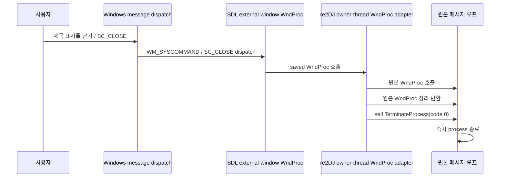
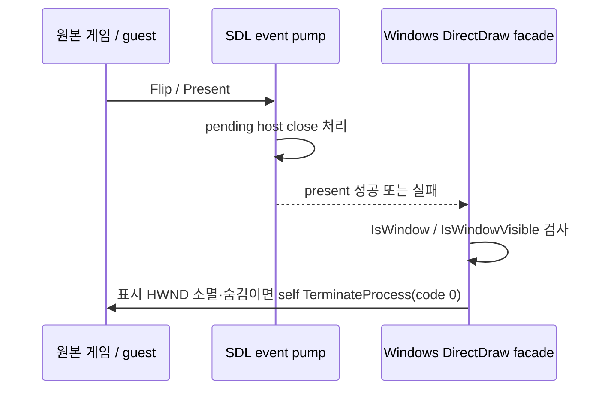

# Win32 창 닫기와 원본 프로세스 종료 설계

## 상태와 근거

**[구현·자동 검증·실제 제품 사용자 검증 완료.]** 제품 trace `20260829-112237-831`은 close와 watcher exit 뒤 `ExitProcess(0)` termination이 완료되지 않는 실패를 확정했다. current-process `TerminateProcess(..., 0)` 보정 뒤 실행 `20260829-112906-743`은 같은 close message 2회와 `visible=0`, `watcher-exit` 뒤 `runtime_detached_exit` code 0과 성공 outcome을 기록했고, 사용자가 창 닫기 시 process 종료를 확인했다.

현재 공용 SDL3/OpenGL backend는 매 `Present`에서 `SDL_PollEvent`로 모든 이벤트를 꺼내고 아무 처리 없이 버린다. 저장소가 고정한 SDL 3.4.14 Windows 구현은 external HWND의 `WM_CLOSE`를 `SDL_EVENT_WINDOW_CLOSE_REQUESTED`로 변환한 뒤 저장된 원래 WndProc도 호출한다. 원본 WndProc가 창을 파괴해 화면은 사라지지만 process message loop를 끝낼 `WM_QUIT`은 관찰상 생성되지 않으며, 현재 backend는 SDL close event마저 버린다. 파괴된 HWND에서는 `MakeCurrent`가 실패할 수 있으므로 event pump는 graphics context 검사보다 먼저 실행해야 한다.

WndProc chain이 교체되거나 우회되는 경우에는 다음 fallback을 사용한다.

## 설계

1. Windows `ApplyRe2djWindowMode`는 원본 HWND의 기존 WndProc를 window property에 보존하고 re2DJ WndProc adapter를 한 번만 설치한다.
2. SDL이 나중에 external HWND를 subclass하면 re2DJ adapter가 SDL의 saved original WndProc가 된다. SDL close 처리가 re2DJ adapter를 호출하므로 HWND owner thread 문맥이 보장된다.
3. re2DJ adapter는 `WM_CLOSE` 또는 `WM_SYSCOMMAND/SC_CLOSE`를 host close 요청으로 판정한다. 판정은 원본 WndProc 호출 전에 보존하고, 원본 WndProc에 창·원본 상태 정리 기회를 준 뒤 현재 process handle에 `TerminateProcess(..., 0)`을 호출한다. 원본 호출 중 HWND가 파괴될 수 있으므로 반환 뒤 window state를 다시 읽어 판정하지 않는다.
4. `WM_NCDESTROY`에서는 저장한 WndProc property를 제거한다. 반복 `SetCooperativeLevel`은 adapter를 중복 설치하지 않는다.
5. 제품 trace는 host close와 `watcher-exit` 뒤 `ExitProcess(0)`이 process를 끝내지 못하는 것을 확인했다. 이 경계에서는 이미 원본 WndProc 정리 기회를 주었고 유일한 표시 HWND도 사라졌으므로, 현재 process 자신에게만 `TerminateProcess(..., 0)`을 사용해 DLL detach 교착을 우회한다. launcher의 외부 강제 종료나 임의 PID 종료에는 사용하지 않는다.
6. 공용 SDL backend와 legacy input/game logic에는 Win32 process-lifetime 정책을 넣지 않는다.
7. `SurfaceFlip`은 `Present`가 성공했는지와 무관하게 SDL event pump 반환 직후 저장된 원본 HWND를 검사한다. HWND가 파괴됐거나 숨겨졌으면 host가 제공한 유일한 표시 surface가 사라진 것이므로 self hard-termination을 수행한다. 최소화된 창은 visible 상태이므로 종료 조건이 아니다.
8. `ApplyRe2djWindowMode`가 창 표시를 완료하면 process당 하나의 Win32 worker thread를 시작하고 최신 표시 HWND를 등록한다. worker는 message pump와 guest render 진행에 의존하지 않고 짧은 간격으로 `IsWindow`와 `IsWindowVisible`을 검사한다. 등록된 창이 파괴되거나 숨겨지면 self hard-termination을 수행한다. 반복 cooperative-level 적용은 watcher를 추가 생성하지 않고 HWND만 갱신한다.
9. watcher 진단은 기존 사용자 지정 graphics trace 경로에만 기록한다. target 등록, worker 시작, close message, 파괴·숨김 exit와 최초 10분 동안 초당 한 번의 HWND valid/visible 표본을 남긴다. 원본 자산이나 window text는 기록하지 않으며 진단량은 600개 표본으로 제한한다.

## 검증

- Windows runtime probe는 자기 자신의 child mode를 실행한다. child의 원본 WndProc는 `SC_CLOSE`를 소비하면서 HWND를 직접 파괴해 `WM_CLOSE`를 생성하지 않는 실제 실패 조건을 모사하고, parent는 child가 제한 시간 안에 exit code 0으로 종료되는지 확인한다.
- fallback 검증에서는 adapter 설치 뒤 WndProc chain을 의도적으로 교체하고 HWND만 파괴한 다음 lifetime 검사를 호출한다. 이로써 메시지 adapter가 전혀 호출되지 않아도 child process가 exit code 0으로 끝나는지 확인한다.
- 최종 watcher 검증에서는 adapter 설치 뒤 WndProc를 교체하고 HWND만 파괴한 후 child main thread가 아무 메시지나 `Flip` 없이 대기한다. parent는 watcher가 제한 시간 안에 child를 exit code 0으로 종료하는지 확인한다.
- parent가 전달한 임시 trace에서 `event=target`, `event=sample`, `event=watcher-exit`이 모두 확인되어야 probe가 성공한다.
- 같은 HWND에 window mode를 반복 적용해 WndProc adapter가 중복 설치되지 않는지 확인한다.
- Windows x86 warnings-as-errors Debug/Release build와 CTest를 통과한다.
- 사용자는 실제 제품 창을 닫은 뒤 `ez2dj.exe`와 기다리던 `re2dj.exe`가 모두 종료되는지 확인한다.

---

# Win32 Window Close and Original Process Exit Design

## Status and evidence

**[Implementation, automated verification, and actual-product user validation complete.]** Product trace `20260829-112237-831` established that termination through `ExitProcess(0)` did not complete after close and watcher exit. After the current-process `TerminateProcess(..., 0)` correction, run `20260829-112906-743` records the same two close messages, `visible=0`, and `watcher-exit`, followed by `runtime_detached_exit` code zero and a successful outcome; the user confirmed process termination on window close.

The shared SDL3/OpenGL backend currently drains every event during `Present` and discards it. The pinned SDL 3.4.14 Windows implementation converts `WM_CLOSE` on an external HWND into `SDL_EVENT_WINDOW_CLOSE_REQUESTED`, then also calls the saved original WndProc. The original WndProc removes the window, but the observed process message loop receives no terminating `WM_QUIT`, while the backend discards the SDL close event too. Because a destroyed HWND can make `MakeCurrent` fail, event pumping must precede graphics-context validation.

## Design

1. `ApplyRe2djWindowMode` preserves the original HWND WndProc in a window property and installs the re2DJ WndProc adapter exactly once.
2. When SDL later subclasses the external HWND, the re2DJ adapter becomes SDL's saved original WndProc. SDL close handling therefore invokes it in the HWND owner-thread context.
3. Treat either `WM_CLOSE` or `WM_SYSCOMMAND/SC_CLOSE` as a host close request. Preserve that decision before calling the original WndProc, allow the original procedure to clean up its window and state, then call `TerminateProcess(..., 0)` on the current process handle. Do not re-read window state after the call because the original procedure may destroy the HWND.
4. Remove the saved-WndProc property at `WM_NCDESTROY`, and do not double-subclass on repeated cooperative-level setup.
5. The product trace confirms that `ExitProcess(0)` does not finish after host close and `watcher-exit`. Since the original WndProc already had a cleanup opportunity and the only display HWND is gone, use `TerminateProcess(..., 0)` only on the current process to bypass DLL-detach deadlock. Do not use launcher-side forced termination or arbitrary PID termination.
6. Keep Win32 process-lifetime policy out of the shared SDL backend and legacy input/game logic.
7. Regardless of `Present` success, `SurfaceFlip` inspects the retained original HWND immediately after the SDL event pump returns. If the HWND was destroyed or hidden, the only host-provided display surface is gone and self hard-termination follows. A minimized window remains visible and is not treated as closed.
8. After `ApplyRe2djWindowMode` finishes showing the window, start one Win32 worker thread per process and register the latest display HWND. Independently of message-pump and guest-render progress, the worker checks `IsWindow` and `IsWindowVisible` at a short interval and performs self hard-termination when the registered window is destroyed or hidden. Repeated cooperative-level setup updates the HWND without creating another watcher.
9. Write watcher diagnostics only to the existing user-selected graphics trace path. Record target registration, worker startup, close messages, destroyed/hidden exit, and one valid/visible HWND sample per second for the first ten minutes. Record no original assets or window text, and bound diagnostics to 600 samples.

## Verification

- Have the Windows runtime probe launch itself in a child mode whose original WndProc consumes `SC_CLOSE` and destroys the HWND directly without generating `WM_CLOSE`, reproducing the actual failure condition. The parent verifies process termination with exit code zero within a bounded timeout.
- For fallback verification, deliberately replace the WndProc chain after adapter installation, destroy only the HWND, and invoke the lifetime check. Confirm that the child exits with code zero even though the adapter never receives a close message.
- For final watcher verification, replace the WndProc after adapter installation, destroy only the HWND, and leave the child main thread waiting without messages or `Flip`. The parent confirms that the watcher exits the child with code zero within the bounded timeout.
- The probe succeeds only when the temporary trace supplied by the parent contains `event=target`, `event=sample`, and `event=watcher-exit`.
- Apply window mode repeatedly to the same HWND and verify that the adapter is not installed twice.
- Pass warnings-as-errors Windows x86 Debug/Release builds and CTest.
- Ask the user to confirm that both `ez2dj.exe` and the waiting `re2dj.exe` exit after closing the actual product window.
