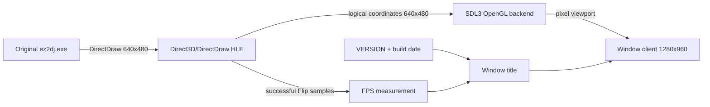

# Win32 실행 창 제목과 기본 2배 확대 설계

## 한국어

### 목적

Win32 제품 창을 사용자 제공 rePIU 화면과 유사하게 식별 가능한 제목으로 표시하고, 기본 windowed 실행 크기를 원본 논리 해상도의 가로·세로 2배로 확대한다. 원본 EZ2DJ 실행 코드와 DirectDraw 표시 모드는 계속 640×480을 사용하며, 변경 범위는 host 창과 상태 표시에 한정한다.

### 창 제목 정책

제목은 다음 형식을 사용한다.

```text
re2DJ v<version> - Build <compiler build date> - SDL3 OpenGL - FPS : <one decimal>
```

- `<version>`은 저장소 루트 `VERSION` 값을 빌드 정의로 주입한다.
- build date는 해당 injected runtime을 컴파일한 날짜를 사용한다.
- renderer 표기는 실제 공용 backend인 `SDL3 OpenGL`을 사용한다.
- FPS는 창 모드를 처음 적용할 때 `0.0`이고, 성공한 DirectDraw `Flip`을 고해상도 성능 카운터로 측정하여 약 1초 간격으로 갱신한다.
- 제목 갱신 실패는 렌더링 실패로 취급하지 않는다. 제목은 host 진단 정보이며 원본 게임 실행의 필수 계약이 아니기 때문이다.

### 표준 caption 소유권 보정

사용자 제품 검증에서 1280×960 client는 적용됐지만 caption이 얇게 보이고 제목 문자열과 아이콘이 그려지지 않는 현상을 확인했다. client만 2배가 되고 Windows non-client 영역은 system metric 크기를 유지하므로 상대적으로 얇아 보이는 것은 정상이다. 그러나 제목 문자열이 사라지는 것은 의도한 결과가 아니다.

원본 HWND의 WndProc는 popup cabinet 창을 전제로 하므로 새 표준 caption의 text 저장, non-client 계산·그리기와 hit-test를 반드시 `DefWindowProcA`에 전달한다고 보장할 수 없다. `window_mode` adapter가 다음 host-owned 메시지를 직접 기본 처리한다.

- `WM_SETTEXT`, `WM_GETTEXT`, `WM_GETTEXTLENGTH`
- `WM_NCCALCSIZE`, `WM_NCPAINT`, `WM_NCACTIVATE`, `WM_NCHITTEST`
- close 이외의 `WM_SYSCOMMAND`

close는 기존처럼 원본 WndProc에 cleanup 기회를 준 뒤 확인된 process 종료 경계를 사용한다. windowed style은 rePIU 참고 화면과 같은 일반 maximize button과 resize frame을 갖도록 `WS_OVERLAPPEDWINDOW`를 사용한다. backend는 실제 client pixel size를 매 draw마다 읽으므로 resize 뒤에도 원본 논리 좌표를 새 client 전체에 표시할 수 있다.

### 후속 제목 변경 차단

첫 caption 소유권 보정 뒤 사용자 재검증에서도 표준 maximize style과 1280×960 client는 적용됐지만 제목과 아이콘은 처음부터 비어 있었다. 현재 함수 순서상 제목 설정이 성공해야만 뒤의 icon 설정과 1280×960 `SetWindowPos`에 도달한다. 따라서 초기 `SetWindowTextA` 실패가 아니라 그 뒤의 guest 또는 후속 window message가 caption 상태를 다시 바꾸는 경로로 범위를 좁힌다. 실제 변경 주체는 아직 trace로 확정하지 않았으므로 guest overwrite는 추정으로 유지한다.

제품 제목과 icon은 host 표시 정책이므로 adapter에 들어오는 일반 `WM_SETTEXT`와 `WM_SETICON` 변경 요청은 성공으로 응답하되 적용하지 않는다. host 갱신 함수는 adapter message chain을 거치지 않고 `DefWindowProcA(WM_SETTEXT)`를 직접 호출한다. icon도 같은 직접 기본 처리로 설정한다. `WM_GETTEXT`/`WM_GETICON`과 non-client paint는 계속 기본 처리하므로 Windows와 진단 도구가 보존된 host 상태를 읽고 그릴 수 있다.

runtime probe는 host 제목·icon 설정 뒤 빈 `WM_SETTEXT`와 null `WM_SETICON`을 보내고도 두 상태가 유지되는지 검사한다.

### DWM non-client 정책 보정

두 번째 사용자 재검증에서도 제목과 icon은 처음부터 보이지 않았다. 최신 실행 `20260829-124836-787`은 새 window style과 1280×960 rendering이 적용된 뒤 SDL external-window wrapping으로 WndProc가 바뀌고 frame이 계속 present된 사실을 확인한다. 그러나 기존 trace에는 저장된 caption state가 없어 DWM이 상태를 받았는지 그리지 않은 것인지는 아직 미확정이다. “host 상태 저장만 보장하면 표준 caption content가 표시된다”는 가정은 사용자 관찰상 충분하지 않으므로 기각한다.

실제 진단 실행 `20260829-125238-338`은 저장 title 길이 59/60, 기대 prefix, icon과 style이 모두 정상이고 SDL이 빈 `WM_SETTEXT`를 보냈지만 차단된 사실을 확인했다. 그 상태에서 non-client DC에 host content를 직접 그려도 DWM이 덮어써 보이지 않았다. 외부 진단으로 `DWMWA_NCRENDERING_POLICY=DWMNCRP_DISABLED`를 적용하자 Windows 기본 title·icon과 약 45px caption이 즉시 복구됐고, 진단용 host text와 기본 text가 겹쳐 그려졌다. 따라서 저장/overwrite 가설을 기각하고 DWM non-client rendering이 이 원본 HWND의 caption content를 소거한 직접 원인으로 확정한다.

최종 windowed 정책은 host 수동 그리기를 사용하지 않는다. `SetWindowPos(...SWP_FRAMECHANGED)` 뒤 `DwmSetWindowAttribute`로 `DWMNCRP_DISABLED`를 적용하고 frame을 다시 그려 USER32 기본 caption 하나만 표시한다. fullscreen에서는 `DWMNCRP_ENABLED`로 복원한다. injected runtime은 Windows system `dwmapi`에만 새로 연결하며 외부 third-party dependency는 추가하지 않는다.

graphics trace에는 bounded caption-state record를 추가해 event, HWND validity, 저장 title 길이와 기대 prefix 일치 여부, icon 존재, style/exstyle와 현재 WndProc를 기록한다. 원본 asset 문자열이나 raw data는 기록하지 않는다.

### 크기와 렌더링 정책

windowed 모드의 클라이언트 영역은 논리 표시 모드 640×480의 정확한 2배인 1280×960으로 만든다. `AdjustWindowRectEx`에는 확대된 클라이언트 크기를 전달하고, 기존처럼 현재 monitor work area 중앙에 배치한다. fullscreen 모드는 기존 monitor bounds 정책을 유지한다.

SDL3/OpenGL backend는 실제 창 pixel size를 OpenGL viewport로 사용하고 shader에는 640×480 논리 viewport를 전달한다. 그러므로 원본 좌표와 surface 크기는 바꾸지 않고 결과 영상만 창 전체로 확대된다.



### 검증

- runtime probe에서 windowed 클라이언트 영역이 1280×960인지 확인한다.
- 제목에 제품명, 현재 version, build 표기, renderer, 초기 `FPS : 0.0`이 포함되는지 확인한다.
- runtime probe에서 표본 FPS로 제목을 갱신하여 소수점 한 자리 형식을 확인한다.
- text/non-client 메시지를 소비하는 원본 WndProc 모사 창에서도 제목 저장과 caption hit-test가 Windows 기본 처리로 복구되는지 확인한다.
- windowed style에 resize frame과 maximize button이 포함되는지 확인한다.
- fullscreen 전환이 monitor bounds를 계속 사용하는지 확인한다.
- Windows x86 Debug/Release build와 CTest를 수행한다.

## English

### Purpose

Give the Win32 product window an identifiable title similar to the user-provided rePIU screen and make the default windowed size twice the original logical resolution in each dimension. The original EZ2DJ code and DirectDraw display mode remain at 640x480; the change is limited to the host window and status display.

### Window title policy

The title uses this format:

```text
re2DJ v<version> - Build <compiler build date> - SDL3 OpenGL - FPS : <one decimal>
```

- `<version>` comes from the repository-root `VERSION` through a build definition.
- The build date is the date on which the injected runtime was compiled.
- The renderer label names the actual shared backend, `SDL3 OpenGL`.
- FPS starts at `0.0` when window mode is first applied and is updated about once per second by measuring successful DirectDraw `Flip` calls with the high-resolution performance counter.
- A title update failure does not fail rendering because the title is host diagnostic information, not a required original-game contract.

### Standard caption ownership correction

User product validation confirmed the 1280x960 client but showed a relatively thin caption with neither title text nor icon painted. The caption looking proportionally thinner is expected because only the client doubles while the Windows non-client area retains its system-metric size. Missing title text is not intended.

The original HWND WndProc assumes a popup cabinet window and is not guaranteed to forward text storage, non-client calculation/painting, and hit testing for the new standard caption to `DefWindowProcA`. The `window_mode` adapter directly applies default processing for these host-owned messages:

- `WM_SETTEXT`, `WM_GETTEXT`, and `WM_GETTEXTLENGTH`
- `WM_NCCALCSIZE`, `WM_NCPAINT`, `WM_NCACTIVATE`, and `WM_NCHITTEST`
- `WM_SYSCOMMAND` commands other than close

Close still gives the original WndProc a cleanup opportunity before using the confirmed process-termination boundary. Windowed style uses `WS_OVERLAPPEDWINDOW` for a normal resize frame and maximize button like the rePIU reference. The backend queries actual client pixels on each draw, so it can continue mapping original logical coordinates across the client after resize.

### Blocking later caption replacement

After the first caption-ownership correction, user revalidation still showed an empty title and icon from the start even though the standard maximize style and 1280x960 client were present. In the current call order, title assignment must succeed before icon assignment and the 1280x960 `SetWindowPos` execute. This narrows the issue away from initial `SetWindowTextA` failure and toward a later guest or window-message path changing caption state. The specific writer is not yet confirmed by trace, so guest overwrite remains an inference.

The product title and icon are host presentation policy. Ordinary `WM_SETTEXT` and `WM_SETICON` requests entering the adapter therefore report success without applying replacement state. Host updates call `DefWindowProcA(WM_SETTEXT)` directly, bypassing the adapter message chain; icon assignment uses the same direct default-processing boundary. `WM_GETTEXT`/`WM_GETICON` and non-client painting retain default processing so Windows and diagnostics can read and paint the preserved host state.

The runtime probe sends an empty `WM_SETTEXT` and null `WM_SETICON` after host assignment and requires both title and icon to remain intact.

### DWM non-client policy correction

The second user revalidation still showed no title or icon from startup. Latest run `20260829-124836-787` confirms the new window style, 1280x960 rendering, a WndProc change during SDL external-window wrapping, and continuing presentation. Existing trace does not contain stored caption state, so whether DWM received but did not paint that state remains unresolved. User observation rejects the assumption that preserving host state alone is sufficient for standard caption content to appear.

Actual diagnostic run `20260829-125238-338` confirms stored title lengths 59/60, the expected prefix, icon, and style, plus a blocked empty `WM_SETTEXT` from SDL. Explicitly drawing host content into the non-client DC in that state was still overwritten by DWM. Applying `DWMWA_NCRENDERING_POLICY=DWMNCRP_DISABLED` externally immediately restored the Windows-default title/icon and an approximately 45-pixel caption; the temporary host text then overlapped the default text. This rejects the storage/overwrite hypothesis and confirms DWM non-client rendering as the direct cause of caption-content removal on this original HWND.

The final windowed policy does not custom-draw caption content. After `SetWindowPos(...SWP_FRAMECHANGED)`, it applies `DWMNCRP_DISABLED` through `DwmSetWindowAttribute` and redraws the frame, leaving one USER32 default caption. Fullscreen restores `DWMNCRP_ENABLED`. The injected runtime adds only the Windows system `dwmapi` dependency and no third-party component.

A bounded caption-state record in the graphics trace captures event, HWND validity, stored-title length and expected-prefix match, icon presence, style/exstyle, and current WndProc. It records no original-asset strings or raw data.

### Size and rendering policy

The windowed client area is exactly 1280x960, twice the 640x480 logical display mode in both dimensions. `AdjustWindowRectEx` receives the scaled client size and the resulting outer window remains centered in the current monitor work area. Fullscreen keeps the existing monitor-bounds policy.

The SDL3/OpenGL backend uses the physical window pixel size for the OpenGL viewport while passing the 640x480 logical viewport to the shader. The original coordinates and surface dimensions therefore remain unchanged while the result scales to the full window.

### Verification

- Verify a 1280x960 windowed client area in the runtime probe.
- Verify that the title contains the product, current version, build label, renderer, and initial `FPS : 0.0`.
- Update the title with a sample FPS in the runtime probe and verify one-decimal formatting.
- Verify restored title storage and caption hit testing against a probe WndProc that consumes text/non-client messages.
- Verify that windowed style includes a resize frame and maximize button.
- Verify that fullscreen continues to use monitor bounds.
- Run Windows x86 Debug/Release builds and CTest.
