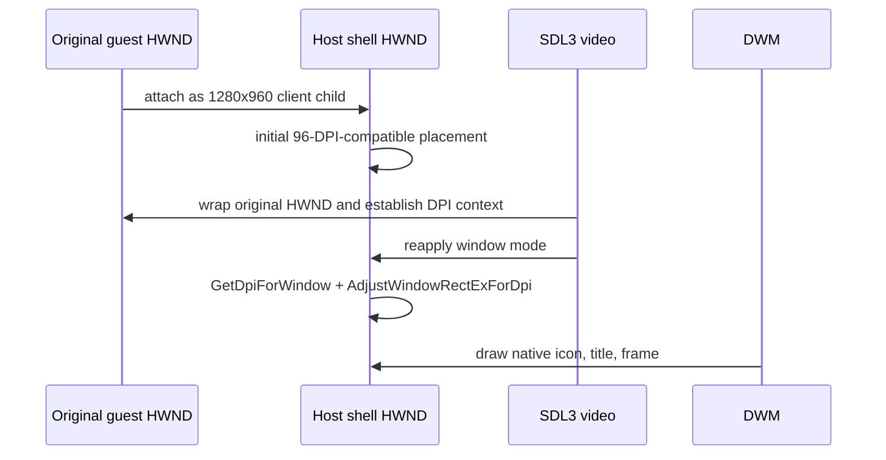

# Win32 DWM 캡션 보존 설계

## 한국어

### 목적

Win32 windowed 제품 창에서 DWM non-client rendering을 유지하면서 상태 제목, icon, 표준 resize frame과 1280×960 client 영역을 함께 제공한다. 작업 091의 `DWMNCRP_DISABLED`는 제목을 복구했지만 Windows 11의 frame metric, DPI 배치와 모서리 표현을 바꾸므로 최종 정책으로 사용하지 않는다.

### 확인된 사실과 미확정 원인

- 제품 실행 `20260829-125238-338`에서 제목 저장, icon, `WS_OVERLAPPEDWINDOW` style과 빈 `WM_SETTEXT` 차단은 정상이다.
- 같은 HWND에서 `DWMNCRP_DISABLED`를 적용하면 제목과 icon이 즉시 표시된다.
- SDL3 external-window wrapping은 re2DJ adapter를 설치한 뒤 HWND 최상위 WndProc를 SDL `WIN_WindowProc`로 교체한다.
- pinned SDL3 Windows backend는 `WM_NCACTIVATE`, `WM_NCUAHDRAWCAPTION`, `WM_NCUAHDRAWFRAME`, `WM_NCCALCSIZE`를 자체 window flags에 따라 처리한다.

따라서 DWM 경로에서 caption content가 사라진 것은 확인됐지만 DWM 자체가 결함 원인이라는 결론은 확정하지 않는다. popup에서 overlapped style로 바뀐 HWND의 DWM 정책이 명시적으로 재활성화되지 않은 경우와 SDL WndProc가 host caption owner보다 위에 설치되는 순서 문제를 별도 가설로 검증한다.

### 보정 순서

1. windowed와 fullscreen 모두 `DWMNCRP_ENABLED`를 명시하고 `SWP_FRAMECHANGED` 뒤 frame을 다시 그린다.
2. 1단계에서 caption content가 복구되지 않으면 SDL wrapping 완료 뒤 host caption adapter가 최상위가 되도록 설치 시점을 분리한다.
3. 최상위 host adapter는 caption 메시지에 `DwmDefWindowProc`를 먼저 제공하고, 처리되지 않은 표준 non-client 메시지는 `DefWindowProc`로 전달한다.
4. SDL 입력과 window event 메시지는 SDL WndProc chain에 전달하고, 원본 WndProc까지 이어지는 순서를 보존한다.
5. windowed client 계산은 가능하면 현재 HWND의 DPI와 `AdjustWindowRectExForDpi`를 사용하고, API를 사용할 수 없는 환경에서는 기존 `AdjustWindowRectEx`로 fallback한다.

### 원본 HWND child hosting

명시적 DWM 활성화, SDL wrapping 뒤 adapter 재설치, `DwmDefWindowProc`, 정상 `SetWindowText` 재통지와 DWM caption/text 색상 보정을 실제 제품에서 각각 적용했지만 현대 frame의 제목과 icon은 계속 비어 있었다. adapter 재설치 실험은 close 전달 재진입도 만들었으므로 폐기한다. 원본 popup HWND를 생성 뒤 top-level overlapped 창으로 바꾸는 방식은 DWM 표준 caption 계약을 안정적으로 만족하지 못한다고 판단한다.

최종 구조는 injected runtime이 소유하는 표준 top-level host shell HWND와 원본 guest HWND를 분리한다. host shell은 `WS_OVERLAPPEDWINDOW`, 제목, icon, DWM, DPI, resize와 close를 소유한다. 원본 HWND는 `WS_CHILD | WS_VISIBLE`로 host client에 배치되고 SDL3/OpenGL은 계속 그 원본 HWND를 external window로 감싼다. 즉 원본 실행 코드와 guest HWND는 그대로 실행 주체로 남고 host 표시 경계만 HLE가 제공한다.

host resize는 guest child를 client 전체로 맞춘다. 실제 제품에서 guest/SDL close를 먼저 호출하면 process termination이 다시 정체됐으므로 host close는 원본 child를 파괴하지 않고 기존 current-process `TerminateProcess` 경계를 즉시 사용한다. fullscreen에서는 같은 host shell의 style만 `WS_POPUP`으로 바꾸고 monitor bounds를 사용한다. 제목 갱신과 lifetime 감시는 guest가 아니라 host shell을 대상으로 한다.

최종 직접 원인은 DWM이 아니라 DPI frame 계산 순서였다. SDL 초기화 전 `AdjustWindowRectEx` 결과는 144-DPI HWND에도 96-DPI outer `1296×999`를 적용해 DWM caption content를 clip했다. SDL video 초기화 뒤 HWND는 per-monitor aware, DPI 144가 되므로 `GetDpiForWindow`와 `AdjustWindowRectExForDpi`로 window mode를 한 번 더 적용한다. 실제 outer는 `1302×1016`, host와 guest physical client는 모두 1280×960이 되고 DWM 기본 icon과 전체 제목이 표시된다. API가 없는 환경은 `AdjustWindowRectEx`로 fallback한다.

### 검증

- runtime probe는 windowed와 fullscreen에서 `DWMWA_NCRENDERING_ENABLED`가 참인지 검사한다.
- windowed client가 1280×960이고 caption hit-test, resize/maximize style, 제목과 icon 상태가 유지되는지 검사한다.
- 실제 제품 창에서 제목·icon, Windows 11 기본 frame layout, FPS 갱신과 닫기 종료를 확인한다.
- Debug/Release Windows x86 build와 CTest를 수행한다.

## English

### Purpose

Keep DWM non-client rendering enabled in the Win32 windowed product while preserving the status title, icon, standard resize frame, and 1280x960 client area. Task 091's `DWMNCRP_DISABLED` restored the title but changes Windows 11 frame metrics, DPI placement, and corner presentation, so it is not the final policy.

### Confirmed facts and unresolved cause

- Product run `20260829-125238-338` confirmed valid title storage, icon, `WS_OVERLAPPEDWINDOW` style, and blocking of an empty `WM_SETTEXT`.
- Applying `DWMNCRP_DISABLED` to the same HWND immediately exposes the title and icon.
- SDL3 external-window wrapping replaces the top-level HWND WndProc with SDL `WIN_WindowProc` after the re2DJ adapter is installed.
- The pinned SDL3 Windows backend handles `WM_NCACTIVATE`, `WM_NCUAHDRAWCAPTION`, `WM_NCUAHDRAWFRAME`, and `WM_NCCALCSIZE` according to its own window flags.

Caption content removal on the DWM path is confirmed, but DWM itself is not yet established as the root defect. Test separately whether the popup-to-overlapped HWND needs explicit DWM policy reactivation and whether SDL's WndProc installation above the host caption owner breaks message ownership.

### Correction sequence

1. Explicitly apply `DWMNCRP_ENABLED` in both windowed and fullscreen modes and redraw the frame after `SWP_FRAMECHANGED`.
2. If step 1 does not restore caption content, split adapter installation so the host caption adapter becomes top-level after SDL wrapping completes.
3. The top-level host adapter offers caption messages to `DwmDefWindowProc` first and sends unhandled standard non-client messages to `DefWindowProc`.
4. Forward SDL input and window-event messages through the SDL WndProc chain while preserving continuation to the original WndProc.
5. Calculate the windowed client frame with the current HWND DPI and `AdjustWindowRectExForDpi` where available, falling back to `AdjustWindowRectEx`.

### Original-HWND child hosting

Actual-product tests separately applied explicit DWM enablement, adapter reinstallation after SDL wrapping, `DwmDefWindowProc`, normal `SetWindowText` notification, and DWM caption/text color correction; the modern frame still omitted title and icon. Adapter reinstallation also introduced close-forwarding reentry, so that experiment is rejected. Converting the original popup HWND into a top-level overlapped window after creation does not reliably satisfy the standard DWM caption contract.

The final structure separates an injected-runtime-owned standard top-level host-shell HWND from the original guest HWND. The host shell owns `WS_OVERLAPPEDWINDOW`, title, icon, DWM, DPI, resizing, and close. The original HWND becomes `WS_CHILD | WS_VISIBLE` filling the host client, and SDL3/OpenGL continues wrapping that original HWND as its external window. Original executable code and the guest HWND therefore remain the executing subject while HLE supplies only the host presentation boundary.

Host resize fits the guest child to the full client. Actual-product testing showed that closing the guest/SDL child first reintroduced process-termination stalling, so host close leaves the original child intact and immediately uses the existing current-process `TerminateProcess` boundary. Fullscreen changes only the same host shell to `WS_POPUP` at monitor bounds. Title updates and lifetime monitoring target the host shell rather than the guest.

The final direct cause was DPI frame-calculation order rather than DWM itself. Before SDL initialization, the `AdjustWindowRectEx` result applied a 96-DPI `1296x999` outer size to a 144-DPI HWND and clipped DWM caption content. After SDL video initialization the HWND is per-monitor aware at DPI 144, so window mode is applied again using `GetDpiForWindow` and `AdjustWindowRectExForDpi`. The actual outer becomes `1302x1016`, both host and guest physical clients remain 1280x960, and the default DWM icon and full title appear. Environments without the API fall back to `AdjustWindowRectEx`.

### Verification

- The runtime probe requires `DWMWA_NCRENDERING_ENABLED` to be true in both windowed and fullscreen modes.
- Verify the 1280x960 windowed client, caption hit testing, resize/maximize style, title, and icon state.
- In the actual product, verify title/icon, native Windows 11 frame layout, FPS updates, and close-to-exit behavior.
- Run Windows x86 Debug/Release builds and CTest.
