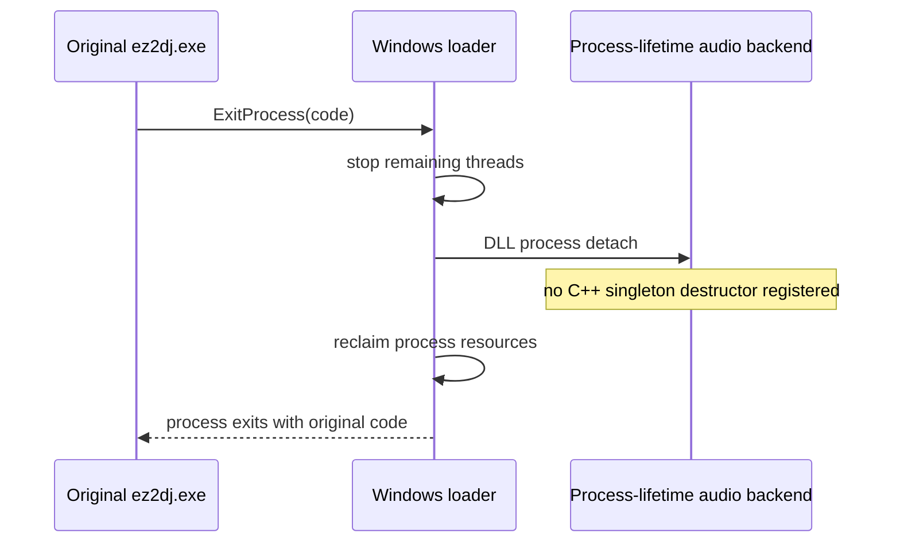

# Win32 SDL 오디오 process-lifetime 설계

## 상태와 근거

**[구현 및 실제 제품 검증 완료.]** 작업 093의 live WOW64 stack은 원본 `ExitProcess`가 시작된 뒤 injected runtime의 정적 `Sdl3MixerAudioBackend` 소멸자가 `SDL_QuitAudio`를 호출하고, 이미 제거된 WASAPI 관리 thread의 응답을 기다리며 교착되는 것을 확인했다. 이 문제는 원본 게임 loop, 입력 HLE 또는 마지막 Direct3D draw의 정지가 아니다.

## 결정

`Sdl3MixerAudioBackend::Instance()`는 함수 정적 객체 대신 한 번 할당한 process-lifetime 객체를 반환한다. 이 객체는 의도적으로 C++ atexit 소멸 대상에 등록하지 않는다. Windows가 process 종료 시 mixer, stream, audio device와 heap을 일괄 회수하므로 DLL detach에서 `MIX_Quit` 또는 `SDL_QuitSubSystem(SDL_INIT_AUDIO)`를 실행하지 않는다.

원본 `ExitProcess` import와 exit code는 변경하지 않는다. `TerminateProcess` HLE로 모든 종료를 우회하지도 않는다. 따라서 이번 변경은 원본 종료 결정을 보존하면서 injected runtime의 안전하지 않은 teardown만 제거한다.

## 검증

Windows runtime probe에 별도 child mode를 추가한다. child는 WASAPI driver를 선택하고 DirectSound HLE를 초기화한 뒤 native `ExitProcess(0)`을 호출한다. parent는 5초 안에 exit code 0으로 끝나는지 확인하고, timeout이면 해당 test child만 종료한다. 기존 window-close child probe, DirectSound facade 검증, Debug/Release CTest도 유지한다.

실제 1st SE 재실행에서는 기존 먹통 시점에 process가 종료 중 교착하지 않는지 확인한다. 그 뒤 원본이 `ExitProcess`에 진입한 최초 조건은 별도 진단 대상으로 남긴다.

---

# Win32 SDL audio process-lifetime design

## Status and evidence

**[Implemented and verified with the product path.]** Task 093's live WOW64 stack confirms that after the original `ExitProcess` begins, the injected runtime's static `Sdl3MixerAudioBackend` destructor calls `SDL_QuitAudio` and deadlocks waiting for a WASAPI management thread that Windows has already removed. The stopped game loop, input HLE, and final Direct3D draw are not the direct cause.

## Decision

`Sdl3MixerAudioBackend::Instance()` returns a single allocated process-lifetime object instead of a function-static object. The object is intentionally not registered for C++ atexit destruction. Windows reclaims mixer, stream, audio-device, and heap resources with the process, so DLL detach does not invoke `MIX_Quit` or `SDL_QuitSubSystem(SDL_INIT_AUDIO)`.

The original `ExitProcess` import and exit code remain unchanged. The design does not replace every exit with a `TerminateProcess` HLE. It preserves the original exit decision while removing only unsafe injected-runtime teardown.

## Verification

The Windows runtime probe gains a child mode that selects WASAPI, initializes the DirectSound HLE, and calls native `ExitProcess(0)`. The parent requires exit code zero within five seconds and terminates only that test child on timeout. Existing host-close child coverage, DirectSound facade checks, and Debug/Release CTest remain in place.

A live 1st SE rerun must confirm that the process no longer remains deadlocked at the prior stopped point. The initial condition that causes the original executable to enter `ExitProcess` remains a separate diagnostic question.
