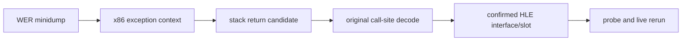

# 1st SE execute-at-zero 크래시 귀속 설계

## 상태와 목표

**[완료.]** 작업 094가 SDL/WASAPI process-exit 교착을 제거한 뒤 제품 실행 `20260829-233725-840`은 `0xc0000005`로 종료됐다. Windows Application Error의 fault offset은 `0x00000000`이고 WER dump `ez2dj.exe.20768.dmp`가 남았다. dump와 원본 call site는 누락된 `DrawIndexedPrimitiveVB` 슬롯을 확정했고, 구현 및 실제 재실행은 정상 종료까지 통과했다.

목표는 원본 실행 파일의 exception context와 stack을 보존한 채 null 함수 호출의 원본 call site, 객체/vtable과 slot을 확인하고, 확인된 Win32/DirectX HLE 경계만 구현하는 것이다.

## 분석 경계

dump는 저장소 밖의 읽기 전용 입력으로 취급한다. `MINIDUMP_EXCEPTION_STREAM`, exception thread의 x86 `CONTEXT`, memory stream과 module list를 읽어 EIP, access 종류/주소, ESP·EBP와 stack return 후보를 추출한다. dump 원문과 원본 자산 byte dump는 커밋하지 않고 주소, register와 구조 해석만 `docs/analysis/`에 남긴다.

## 확인된 호출 계약

WER dump의 exception thread는 `EIP=0x00000000`, `ESP=0x001AF9D4`였고 첫 번째 복귀 주소는 원본 image의 `0x004206A3`이었다. 직전 명령 `call dword ptr [edx+0x8C]`와 DirectX 6 `IDirect3DDevice3` vtable 순서를 대조하면 누락된 슬롯은 `DrawIndexedPrimitiveVB`이다. stack 인자는 `D3DPT_TRIANGLELIST`, 기존 vertex buffer, 600개의 16-bit index, flags 0으로 해석된다. 현재 facade에서 해당 슬롯은 null이므로 이 관찰은 execute-at-zero와 직접 일치한다.

구현은 공용 렌더 명령에 triangle-list topology를 추가하고, 공용 vertex-buffer 연산에서 16-bit index를 범위 검사한 뒤 vertex stream으로 전개한다. Windows COM adapter는 guest pointer, facade 소유권, lock 상태를 검증하고 전개된 stream을 기존 fixed-function 변환 및 SDL/OpenGL backend로 전달한다. 원본 실행 파일이나 gameplay logic은 변경하지 않는다.

call site가 원본 image 안이면 주변 instruction과 register/object memory로 간접 호출 operand를 해석한다. COM vtable 호출이면 기존 facade의 vtable 선언과 대조한다. 근거가 부족하면 성공을 가장하는 stub을 추가하지 않고 분석 단계에서 멈춘다.

## 구현 및 검증 원칙

- 원본 gameplay code와 executable byte는 수정하지 않는다.
- 확인된 import thunk 또는 COM facade 경계에서만 HLE를 확장한다.
- 공용 상태/연산과 Windows guest ABI adapter를 분리한다.
- 관련 단위/runtime probe, Debug/Release Windows x86 build와 CTest를 수행한다.
- 실제 1st SE를 같은 약 100초 경계까지 실행해 기존 fault가 제거되고 다음 경계가 무엇인지 기록한다.

---

# 1st SE execute-at-zero crash attribution design

## Status and objective

**[Complete.]** After Task 094 removed the SDL/WASAPI process-exit deadlock, product run `20260829-233725-840` exited with `0xc0000005`. Windows Application Error records fault offset `0x00000000`, and WER produced `ez2dj.exe.20768.dmp`. The dump and original call site identify the missing `DrawIndexedPrimitiveVB` slot; implementation and a live rerun pass through a clean shutdown.

The objective is to preserve the original executable's exception evidence, identify the original null-call site plus its object/vtable slot, and implement only the confirmed Win32 or DirectX HLE boundary.

## Analysis boundary

The dump is read-only input outside the repository. Read its exception stream, x86 context, memory streams, and module list to recover EIP, access kind/address, ESP/EBP, and stack return candidates. Do not commit the dump or raw original-asset bytes; record only addresses, registers, and structural interpretation in `docs/analysis/`.

If the call site lies in the original image, decode the surrounding instruction and inspect register/object memory for the indirect-call operand. Compare COM calls against the existing facade vtables. If evidence is insufficient, stop at analysis rather than adding a success-only stub.

## Confirmed call contract

The dump's exception thread had `EIP=0x00000000` and `ESP=0x001AF9D4`; its first return address was `0x004206A3` in the original image. Comparing the preceding `call dword ptr [edx+0x8C]` with the DirectX 6 `IDirect3DDevice3` vtable identifies the missing slot as `DrawIndexedPrimitiveVB`. The stack arguments decode as `D3DPT_TRIANGLELIST`, an existing vertex buffer, 600 16-bit indices, and flags zero. The slot is null in the current facade, directly accounting for the execute-at-zero failure.

The implementation adds triangle-list topology to the shared draw command and bounds-checked 16-bit index expansion to the shared vertex-buffer operation. The Windows COM adapter validates guest pointers, facade ownership, and lock state, then passes the expanded stream through the existing fixed-function transform and SDL/OpenGL backend. It does not modify the original executable or gameplay logic.

## Implementation and verification principles

- Do not modify original gameplay code or executable bytes.
- Extend HLE only at a confirmed import-thunk or COM-facade boundary.
- Separate shared state/operations from the Windows guest ABI adapter.
- Run relevant unit/runtime probes, Debug/Release Windows x86 builds, and CTest.
- Rerun 1st SE through the same roughly 100-second boundary and record whether the old fault is removed and what boundary follows.
