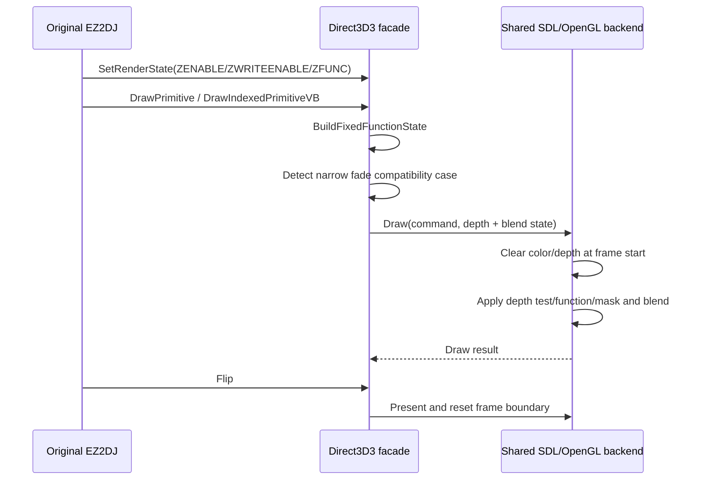

# 장면 전환과 깊이 정렬 보정 설계

## 상태와 근거

**구현 전 설계.** 2026-08-30 Win32 Direct3D 추적과 현재 SDL3/OpenGL backend를 대조한 결과, 다음을 확인했다.

- SDL3/OpenGL context가 깊이 버퍼를 요청하지 않는다.
- backend가 매 frame 시작 시 `GL_DEPTH_TEST`를 무조건 끄고 색상 버퍼만 지운다.
- Windows facade는 `ZENABLE`, `ZWRITEENABLE`, `ZFUNC`를 진단 로그에 기록하지만 공용 draw state로 전달하지 않는다.
- 관찰된 실행 로그에서는 `ZENABLE=0`만 확인되므로 실제 게임 경로에서 깊이 테스트가 켜졌다는 사실은 아직 미확정이다.
- 초기 장면 전환 로그에서는 배경 texture 뒤에 texture 없는 검정 TL quad가 반복되고, 정점 alpha가 바뀌는 동안 `ALPHABLENDENABLE=0`인 구간이 관찰되었다. 이것이 원본의 의도인지, 현재 화면에서 보이는 깜빡임의 단독 원인인지는 미확정이다.

따라서 깊이는 명시적인 Direct3D 상태를 OpenGL 상태로 전달하는 일반 수정으로 처리한다. 페이드는 Direct3D 상태 의미를 전역적으로 바꾸지 않고, 화면 전체를 덮는 검정·정점 alpha quad라는 좁은 호환성 조건에서만 source-alpha 보정을 적용한다. 보정 적용 여부는 bounded draw 진단에 남겨 실제 실행에서 재검증한다.

## 목표

1. Direct3D 3의 깊이 테스트, 깊이 쓰기, 비교 함수를 backend가 조건부로 적용한다.
2. 첫 draw에서 색상·깊이 버퍼를 함께 지워 이전 frame의 깊이 값이 다음 장면에 남지 않게 한다.
3. 기존 `ZENABLE=0` 경로의 2D 출력과 성능을 유지한다.
4. 장면 전환에서 관찰된 검정 full-screen alpha quad의 fade가 alpha blend disabled 때문에 한 번에 불투명해지는 경우를 완화한다.
5. 지원하지 않는 blend/depth 상태는 성공으로 가장하지 않고 기존과 같이 오류로 진단한다.

## 상태 흐름

- 최종 실행에서는 Direct3D `D3DBLEND_INVSRCOLOR`(`dstblend=4`)가 반복되었고, 기존 facade가 이를 미지원 blend factor로 거절했다.

## 공용 상태 계약

`CompareFunction`을 OpenGL과 무관한 여섯 가지 순서 비교와 `Never`, `Always`로 확장한다. `LegacyFixedFunctionState`에는 `depth_test_enabled`, `depth_write_enabled`, `depth_function`을 추가한다. Direct3D 기본값은 depth test/write 비활성으로 유지한다.

`Sdl3OpenGlBackend`는 context 생성 시 16-bit 이상 깊이 버퍼를 요청하고, `glDepthFunc`와 `glDepthMask`를 동적으로 로드한다. draw마다 depth test를 enable/disable하고 비교 함수와 write mask를 적용한다. frame의 첫 draw는 `GL_COLOR_BUFFER_BIT | GL_DEPTH_BUFFER_BIT`를 지운다. ES2와 desktop GL에서 공통으로 제공되는 상수와 함수만 사용한다.

## 전환 페이드 호환성

Windows facade에서 다음을 모두 만족하는 draw만 보정한다.

- texture stage 0에 texture가 없다.
- triangle strip의 네 정점이 논리 화면 전체를 덮는다.
- 모든 정점의 RGB가 검정이고 alpha가 0과 255 사이이며 정점 간 alpha가 동일하다.

이 경우 guest render state가 alpha blend를 끈 상태라도 `SRCALPHA`/`INVSRCALPHA` source-over를 사용한다. 이 조건은 일반적인 비텍스처 geometry나 명시적인 blend state를 변경하지 않도록 제한한다. `INVSRCALPHA`를 공용 blend factor로 추가하고 Direct3D enum을 매핑한다. 보정은 `fade_compatibility_applied` 진단 필드로 표시한다.

이 정책은 관찰된 로그와 사용자의 화면 증상에 근거한 추론이며, 원본 Direct3D 드라이버가 같은 결과를 냈다는 확정 사실이 아니다. 실제 실행에서 transition frame의 밝기 변화와 깜빡임이 개선되는지 확인한 뒤 정책을 유지하거나 제거한다.

## 검증 전략

- asset-free unit test: depth compare enum의 기본값과 draw command 기존 decode 회귀를 확인한다.
- Windows x86 Debug/Release warnings-as-errors build 및 CTest.
- runtime probe: ZENABLE/ZWRITEENABLE/ZFUNC와 INVSRCOLOR/INVSRCALPHA를 설정한 draw가 오류 없이 backend에 도달하는지 확인한다.
- canonical `ez2dj1stse` run: `LateDraw`에서 depth 상태와 fade compatibility marker를 확인하고, 최소 한 번 장면 전환을 관찰한다.

## 미확정 사항

- 현재 관찰 경로에서 실제 Z-enabled draw가 존재하는지.
- 원본의 alpha-blend-disabled 검정 quad가 의도된 특수 효과인지.
- 전체 장면의 z 순서가 depth buffer만으로 충분한지, 원본이 draw 호출 순서에 의존하는지.

---

# Scene-transition and depth-ordering correction design

## Status and evidence

**Design before implementation.** On 2026-08-30, comparison of the Win32 Direct3D trace with the SDL3/OpenGL backend confirmed:

- The SDL3/OpenGL context does not request a depth buffer.
- The backend unconditionally disables `GL_DEPTH_TEST` at the beginning of each frame and clears only the color buffer.
- The Windows facade records `ZENABLE`, `ZWRITEENABLE`, and `ZFUNC` for diagnostics but does not pass them into the shared draw state.
- The observed product path has only `ZENABLE=0`; an actual Z-enabled game draw remains unconfirmed.
- Early transition frames draw an untextured black TL quad after the background texture, with changing vertex alpha while `ALPHABLENDENABLE=0`. Whether this is intentional original behavior or the sole cause of the visible flicker remains unresolved.
- The final run repeatedly uses Direct3D `D3DBLEND_INVSRCOLOR` (`dstblend=4`), which the former facade rejected as an unsupported blend factor.

Depth will therefore be fixed generically by passing explicit Direct3D depth state into OpenGL. Fade handling will not globally change Direct3D semantics; it will use a narrow compatibility rule for a full-screen black vertex-alpha quad and report when the rule is applied.

## Goals

1. Apply Direct3D 3 depth testing, depth writes, and comparison functions conditionally in the backend.
2. Clear color and depth at the first draw of each frame so stale depth values cannot leak across scenes.
3. Preserve the existing `ZENABLE=0` 2D path and its performance.
4. Mitigate the observed transition case where a black full-screen alpha quad becomes opaque because alpha blending is disabled.
5. Forward the observed inverse-source-color blend draws instead of rejecting them.
6. Keep unsupported blend/depth states explicit failures instead of silently pretending support.

## Shared state contract

Expand the platform-neutral compare enum to include the eight Direct3D ordering functions. Add depth-test, depth-write, and depth-function fields to `LegacyFixedFunctionState`, with both depth features disabled by default. Request a 16-bit-or-better depth buffer from SDL, load `glDepthFunc` and `glDepthMask`, clear depth on frame start, and apply depth state for every draw. Include `INVSRCOLOR` and `INVSRCALPHA` in the blend-factor contract.

## Fade compatibility

Only an untextured four-vertex triangle strip covering the logical screen, with uniform black RGB and alpha strictly between 0 and 255, qualifies. The facade uses source-alpha/inverse-source-alpha source-over for that draw even if guest alpha blending is disabled. This is an inference from the trace and symptom, not a confirmed original-driver result; validation must decide whether to keep the policy.

## Verification and unresolved items

Run asset-free tests, Windows x86 Debug/Release builds, the runtime probe with depth, inverse-source-color, and inverse-source-alpha states, and a canonical run that inspects bounded `LateDraw` diagnostics. It remains unresolved whether the game ever enables depth in the observed path, whether the black quad is intentional, and whether draw order rather than depth is the original scene-ordering mechanism.
