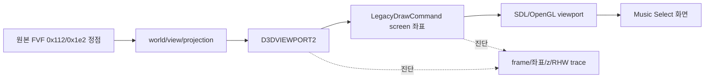

# Music Select 좌표 변환 진단 및 보정 설계

## 상태

**진단 진행 중, 화면 매핑 보정 적용.** `20260830-120003-655` 추적의 Music Select 유사 구간(`frame=3327`)에서 논리 좌표와 자산 크기를 대조했다. `CLUBMIX_PANEL`(297x112)은 x=172..469, `DEMOPLAY`(175x39)은 x=232.5..407.5로 배치되어 640x480 논리 화면의 중앙 정렬과 일치한다. 따라서 해당 trace에서는 원본 좌표나 z 순서가 어긋났다는 근거가 확인되지 않았다. 반면 SDL backend는 창의 pixel 크기가 바뀌어도 첫 frame 이후 `glViewport`를 갱신하지 않아 DPI 변경·창 크기 변경 뒤 논리 좌표가 화면에서 어긋날 수 있었다.

## 목표

1. Music Select 구간의 변환 전 정점(`FVF 0x112`, `0x1e2`)에 대해 최종 화면 좌표, 깊이, RHW와 viewport/matrix 상태를 관찰한다.
2. Direct3D viewport 변환 또는 SDL/OpenGL 화면 좌표 변환에서 발생하는 오차를 분리한다.
3. 확인된 변환 오류만 수정하고, 원본 게임의 draw 호출 순서나 gameplay를 재구성하지 않는다.

## 진단 경계

진단 상한은 성능과 로그 크기를 제한하되 Music Select 진입 이후까지 관찰할 수 있도록 확대한다. 각 대상 draw에는 최종 screen-space bounds와 `reciprocal_w` 범위를 남긴다. 원본 정점 데이터나 자산 내용은 기록하지 않는다.

## 보정 원칙

- `D3DVIEWPORT2`의 clip 범위와 screen rectangle은 원본 호출값을 그대로 사용한다.
- screen-space 명령은 논리 해상도(640x480) 좌표로 유지하고, host 창 배율은 SDL viewport가 담당한다.
- `reciprocal_w`는 perspective interpolation 정보로만 전달하며 screen x/y/z를 임의로 재배치하지 않는다.
- 좌표 이상이 확인되지 않은 상태에서 전역 오프셋, 강제 depth, draw 순서 변경을 적용하지 않는다.
- SDL/OpenGL backend는 매 draw에서 조회한 실제 pixel 크기가 이전 값과 다르면 `glViewport`를 다시 설정한다. 논리 좌표(640x480)는 변환하지 않는다.

## 검증

- 변환 decoder 단위 테스트에 비-identity viewport와 perspective `w` 사례를 추가한다.
- Windows x86 Debug/Release 빌드와 CTest를 실행한다.
- 사용자 HDD로 Music Select에 진입해 중앙 artwork와 주변 프레임의 위치·크기·겹침을 확인한다.
- 창 크기 변경 또는 DPI 환경에서 첫 frame과 이후 frame의 좌표가 같은 비율로 유지되는지 확인한다.

## 현재 판정

`frame=3327`의 좌표는 확인된 자산 폭과 화면 중앙을 기준으로 일관된다. 현재 구현 변경은 정적 좌표에 오프셋을 더하는 방식이 아니라, native child 창 크기 변경 시 stale pixel viewport를 제거하는 범용 보정이다. 중앙 artwork의 정확한 draw 호출과 사용자 화면의 최종 위치는 실제 Music Select 재현으로 계속 검증한다.

최신 ClubMix 추적(`20260830-121711-829`)에서는 후보 디스크 표면의 색상 키가 활성화되고 유효 픽셀이 남아 있었지만, 상단 우측에 해당하는 큰 텍스처 draw 좌표는 기록되지 않았다. 그러므로 투명도는 가장자리·겹침 품질의 후속 점검 대상으로 남기고, 우측 상단 디스크의 위치/상태 전환과 512x512 합성 표면의 내부 구성을 우선 조사한다.

추가 bounded 합성 추적에서도 늦은 display-surface blit가 주 경로라는 근거는 확인되지 않았다. `frame=3328`의 display surface `id=2 (640x480)`에는 작은 source(`28x363`, `72x54`, `21x22`)만 들어갔고 `256x256` 또는 `512x512` 디스크 후보 표면은 합성되지 않았다. 다음 설계 단계는 renderer 쪽 위치·투명도 우회보다 `texture=20`과 후보 표면을 원본 리소스/상태 전환에 귀속시키는 것이다.

이를 위해 후보 texture surface에 대해 non-key 및 non-zero 픽셀의 bounding box만 bounded trace로 기록한다. 이 요약은 `texture=20` 내부 합성의 채움 영역을 판단하는 데 사용하며 원본 픽셀이나 자산을 저장하지 않는다.

첫 결과에서 `texture=20`은 전체 `(0,0)-(511,511)`이 채워져 있고, `texture=21/22`도 각각 `(1,9)-(255,247)`, `(4,47)-(250,208)`의 유효 영역을 갖는다. 따라서 다음 단계는 투명도 보정이 아니라 이 표면들이 상단 우측 상태에서 어떤 원본 호출·상태 전환을 받아야 하는지 확인하는 것이다.

The latest ClubMix trace (`20260830-121711-829`) shows active color-keying and retained valid pixels for the candidate disc surfaces, but no large textured draw coordinates corresponding to the upper-right area. Transparency therefore remains a follow-up check for edge and overlap quality; the position/state transition for the upper-right disc and the internal composition of the 512x512 surface take priority.

---

# Music Select coordinate conversion diagnosis and correction design

## Status

**Design and diagnosis in progress.** In the latest `ez2dj1stse` Direct3D trace (`20260830-111844-237`), the `LateDraw` diagnostic stops after `frame=318` because of a 512-entry bound. Music Select draws continue later (including a render-state change at `frame=665` and `FVF=0x112` draws), so the current evidence cannot establish their coordinate ranges or ordering.

The later trace `20260830-120003-655` provides a coordinate sanity check at `frame=3327`: the 297x112 `CLUBMIX_PANEL` is drawn at x=172..469 and the 175x39 `DEMOPLAY` asset at x=232.5..407.5, both centered in the 640x480 logical surface. No static offset or z-order defect is established there. The SDL backend did, however, keep a stale OpenGL pixel viewport after a native child-window/DPI size change; the implementation now refreshes `glViewport` whenever the queried pixel dimensions change.

## Goals

1. Observe final screen coordinates, depth, RHW, and viewport/matrix state for untransformed Music Select vertices (`FVF 0x112` and `0x1e2`).
2. Separate a Direct3D viewport conversion error from an SDL/OpenGL screen-coordinate conversion error.
3. Change only a conversion defect confirmed by evidence; do not reconstruct game draw order or gameplay in C++.

## Diagnostic boundary

The bounded diagnostics will be extended far enough to cover entry into Music Select while keeping log size finite. Each target draw records final screen-space bounds and a `reciprocal_w` range. Original vertex payloads and asset contents are not recorded.

## Correction principles

- Preserve the original `D3DVIEWPORT2` clip range and screen rectangle.
- Keep screen-space commands in logical 640x480 coordinates; SDL's viewport owns host-window scaling.
- Carry `reciprocal_w` only for perspective interpolation; do not arbitrarily relocate screen x/y/z.
- Do not apply a global offset, forced depth, or draw reordering until a coordinate defect is confirmed.
- Refresh the host pixel viewport when its size changes; keep the guest logical coordinate system unchanged.

## Verification

- Add non-identity viewport and perspective-`w` cases to decoder unit tests.
- Run Windows x86 Debug/Release builds and CTest.
- Enter Music Select with the user's HDD and confirm positions, scale, and overlap of center artwork and surrounding frame.
- Repeat after a window resize or DPI change to verify the viewport refresh.

## Current assessment

The observed `frame=3327` coordinates are internally consistent with the loaded resource sizes, so the exact user-visible artwork position remains unresolved until a reproducible Music Select capture is available. The applied correction targets only stale host viewport state and does not add a Music Select-specific coordinate offset.

The additional bounded composition trace also provides no evidence that a late display-surface blit is the primary path. At `frame=3328`, display surface `id=2 (640x480)` receives only small sources (`28x363`, `72x54`, and `21x22`), not the `256x256` or `512x512` disc candidates. The next design step is therefore to attribute `texture=20` and the candidate surfaces to their original resource/state transitions before considering a renderer-side position or transparency workaround.

For that purpose, the candidate texture surfaces will report only bounded `non-key` and `non-zero` pixel boxes in the bounded trace. This summary is intended to identify the filled region of `texture=20`'s internal composition without storing original pixels or asset contents.

The first result shows `texture=20` filled across `(0,0)-(511,511)`, while `texture=21/22` retain valid areas `(1,9)-(255,247)` and `(4,47)-(250,208)`. The next step is therefore not a transparency workaround but identifying which original calls and state transitions should drive these surfaces in the upper-right state.
