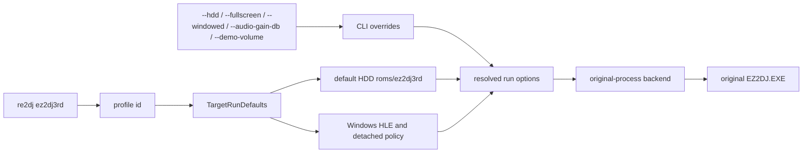

# 타깃 프로파일 실행 기본값과 프로파일 shortcut 설계

## 상태

**구현 완료.** 기존 `ez2dj3rd` built-in fingerprint를 실행 프로파일로 확장했다. 프로파일은 기본 HDD 경로와 Windows 원본 실행에 필요한 기본 정책을 소유하고, 적용 가능한 명령행 값은 그 기본값을 덮어쓴다. `re2dj ez2dj3rd`는 저장소 작업 디렉터리 기준 `roms/ez2dj3rd`를 HDD 경로로 사용해 바로 실행한다.

* **Implemented.** The existing `ez2dj3rd` built-in fingerprint is now an execution profile. The profile owns the default HDD path and the baseline policy needed by Windows original-process execution, while applicable command-line values override those defaults. `re2dj ez2dj3rd` uses `roms/ez2dj3rd` relative to the repository working directory and starts execution directly.*

## 확인된 입력 근거

사용자가 제공한 `roms/ez2dj3rd/ez2dj` 디렉터리에서 `EZ2DJ.EXE`, `EZ2DJ.INI`, `FONTKR.DAT`, `BG`, `Sound`, `system`을 확인했다. `EZ2DJ.INI`에는 `Window Width=640`, `Window Height=480`, `UseIOCard=1`, `FullScreen=1`이 있다.

*In the user-supplied `roms/ez2dj3rd/ez2dj` directory, `EZ2DJ.EXE`, `EZ2DJ.INI`, `FONTKR.DAT`, `BG`, `Sound`, and `system` were observed. `EZ2DJ.INI` contains `Window Width=640`, `Window Height=480`, `UseIOCard=1`, and `FullScreen=1`.*

정적 import 확인 결과 3rd는 `DSOUND` ordinal `#1`과 기본 파일 I/O를 사용하고, `DDRAW!DirectDrawCreateEx`를 import한다. 현재 launcher가 제공하는 `DirectDrawCreate`, display mode, command-line, Windows-directory, DemoVolume, legacy I/O hook과 일치하지 않는 import는 기본 정책에 넣지 않는다. VFS는 3rd IAT에 있는 파일 API를 연결하고 없는 선택적 import는 건너뛴다.

*The static imports confirm that 3rd uses DSOUND ordinal `#1` and basic file I/O, and imports `DDRAW!DirectDrawCreateEx`. The baseline does not enable the launcher's `DirectDrawCreate`, display-mode, command-line, Windows-directory, DemoVolume, or legacy-I/O hooks when the corresponding imports are absent. VFS hooks the file APIs present in the 3rd IAT and skips absent optional imports.*

`System.ini`가 없으므로 3rd의 guest drive letter와 Win32 guest directory는 계속 미확정으로 둔다. 3rd protected runtime의 DirectInput/AVI/WS2_32 동작과 LPTDI 응답도 아직 확정하지 않는다.

*Because `System.ini` is absent, the 3rd guest drive letter and Win32 guest directory remain unresolved. DirectInput/AVI/WS2_32 runtime behavior and any LPTDI response for the protected 3rd build also remain unconfirmed.*

## 구조

`TargetProfile`에 `TargetRunDefaults`를 추가한다. 이 값은 플랫폼 중립적인 profile metadata이지만, 현재 Windows facade가 소비하는 실행 정책을 명시한다. detected-only profile은 빈 기본값을 가지므로 검증되지 않은 실행 정책을 자동으로 상속하지 않는다.

*Add `TargetRunDefaults` to `TargetProfile`. These are platform-neutral profile metadata consumed by the current Windows facade to construct execution policy. Detected-only profiles keep empty defaults, so they do not inherit an unverified execution policy automatically.*



기본값의 핵심 필드는 다음과 같다.

- shortcut용 `default_hdd_directory_relative_path`
- `fullscreen`, audio gain, demo-volume 같은 사용자 실행 기본값(해당 hook이 있는 프로파일에 한함)
- command-line/windows-directory/VFS/DirectDraw 3/DirectSound/legacy I/O/detached 등 HLE 정책
- profile별 LPTDI target-state override. 3rd는 확인되지 않았으므로 비워 둔다.

*The core fields are the shortcut's `default_hdd_directory_relative_path`, user-facing defaults such as fullscreen/audio gain/demo volume when the corresponding hook exists, HLE policy switches for command line, Windows directory, VFS, DirectDraw 3, DirectSound, legacy I/O, and detached execution, plus a per-profile LPTDI target-state override. The 3rd target-state remains empty because it is unconfirmed.*

## 명령행 우선순위

1. `--hdd <directory>`가 있으면 프로파일의 기본 HDD 경로를 대체한다.
2. 첫 번째 positional argument는 profile ID shortcut으로 해석하고 자동으로 `--run`을 선택한다. `--target <id>`가 함께 있으면 최종 profile ID는 `--target` 값이다.
3. `--fullscreen`과 `--windowed`는 해당 HLE display hook이 있는 profile의 fullscreen 기본값을 각각 true/false로 덮어쓴다.
4. `--audio-gain-db`, `--demo-volume`, `--io-config`는 해당 profile에서 지원되는 경우 기본값을 대체하거나 추가한다.
5. `--list-targets`와 `--resolve`는 실행보다 우선하며 기존 진단·조회 동작을 보존한다.

*Precedence: explicit `--hdd` replaces the profile path; a first positional argument selects a profile and implies `--run`; `--target` wins if supplied as well; `--fullscreen` and `--windowed` override the profile fullscreen default when the profile supports that display hook; supported audio/demo/I-O options override or add to profile defaults; and `--list-targets` or `--resolve` take precedence over execution.*

지원 예시는 다음과 같다.

```text
re2dj ez2dj3rd
re2dj ez2dj3rd --audio-gain-db 3
re2dj ez2dj3rd --hdd D:\roms\ez2dj3rd
re2dj --hdd D:\roms --target ez2dj3rd --run
```

`re2dj ez2dj3rd`의 shortcut 경로는 편의 기본값일 뿐이다. 다른 위치의 합법적인 HDD는 `--hdd`로 지정한다.

*The shortcut path is only a convenience default; a legally owned HDD at another location is selected with `--hdd`.*

## 검증

- synthetic target-profile test가 3rd의 default HDD path, HLE profile, 실제 import에 맞춘 기본 hook, and no-guessed guest path를 고정한다.
- Windows product-loader policy test가 1st의 기존 argument ordering과 3rd의 profile-derived arguments를 고정한다.
- Windows x86 Debug build와 CTest를 실행한다.
- `re2dj ez2dj3rd`를 실제 `roms/ez2dj3rd`에 대해 실행해 profile resolution, mounted working directory, and runtime-detached 진입을 확인한다. 실행 process는 검증 후 수동 종료한다.
- 3rd 실행에서 새로 확인된 runtime 사실은 `docs/analysis/`에 확인됨/추정/미확정으로 구분해 기록한다.

*Verification pins the 3rd defaults, import-aligned hooks, and the absence of a guessed guest path in synthetic target-profile tests; preserves 1st argument ordering while checking 3rd profile-derived arguments; runs the Windows x86 Debug build and CTest; and exercises `re2dj ez2dj3rd` against the supplied dump through runtime detachment. The live process is stopped manually after verification. Newly observed 3rd runtime facts are recorded in `docs/analysis/` with confirmed, inferred, and unresolved status.*
