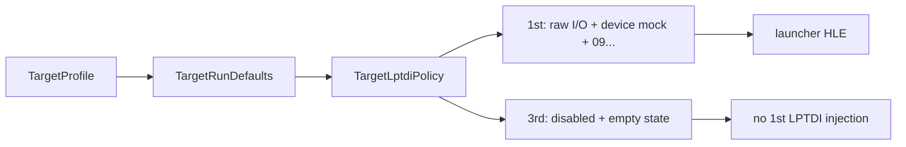

# LPTDI 프로파일 분리 설계

## 상태

**구현 완료.** `ez2dj3rd`를 실제 Windows x86 launcher로 실행하고, 1st SE의 LPTDI 정책을 3rd에 강제로 적용하는 비교를 수행한 결과 프로파일별 분리가 필요하다고 판단했다. 1st SE의 raw I/O와 LPTDI 응답 상태를 공용 실행 기본값으로 취급하지 않고, `TargetRunDefaults` 아래의 전용 `TargetLptdiPolicy`가 소유하도록 정리했다.

* **Implemented.** After running `ez2dj3rd` through the Windows x86 launcher and comparing a forced 1st SE LPTDI policy on 3rd, per-profile separation was required. The 1st SE raw-I/O and LPTDI response state are not treated as shared execution defaults; a dedicated `TargetLptdiPolicy` under `TargetRunDefaults` owns them.*

## 확인된 근거

1. 1st SE 보호 실행에서는 `CreateFileA("\\.\LPTDI1")`, `DeviceIoControl` 두 건, raw `IN/OUT` 지점, 그리고 최소 target state `0900000000000000`이 확인되어 있다.
2. 사용자가 제공한 3rd `EZ2DJ.INI`에는 `UseIOCard=1`이 있지만, 이는 설정 플래그일 뿐 LPTDI 장치 계약을 확정하지 않는다.
3. 3rd `EZ2DJ.EXE`의 정적 import와 문자열에는 `DeviceIoControl`, `LPTDI`, `TDSD.VXD`가 확인되지 않았다. 대신 `DirectInputCreateA`, `DirectDrawCreateEx`, DSOUND ordinal `#1` 등이 확인됐다.
4. `--hle-vfs --run-detached`로 3rd를 실행하면 entry 주입·VFS mount·detached까지 도달했지만, 해당 실행에서 LPTDI 응답 이벤트나 3rd VFS trace가 관찰되지 않았다. 이는 LPTDI 계약 전체를 확정하는 결과가 아니라 현재 관찰 경계에서의 미확정 상태다.
5. 현재 launcher에서 1st의 `--device-mock-lptdi-target-state 0900000000000000`를 3rd에 강제로 적용하면 `DeviceIoControl` import 패치 전에 `LPTDI device mock is not configured for this target`로 거부된다. 3rd 정적 IAT에 해당 import가 없다는 사실과 함께, 같은 정책을 공유하면 안 된다는 런처·PE 증거다.

*1. The protected 1st SE run confirms `CreateFileA("\\.\LPTDI1")`, two `DeviceIoControl` calls, raw `IN/OUT` sites, and the minimum target state `0900000000000000`.*
*2. The supplied 3rd `EZ2DJ.INI` contains `UseIOCard=1`, but that flag alone does not establish an LPTDI device contract.*
*3. The 3rd `EZ2DJ.EXE` has no confirmed static `DeviceIoControl`, `LPTDI`, or `TDSD.VXD` import/string evidence; it does contain `DirectInputCreateA`, `DirectDrawCreateEx`, and DSOUND ordinal `#1`.*
*4. A 3rd run with `--hle-vfs --run-detached` reached entry injection, VFS mount, and detachment, but produced no LPTDI response event or 3rd VFS trace in that observation. This does not prove the complete absence of an LPTDI contract; it leaves the contract unresolved at the current boundary.*
*5. With the current launcher, forcing the 1st policy `--device-mock-lptdi-target-state 0900000000000000` onto 3rd is rejected before the `DeviceIoControl` import patch with `LPTDI device mock is not configured for this target`. Together with the absent static import in the 3rd PE, this provides launcher and PE evidence that the policies cannot be shared.*

## 변경 구조

`TargetRunDefaults`에 다음 전용 구조를 추가한다.

```cpp
struct TargetLptdiPolicy {
    bool legacy_io_ports = false;
    bool device_mock_enabled = false;
    std::string device_mock_target_state_hex;
};
```

- `legacy_io_ports`: 확인된 1st SE raw `IN/OUT` HLE 허용 여부다. 현재 런타임의 RVA는 1st 전용이므로 3rd에서 켜지지 않는다.
- `device_mock_enabled`: 해당 프로파일이 synthetic LPTDI `CreateFileA`/`DeviceIoControl` 경계를 사용할 수 있다는 명시적 허용이다.
- `device_mock_target_state_hex`: 프로파일이 검증한 응답 상태다. 1st SE만 `0900000000000000`을 가진다. 3rd는 비활성·빈 값으로 둔다.

런처의 진단용 `--device-mock-lptdi*` 옵션은 `device_mock_enabled`가 허용된 프로파일에서만 진행하고, `--hle-io-ports`/`--io-config`는 `legacy_io_ports`가 허용된 프로파일에서만 진행한다. 제품 facade는 같은 중첩 정책을 명령행으로 변환하므로 3rd 실행에 1st target state나 raw I/O를 암묵적으로 전달하지 않는다.

*Add the following dedicated structure to `TargetRunDefaults`:*

```cpp
struct TargetLptdiPolicy {
    bool legacy_io_ports = false;
    bool device_mock_enabled = false;
    std::string device_mock_target_state_hex;
};
```

- `legacy_io_ports` permits the confirmed 1st SE raw `IN/OUT` HLE. The current runtime RVAs are 1st-specific, so 3rd never enables it.
- `device_mock_enabled` explicitly authorizes the synthetic LPTDI `CreateFileA`/`DeviceIoControl` boundary for a profile.
- `device_mock_target_state_hex` stores a response state verified for that profile. Only 1st SE has `0900000000000000`; 3rd remains disabled and empty.

The launcher’s diagnostic `--device-mock-lptdi*` options proceed only for profiles with `device_mock_enabled`, while `--hle-io-ports`/`--io-config` proceed only for profiles with `legacy_io_ports`. The product facade converts the same nested policy to launcher arguments, so 3rd execution cannot inherit the 1st target state or raw I/O implicitly.



## 검증 전략

- target profile unit test에서 1st와 3rd의 세 LPTDI 필드를 서로 다르게 고정한다.
- Windows product-loader probe에서 1st argument에는 LPTDI state와 raw I/O가 유지되고, 3rd argument에는 둘 다 없음을 확인한다.
- 3rd에 `--device-mock-lptdi-target-state`를 적용했을 때 실제 `DeviceIoControl` import 패치 전에 프로파일 거부 오류가 나는지 확인한다.
- Windows x86 Debug build와 CTest를 실행하고, 3rd shortcut을 다시 실행해 기존 `runtime_detached` 경계를 회귀 확인한다.

*Verification pins all three LPTDI fields differently for 1st and 3rd in the target-profile unit test; preserves the 1st LPTDI state/raw-I/O arguments while omitting both from 3rd in the product-loader probe; checks that 3rd rejects `--device-mock-lptdi-target-state` before attempting the missing `DeviceIoControl` patch; runs the Windows x86 Debug build and CTest; and reruns the 3rd shortcut through the existing `runtime_detached` boundary.*

## 제외 범위

3rd의 실제 보호 응답 프로토콜, 물리 동글 알고리즘, `UseIOCard`의 내부 소비 방식, DirectInput 경로를 추측하거나 구현하지 않는다. 원본 HDD와 실행 파일은 저장소에 추가하지 않는다.

*The scope does not guess or implement 3rd’s actual protection-response protocol, physical dongle algorithm, internal consumption of `UseIOCard`, or DirectInput path. Original HDD contents and executables are not added to the repository.*
