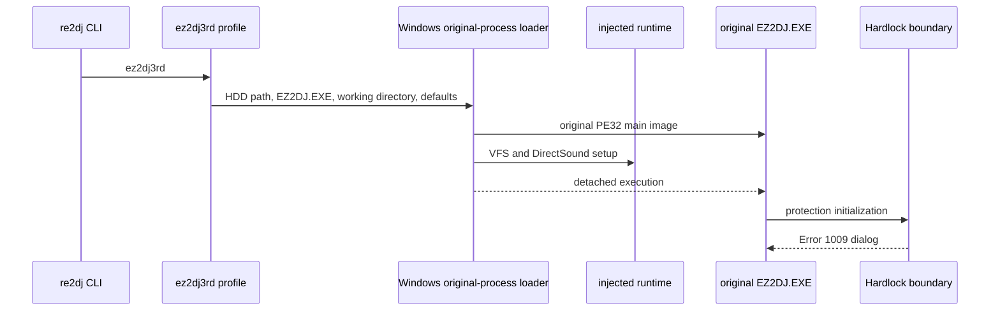

# ez2dj3rd Hardlock 실행 경계 설계

## 상태

**확인 완료 — 실행 경계까지.** `re2dj ez2dj3rd`는 내장 `ez2dj3rd` 프로파일을 선택하고 원본 `ez2dj/EZ2DJ.EXE`를 실행한다. 현재 원본은 응답 상태로 유지되지만, 게임 화면 전에 `Hardlock` 대화상자와 `Error 1009 : Cannot open Hardlock driver.`를 표시한다.

이 작업에서는 1st SE의 LPTDI 정책을 3rd에 복사하지 않는다. 3rd의 Hardlock 응답 계약이 확인되지 않았으므로 대화상자를 제거한 것으로 간주하지 않는다.

*Completed through the execution boundary. `re2dj ez2dj3rd` selects the built-in `ez2dj3rd` profile and starts the original `ez2dj/EZ2DJ.EXE`. The original process remains responsive, but shows a `Hardlock` dialog with `Error 1009 : Cannot open Hardlock driver.` before a game screen appears.*

*This design does not copy the 1st SE LPTDI policy into 3rd. The 3rd Hardlock response contract is not confirmed, so removing the dialog is not treated as complete.*

## 확인된 사실

- **확인됨:** 3rd 프로파일의 HDD 기본 경로는 저장소 root 기준 `roms/ez2dj3rd`이고, 실행 파일과 작업 디렉터리는 각각 `ez2dj/EZ2DJ.EXE`, `ez2dj`이다.
- **확인됨:** 3rd의 정적 import에는 `CreateFileA`, `GetProcAddress`, `DirectDrawCreateEx`, DirectSound ordinal `#1`, DirectInput, AVI, WS2_32가 포함된다. `DeviceIoControl`, `LPTDI`, `TDSD.VXD` 문자열은 정적 검색에서 확인되지 않았다.
- **확인됨:** 안정 실행 로그 `logs/windows_x86_launcher_probe/ez2dj3rd/20260830-211620-710.jsonl`은 runtime 주입, `ez2dj` VFS mount, DirectSound hook, `runtime_detached`, 응답 상태의 원본 프로세스를 확인한다.
- **확인됨:** 같은 실행의 창 열거에서 원본 프로세스가 `#32770` 클래스, `Hardlock` 제목의 대화상자를 생성했다.
- **확인됨:** VFS runtime에는 `\\.\\` 장치 경로만 별도 bounded trace하는 경계를 추가했다. 장치 요청 경로, API, 성공 여부, Win32 오류 코드만 최대 128건 기록하며 원본 HDD와 EXE는 수정하지 않는다.
- **미확정:** 안정 실행에서 3rd의 실제 Hardlock 장치 요청이 VFS import thunk를 통과하는지, 그리고 어떤 응답 데이터가 필요한지는 확인되지 않았다. 따라서 Hardlock mock, IOCTL 응답, raw I/O를 추가하지 않는다.

## 경계와 실행 흐름

장치 요청이 실제로 관찰되고 호출 규약과 응답 payload가 확인되면 `TargetLptdiPolicy`와 별도의 3rd 보호 정책을 설계한다. 그 전에는 확인된 실행 준비와 실패 경계만 유지한다.

*If a real device request is observed and its calling convention and response payload are confirmed, a 3rd-only protection policy will be designed separately from `TargetLptdiPolicy`. Until then, the implementation keeps only the verified execution preparation and failure boundary.*

## 검증 전략

1. `re2dj_windows_vfs_runtime_probe.exe`로 장치 trace budget과 미설정 `\\.\\Hardlock` 경계의 오류 기록을 확인한다.
2. `re2dj_windows_x86_launcher_probe.exe --hdd .\\roms\\ez2dj3rd --target ez2dj3rd --hle-vfs --hle-directsound --run-detached`로 프로파일 실행 준비를 확인한다.
3. `re2dj ez2dj3rd`로 제품 shortcut, 원본 프로세스 상태, Hardlock 다음 경계를 확인한다.
4. Windows x86 Debug 빌드와 unit test를 통과시킨다.

*The verification strategy is to validate the bounded device trace with the runtime probe, validate the profile execution preparation with the x86 launcher, run the product shortcut to record the post-Hardlock boundary, and pass the Windows x86 Debug build and unit tests.*
