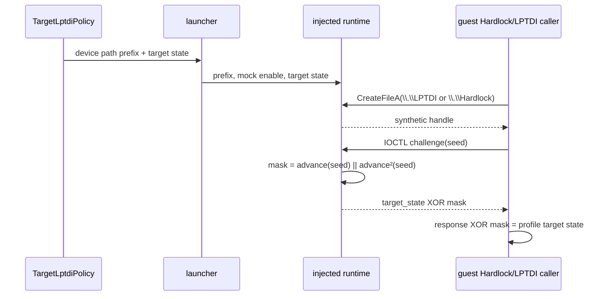

# 프로파일별 Hardlock/LPTDI 응답 설계

## 목적

3rd의 `Hardlock` 장치가 1st SE에서 확인한 LPTDI challenge-response HLE를 재사용하도록 하되, 장치 경로와 보호 콘텐츠별 응답 state를 프로파일 데이터로 분리한다. 공용 runtime은 IOCTL 형식과 challenge mask 변환만 소유하고, 버전별 값은 `TargetLptdiPolicy`가 소유한다.

*The 3rd `Hardlock` device should reuse the LPTDI challenge-response HLE confirmed on 1st SE, while the device path and content-specific response state remain profile data. The shared runtime owns the IOCTL shape and challenge-mask transform; version-specific values belong to `TargetLptdiPolicy`.*

## 설계 결정

- `TargetLptdiPolicy`에 synthetic device path prefix를 추가한다. 1st SE는 `\\.\\LPTDI`, 3rd는 `\\.\\Hardlock`을 사용한다.
- 기존 `device_mock_target_state_hex`는 프로파일별 post-XOR target state로 유지한다. 런타임에서 매 실행마다 입력되는 challenge seed를 대체하지 않고, 그 seed로 만든 mask와 XOR할 콘텐츠별 state만 바꾼다.
- launcher는 선택된 프로파일의 device path prefix와 target state를 injected runtime에 전달한다. runtime에 1st/3rd ID를 하드코딩하지 않는다.
- 3rd의 실제 target state가 확정되기 전까지 1st의 `0900000000000000`을 복사하지 않는다. 현재 3rd 기본값 `0000000000000000`은 분리 경계를 검증하기 위한 zero target-state probe이며, 실제 Hardlock seed/응답으로 확정하지 않는다.
- 명령행으로 넘긴 LPTDI 값은 프로파일 기본값보다 우선할 수 있도록 기존 diagnostic override를 유지한다. 제품 shortcut은 프로파일 값을 자동 전달한다.

*Decisions: add a synthetic-device path prefix to `TargetLptdiPolicy` (`\\.\\LPTDI` for 1st SE and `\\.\\Hardlock` for 3rd); keep `device_mock_target_state_hex` as the profile-specific post-XOR target state; do not replace the per-run guest challenge seed; pass both values from the selected profile to the injected runtime without hardcoding target IDs; do not copy 1st SE's `0900000000000000` before the 3rd state is confirmed; use 3rd's `0000000000000000` only as an explicitly unresolved zero-state probe; and preserve command-line precedence over profile defaults.*

## 흐름

응답 경로는 공유하지만 prefix와 target state는 공유하지 않는다. 프로파일 값이 없거나 유효하지 않으면 1st SE 정책을 조용히 재사용하지 말고 process 생성 전에 실패해야 한다.

*The response path is shared, but the prefix and target state are not. A missing or invalid profile value must fail before process creation rather than silently using the 1st SE policy.*

## 검증 전략

1. unit test에서 1st/3rd profile의 path prefix와 response state가 서로 다른지 확인한다.
2. Windows product loader probe에서 profile arguments contain the selected device prefix and target state.
3. VFS runtime probe에서 default LPTDI prefix와 explicitly selected Hardlock prefix가 각각 동작하는지 확인한다.
4. `re2dj ez2dj3rd`를 실행해 Hardlock open 경계를 넘는지 확인하고, target state가 틀리면 다음 보호 실패 경계만 기록한다.

*Verification: assert distinct 1st/3rd path prefixes and response states in unit tests; assert that the Windows product loader carries the selected profile values; test both the default LPTDI and explicitly selected Hardlock prefixes in the VFS runtime probe; then run `re2dj ez2dj3rd` and record only the next protection boundary if the target state is not yet valid.*

## 구현 및 현재 확인 상태

`TargetLptdiPolicy`의 prefix/state가 product launcher에서 injected runtime의 장치 mock과 challenge-response state로 전달되며, 3rd처럼 정적 `DeviceIoControl` import가 없는 경우 `GetProcAddress` 결과도 같은 wrapper 계층으로 연결한다. Windows x86 unit test, product-loader probe, VFS runtime probe와 CTest는 통과했다. `re2dj ez2dj3rd`는 최신 실행에서 detached 원본 프로세스를 유지했지만 VFS trace가 없으므로 실제 동적 Hardlock 요청과 유효 response는 미확정이다.

*The prefix and state in `TargetLptdiPolicy` now flow from the product launcher into the injected runtime's device mock and challenge-response state. When a 3rd-style executable has no static `DeviceIoControl` import, `GetProcAddress` results are routed through the same wrapper layer. The Windows x86 unit test, product-loader probe, VFS runtime probe, and CTest pass. The latest `re2dj ez2dj3rd` run keeps the detached original process alive, but the absent VFS trace leaves the real dynamic Hardlock request and valid response unresolved.*
