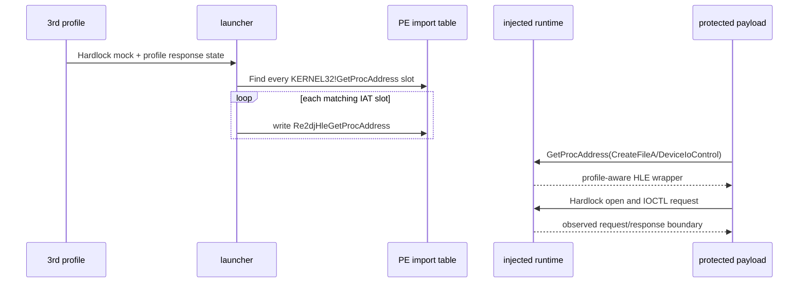

# 3rd Hardlock 동적 import 연결 분석 및 후킹 설계

## 목적

3rd 원본 실행 파일이 Hardlock 초기화에서 실제 HLE 경계에 도달하지 못하는 원인을 확인하고, 보호 코드가 사용하는 모든 `KERNEL32.dll!GetProcAddress` import 슬롯을 선택된 프로파일의 injected runtime으로 연결한다.

*Analyze why the 3rd original executable does not reach the Hardlock HLE boundary and route every `KERNEL32.dll!GetProcAddress` import slot used by its protection code to the selected profile's injected runtime.*

## 확인된 사실

**확인됨 — 2026-08-30.** 3rd `EZ2DJ.EXE`에는 `KERNEL32.dll` import descriptor가 여러 개 있다. 첫 번째 descriptor의 IAT에는 일반 게임 코드용 `GetProcAddress`가 있고, 두 번째 descriptor의 IAT에는 별도의 `GetProcAddress` 슬롯이 있다. 보호 진입 stub는 두 번째 descriptor의 슬롯인 image VA `0x00A42F94`를 직접 호출한다.

`FindIatSlotByName`은 현재 첫 번째 일치 슬롯 하나만 반환한다. 따라서 런처가 `Re2djHleGetProcAddress`를 설치해도 보호 진입 stub가 사용하는 슬롯은 native `GetProcAddress`로 남을 수 있다. 이 경우 3rd 보호 코드의 동적 `CreateFileA`·`DeviceIoControl` 조회가 injected runtime을 통과하지 않아 `Hardlock` open 오류가 계속될 수 있다.

복호화된 3rd 보호 payload에는 `Hardlock`, `Hardlock API error code`, `Cannot open Hardlock driver` 등의 오류 문자열이 포함되어 있다. 이는 Hardlock 보호 코드가 별도 payload에 있음을 확인하지만, 아직 유효한 물리 장치 seed나 응답 payload를 확정하지는 않는다.

*Confirmed — 2026-08-30. The 3rd `EZ2DJ.EXE` has multiple `KERNEL32.dll` import descriptors. The first descriptor contains a `GetProcAddress` slot for ordinary game code, while the second descriptor contains another slot. The protected entry stub directly calls the second descriptor's slot at image VA `0x00A42F94`.*

*`FindIatSlotByName` currently returns only the first matching slot. Therefore, even after the launcher installs `Re2djHleGetProcAddress`, the slot used by the protected entry stub can remain native `GetProcAddress`. The 3rd protection code then does not route dynamic `CreateFileA` and `DeviceIoControl` lookups through the injected runtime, which can preserve the `Hardlock` open error.*

*The decrypted 3rd protection payload contains strings such as `Hardlock`, `Hardlock API error code`, and `Cannot open Hardlock driver`. This confirms a separate Hardlock protection payload, but does not yet establish a valid physical-device seed or response payload.*

## 설계 결정

1. PE import 검색 계층에 이름으로 일치하는 모든 IAT 슬롯을 반환하는 공용 함수를 추가한다.
2. 기존 단일 슬롯 API는 첫 번째 결과를 반환하도록 유지해 기존 호출자의 동작을 보존한다.
3. 장치 mock의 동적 resolver 설치만 모든 `KERNEL32.dll!GetProcAddress` 슬롯에 적용한다. 정적 함수 import 후킹은 기존처럼 개별 슬롯 정책을 따른다.
4. 3rd의 zero target state는 실제 Hardlock seed로 승격하지 않는다. 모든 동적 호출이 관찰된 뒤 응답 계약을 별도로 확정한다.

*Decisions: add a shared PE-import query that returns every matching IAT slot by name; preserve the existing single-slot API by returning its first result; apply all-slot patching only to the device mock's dynamic resolver while keeping static function hooks unchanged; and keep the 3rd zero target state as an unresolved probe until the actual dynamic contract is observed.*

## 흐름

## 검증 기준

- PE helper test or launcher diagnostic confirms more than one matching `GetProcAddress` slot for the 3rd image.
- Windows x86 Debug build and CTest pass.
- The 3rd product run creates a VFS trace entry for the dynamic Hardlock request, or the next concrete failure boundary is recorded.
- A Hardlock dialog disappearing alone is not treated as a valid response confirmation; the request API, control code, buffers, and execution result must be observed.

*Verification: confirm multiple matching `GetProcAddress` slots for the 3rd image; pass the Windows x86 Debug build and CTest; make the 3rd run produce a VFS trace for the dynamic Hardlock request or record the next concrete failure boundary; and do not treat dialog disappearance alone as response confirmation without observing the request, control code, buffers, and execution result.*
