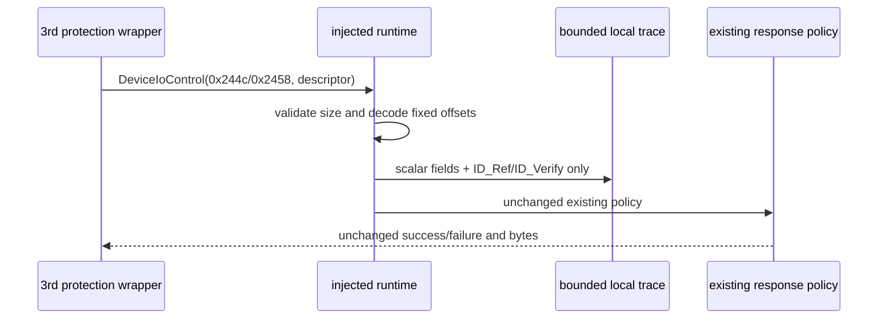

# ez2dj3rd Hardlock descriptor key material capture design

상태: 구현 완료, 실제 3rd descriptor 값 확인은 원본 자산 재제공 대기

*Status: implementation complete; actual 3rd descriptor values await renewed access to the original assets.*

## 목적

3rd `EZ2DJ.EXE`의 Hardlock `Function 0x0e` descriptor에서 seed 복구 가능성을 판단하는 데 필요한 최소 key material을 비침습적으로 수집합니다. 전체 256/264바이트 packet이나 원본 실행 파일을 저장소에 기록하지 않고, 공개 `HL_API` 구조에서 정의된 고정 scalar와 `ID_Ref[8]`, `ID_Verify[8]`만 사용자 로컬의 bounded trace에 남깁니다.

*Capture the minimum key material needed to determine whether the three Hardlock seeds can be recovered from the 3rd `EZ2DJ.EXE` `Function 0x0e` descriptor. Do not store the complete 256/264-byte packet or original executable in the repository; record only fixed scalars plus `ID_Ref[8]` and `ID_Verify[8]` defined by the public `HL_API` layout in a bounded user-local trace.*

## 근거와 확인 상태

- **확인됨:** 공개 Hardlock `fastapi.h`의 packed 32-bit `HL_API`는 `Data` 뒤에 `Bcnt`, `Function`, `Status`, `Remote`, `Port`, `Speed`, `NetUsers`, `ID_Ref[8]`, `ID_Verify[8]`를 둡니다.
- **확인됨:** 현재 3rd wrapper는 256바이트 descriptor를 복사하고 `Bcnt * 8`바이트 block 배열을 붙여 `0x9c402458`에 같은 input/output 주소로 전달합니다.
- **확인됨:** 현재 경량 runtime trace는 control code와 input/output 크기만 기록하므로 descriptor의 reference/verify material은 남지 않습니다.
- **추정:** 공개된 동시대 seed-recovery 자료가 `ID_Ref`와 `ID_Verify`를 입력으로 사용하므로, 3rd descriptor의 두 필드가 nonzero이고 반복 실행에서 안정적이면 실제 동글 없이 seed 후보를 검증할 수 있는 다음 입력이 됩니다.
- **미확정:** 해당 필드가 3rd envelope에서 실제 seed 복구에 충분한지, 세 seed가 무엇인지, 유효 `Function 0x0e` response가 무엇인지는 아직 확인되지 않았습니다.

*Confirmed: the public packed 32-bit `HL_API` places `Bcnt`, `Function`, `Status`, `Remote`, `Port`, `Speed`, `NetUsers`, `ID_Ref[8]`, and `ID_Verify[8]` after `Data`; the reconstructed 3rd wrapper copies the 256-byte descriptor, appends `Bcnt * 8` bytes, and submits the same buffer as input and output to `0x9c402458`; and the current lightweight trace records only the control code and sizes. Inferred: because contemporary seed-recovery material uses `ID_Ref` and `ID_Verify`, stable nonzero values may provide the next offline seed-recovery input. Unresolved: whether they are sufficient for this envelope, the actual seeds, and every valid `Function 0x0e` response.*

## 설계

1. 플랫폼 중립 parser는 raw byte view를 받아 little-endian 32-bit `HL_API` header의 고정 필드만 복사합니다. 호스트 pointer로 역참조하지 않습니다.
2. 최소 52바이트가 없으면 parse에 실패합니다. 전체 descriptor 크기 256은 호출 경계에서 별도로 확인합니다.
3. Windows injected runtime은 synthetic device의 `0x9c40244c`와 `0x9c402458`에서만 parser를 호출합니다.
4. trace는 API version, module ID/address, block count, function, status, remote/port와 8바이트 reference/verify를 기록합니다. 전체 reserved 영역, block payload, 원본 code bytes는 기록하지 않습니다.
5. 기존 device trace budget을 공유해 로그 양을 제한합니다.
6. 진단은 기존 IOCTL response mode보다 먼저 관찰만 수행하고, buffer·`LastError`·return value·bytes-returned를 변경하지 않습니다.
7. seed solver나 E-Y-E 암호 구현은 이번 범위에 넣지 않습니다. GPL source를 재사용하지 않으며, 값 확보 뒤 별도 설계와 라이선스 검토를 거칩니다.

*A platform-neutral parser copies only fixed fields from a raw little-endian 32-bit `HL_API` byte view and never dereferences the guest pointer. Parsing requires at least 52 bytes, while the call boundary separately requires the complete 256-byte descriptor. The Windows runtime invokes it only for synthetic-device `0x9c40244c` and `0x9c402458`, writes bounded scalar/reference/verify diagnostics, and then executes the existing response policy unchanged. No seed solver or E-Y-E cipher implementation is included, and GPL source is not reused.*

## 검증

- synthetic descriptor unit test로 각 offset과 짧은 input 거부를 검증합니다.
- Windows VFS runtime probe가 선택된 control code에서 descriptor marker를 남기고 일반 LPTDI 요청에는 남기지 않는지 확인합니다.
- Windows x86 Debug build와 CTest를 통과합니다.
- 합법적으로 보유한 3rd HDD가 다시 제공되면 bounded 실행 두 번에서 reference/verify 안정성, Function `0x0e`, `Bcnt=1`을 확인합니다.
- 로컬 trace와 원본 자산은 커밋하지 않습니다.

*Verify offsets and short-input rejection with a synthetic descriptor unit test; verify selected-control-code logging and ordinary-LPTDI exclusion in the Windows runtime probe; pass the Windows x86 Debug build and CTest; and, once the legally owned 3rd HDD is available again, compare two bounded runs for stable reference/verify material, `Function 0x0e`, and `Bcnt=1`. Never commit local traces or original assets.*
