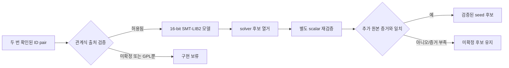

# ez2dj3rd Hardlock 세 seed SMT 복구 설계

## 목적

두 번의 원본 실행에서 안정적으로 확인된 `ID_Ref=478c8b793f201f8a`와 `ID_Verify=cc22ae2da344b2a2`를 입력으로 사용해 Hardlock E-Y-E의 세 16-bit seed를 복구할 수 있는지 조사합니다. 원본 게임 코드는 변경하지 않으며 solver는 오프라인 분석 도구로만 둡니다.

*Investigate whether the three 16-bit Hardlock E-Y-E seeds can be recovered from `ID_Ref=478c8b793f201f8a` and `ID_Verify=cc22ae2da344b2a2`, which were stable across two original runs. The original game code remains unchanged, and the solver is an offline analysis tool only.*

## 확인 상태

- **확인됨:** 두 ID는 guest descriptor offset `0x24`와 `0x2c`에서 읽었고 두 실행에서 동일했습니다.
- **확인됨:** 공개 자료는 E-Y-E가 세 16-bit seed를 사용하는 8-byte transform이라고 설명합니다.
- **미확정:** `ID_Ref`에서 `ID_Verify`를 만드는 정확한 bit-level 관계식, byte order, round variant 및 유일해 존재하는 seed 해의 수는 아직 확인되지 않았습니다.
- **미확정:** 이 ID pair만으로 유일한 해를 얻을 수 있는지, 추가 challenge/response가 필요한지는 solver 실행 전 알 수 없습니다.

*Confirmed: both IDs were read at guest descriptor offsets `0x24` and `0x2c` and matched across two runs; public material describes E-Y-E as an eight-byte transform keyed by three 16-bit seeds. Unresolved: the exact bit-level relation, byte order, round variant, number of satisfying seed assignments, and whether this pair alone is sufficient without another challenge/response.*

## 설계 결정

1. seed 세 개는 각각 정확히 16-bit bit-vector로 모델링하고 모든 산술의 wraparound와 shift 폭을 명시합니다.
2. transform 관계식은 원본 바이너리에서 독립 복원했거나, BSD/MIT/Apache-2.0 등 프로젝트 정책에 맞는 출처로 검증된 경우에만 구현합니다.
3. 공개 GPL `hl_seed.c`는 저장소에 복사·번역·연결하지 않습니다. 사용자가 2026-08-31 명시적으로 승인한 예외에 따라, 저장소 밖 임시 디렉터리에서 관계식 확인과 일회성 solver 분석에만 사용할 수 있습니다. 임시 source·binary·중간 SMT 파일은 커밋하지 않으며 분석 종료 뒤 제거합니다.
4. solver backend 후보는 MIT 라이선스의 Z3이며, 먼저 SMT-LIB2를 생성하는 얇은 도구로 분리해 backend 교체 가능성을 유지합니다.
5. solver가 낸 모든 후보는 같은 관계식의 별도 scalar evaluator와 가능한 추가 원본 관찰로 재검증합니다. 한 pair에 만족한다는 이유만으로 실제 dongle seed로 확정하지 않습니다.
6. 원본 HDD와 runtime dump는 입력 파일이나 fixture로 저장소에 넣지 않습니다. 문서에는 두 bounded ID와 결과 seed 후보·검증 상태만 기록합니다.

*Model each seed as an exact 16-bit bit-vector with explicit wraparound and shift widths. Implement the repository transform only after independent reconstruction from the original binary or verification from a BSD/MIT/Apache-2.0-compatible source. Do not copy, translate, or link public GPL `hl_seed.c` into the repository. Under the user's explicit 2026-08-31 exception, it may be consulted only in a temporary directory outside the repository for relation checking and a one-off solver analysis; temporary source, binaries, and intermediate SMT files must not be committed and must be removed afterward. Prefer MIT-licensed Z3 behind an SMT-LIB2-producing tool so the backend remains replaceable. Recheck every model with a separate scalar evaluator and, where possible, another original observation; satisfying one pair does not establish a physical-dongle seed. Never add the original HDD or runtime dumps to fixtures.*

## 흐름

## 검증 기준

- 고정 synthetic vector로 byte order, wraparound, rotate/shift 동작을 검사합니다.
- solver model을 다시 transform했을 때 8-byte `ID_Verify` 전체가 정확히 일치해야 합니다.
- 복수 해가 있으면 제한 없이 첫 값을 확정하지 않고 해 개수 또는 추가 입력 필요성을 보고합니다.
- 실제 Function `0x0e` challenge에 대한 응답으로 원본 실행이 다음 경계까지 진행하기 전에는 seed를 **확인됨**으로 표시하지 않습니다.

*Test byte order, wraparound, and rotate/shift behavior with fixed synthetic vectors. Re-evaluating every solver model must reproduce all eight `ID_Verify` bytes. Report multiple solutions or the need for another input instead of accepting the first model. Do not mark seeds as confirmed until their Function `0x0e` response advances the original execution boundary.*

## 참고 자료

- [공개 packed HL_API header](https://github.com/richschonthal/Certificate-Server/blob/master/Hardlock/api/src/fastapi.h)
- [Z3 공식 저장소 및 MIT 라이선스](https://github.com/Z3Prover/z3)

*References: the public packed HL_API header and the official MIT-licensed Z3 repository linked above.*
