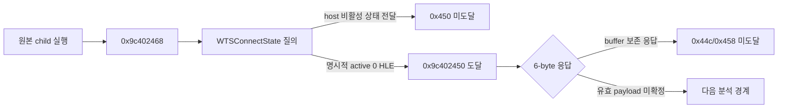

# ez2dj3rd Hardlock status 경계 진단 설계

## 목적

단일 `ID_Ref`/`ID_Verify` pair로는 세 seed가 유일하지 않다는 Task 107 결과에 따라, 원본 실행이 다음 Hardlock 요청으로 진행하도록 막는 가장 가까운 상태 경계를 검증합니다. 원본 HDD 파일이나 실행 파일은 수정하지 않고, 별도 프로세스로 실행된 guest descriptor의 `Status` 필드만 제한적으로 바꾸어 후속 요청 발생 여부를 관찰합니다.

*Following Task 107's finding that one `ID_Ref`/`ID_Verify` pair does not uniquely identify the three seeds, verify the nearest status boundary that prevents the original execution from reaching the next Hardlock request. Do not modify the original HDD or executable; modify only the `Status` field of the guest descriptor in a separate running process and observe whether later requests occur.*

## 확인 상태

- **확인됨:** 두 원본 실행에서 descriptor는 `0x00a67290`, `Status` word는 offset `0x1a`의 `0x00a672aa`에 있었고 값은 `38`이었습니다.
- **확인됨:** `0x9c402468` 호출은 input/output size가 모두 0이므로 현재 IOCTL response buffer 정책으로 descriptor를 수정할 수 없습니다.
- **확인됨:** 공개 header는 status `38`을 `TS_DETECTED`로 정의합니다.
- **확인됨:** 원본은 `WTS_CURRENT_SESSION`의 `WTSConnectState`를 질의하며, host 값이 비활성 상태일 때 `0x9c402468` 뒤에서 멈춥니다.
- **확인됨:** 명시적 진단 옵션으로 성공한 4바이트 class 4 결과만 활성 상태 `0`으로 바꾸면 zero-byte/full-size IOCTL 정책 모두 `0x9c402450`까지 진행합니다.
- **미확정:** descriptor status `38`이 직접 분기 입력인지, `0x9c402450`의 유효 6바이트 응답과 후속 `0x44c/0x458` 도달 조건은 확인되지 않았습니다.

*Confirmed: in two original runs the descriptor was at `0x00a67290`, its `Status` word at offset `0x1a` (`0x00a672aa`) was `38`, and request `0x9c402468` had zero-sized input and output buffers. The current IOCTL response-buffer policy therefore cannot alter the descriptor. The public header defines status `38` as `TS_DETECTED`. The original queries `WTSConnectState` for `WTS_CURRENT_SESSION`; it stops after `0x9c402468` for an inactive host value, while an explicit diagnostic override of only a successful four-byte class-4 result to active state `0` reaches `0x9c402450` under both zero-byte and full-size IOCTL policies. Whether descriptor status `38` is itself a direct branch input, the valid six-byte `0x450` response, and the condition for reaching `0x44c/0x458` remain unresolved.*

## 진단 경계

1. 기존 launcher와 `FEnteDev` synthetic handle의 full-success 정책으로 원본을 별도 프로세스에서 실행합니다.
2. launcher가 기록한 실제 process ID만 대상으로 `0x00a672aa`를 짧은 간격으로 읽습니다.
3. 값이 정확히 16-bit `38`일 때만 한 번 `0`으로 바꾸고, 즉시 다시 읽어 성공 여부를 확인합니다.
4. 기존 VFS 로그에서 `0x9c402450`, `0x9c40244c`, `0x9c402458` 발생 여부와 buffer 크기를 관찰합니다.
5. 시간 제한 뒤 살아 있는 진단 child만 종료합니다. 원본 디렉터리, overlay 및 repository 파일은 이 메모리 변경의 대상이 아닙니다.
6. 조기 polling으로도 status 분기보다 앞서지 못하면, 기존 동적 resolver wrapper에 bounded·read-only 이름 진단을 추가해 Terminal Services 관련 API가 실제로 resolve되는지 식별합니다. 이 진단은 반환 주소와 API 동작을 바꾸지 않습니다.
7. Terminal Services query가 확인되면 해당 API를 원래 함수로 그대로 전달하는 관찰 wrapper에서 info class, 성공 여부, 반환 크기와 최대 32-bit scalar prefix만 기록합니다. 원래 반환값, 할당 buffer와 `LastError`는 보존합니다.
8. `WTS_CURRENT_SESSION`의 `WTSConnectState`가 비활성/원격 연결값을 반환하는 것이 확인되면, 명시적 launcher 분석 옵션에서만 성공한 4-byte class 4 결과를 활성 console 상태값 `0`으로 바꿉니다. 다른 session, class, 실패 결과 및 기본 실행은 그대로 전달합니다.

*Launch the original in a separate process with the existing synthetic `FEnteDev` full-success policy. Target only the process ID recorded by the launcher, poll `0x00a672aa`, write `0` once only when the exact 16-bit value is `38`, and read it back immediately. Observe subsequent `0x450`, `0x44c`, and `0x458` requests and their sizes in the existing VFS log. After a bounded interval, terminate only the surviving diagnostic child. The original directory, overlay, and repository files are never targets of this memory change. If early polling still cannot precede the status branch, add a bounded, read-only name diagnostic to the existing dynamic resolver wrapper to identify whether Terminal Services APIs are actually resolved; it must not change API behavior. When a Terminal Services query is confirmed, use a forwarding observation wrapper that records only the info class, success, returned size, and at most a 32-bit scalar prefix while preserving the original result, allocated buffer, and `LastError`.*

## 제품 정책

이 실험은 주소와 상태값이 확인된 `ez2dj3rd` 한 실행을 위한 분석 절차입니다. Hardlock status를 무조건 성공으로 만드는 runtime 기능이나 기본 제품 정책으로 승격하지 않습니다. 후속 요청에 도달해도 synthetic no-op output을 유효 dongle response로 간주하지 않습니다.

Terminal Services override는 현대 host의 session 경계를 HLE하는 명시적 진단 정책이며 Hardlock descriptor를 직접 위조하지 않습니다. 기본값은 꺼짐이고 `WTS_CURRENT_SESSION + class 4 + 성공한 4-byte 결과`에만 적용합니다.

*This is an analysis procedure for one confirmed `ez2dj3rd` execution and address. It must not become a runtime feature or default policy that forces arbitrary Hardlock status values to success. Reaching later requests does not make a synthetic no-op output a valid dongle response. The Terminal Services override is an explicit HLE diagnostic for a modern host-session boundary, not direct descriptor forgery. It is disabled by default and applies only to a successful four-byte `WTS_CURRENT_SESSION` class-4 result.*

## 판정 기준

- host session 상태와 명시적 활성 상태 HLE 사이에서 후속 IOCTL 도달 여부가 반복되면 WTS session 경계의 인과성을 **확인됨**으로 기록합니다.
- `0x450`까지만 도달하면 descriptor status와 후속 Hardlock 응답은 별도 미확정 경계로 유지합니다.
- 원래 값이 38이 아니거나 주소가 읽히지 않으면 쓰지 않고 실험을 중단합니다.
- 어떤 결과에서도 Task 107 seed 후보는 실제 seed로 확정하지 않습니다.

*Record the WTS session boundary as causal only when later-IOCTL reachability repeats between the host-session value and the explicit active-session HLE. If execution reaches only `0x450`, keep descriptor status and later Hardlock responses as separate unresolved boundaries. Do not write guest status memory when the original value is not 38 or the address cannot be read. No outcome alone promotes a Task 107 candidate to a physical seed.*
