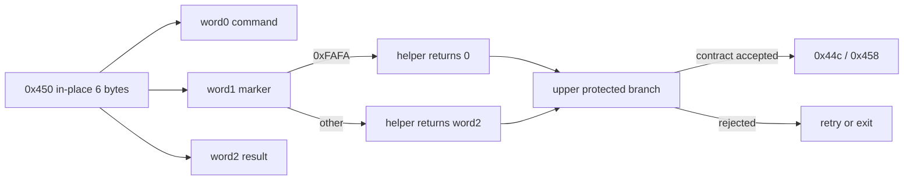

# ez2dj3rd Hardlock 0x9c402450 응답 경계 설계

## 목적

Task 108에서 활성 console session HLE가 원본을 `0x9c402450`까지 진행시킴을 확인했습니다. 이번 작업은 6바이트 in-place buffer의 실제 입력, synthetic 반환 뒤 소비 코드와 다음 분기를 연결하여 `0x9c40244c/458`에 필요한 가장 가까운 응답 계약을 복원합니다.

*Task 108 confirmed that active-console-session HLE advances the original to `0x9c402450`. This task connects the actual six-byte in-place input, post-synthetic-return consumer code, and next branch to reconstruct the nearest response contract required to reach `0x9c40244c/458`.*

## 현재 확인 상태

- **확인됨:** 과거 계측 로그의 두 `0x450` packet은 각각 `01 00 FA FA 00 10`, `00 00 FA FA 00 10`이었고 input/output pointer가 같았습니다.
- **확인됨:** 복원된 두 caller는 IOCTL 성공 뒤 buffer offset 2의 word를 `0xFAFA`와 비교합니다. marker가 같으면 0을 반환하며, 다르면 offset 4의 word를 반환합니다. 한 변형은 IOCTL 실패 시 0, 다른 변형은 `0xffff`를 반환합니다.
- **확인됨:** Task 108의 현재 실행은 active-session HLE에서 `0x450`을 세 번 호출하지만 `0x44c/458`에는 도달하지 않았습니다.
- **미확정:** 현재 세 요청의 6바이트 값, marker 검사 뒤 상위 분기, 과거 계측과 현재 실행의 차이입니다.

*Confirmed: two historical `0x450` packets were `01 00 FA FA 00 10` and `00 00 FA FA 00 10`, with aliased input/output pointers. Both reconstructed callers compare the word at buffer offset 2 with `0xFAFA` after a successful IOCTL; a match returns zero, while a mismatch returns the word at offset 4. One variant returns zero on IOCTL failure and the other returns `0xffff`. Task 108's current active-session runs call `0x450` three times but do not reach `0x44c/458`. The current three packet values, the upper branch after marker consumption, and the reason for the historical/current difference remain unresolved.*

## 진단 설계

1. synthetic device의 `0x9c402450`에만 적용되는 bounded packet marker를 추가합니다.
2. 입력 크기와 출력 크기가 모두 정확히 6바이트이고 pointer가 유효할 때만 호출 전 6바이트를 복사해 기록합니다.
3. 기존 IOCTL return, output, bytes-returned와 `LastError` 정책은 바꾸지 않습니다.
4. 전용 runtime probe에서 정확한 packet marker와 다른 control code 비분류를 검증합니다.
5. 원본은 active-session HLE와 zero-byte/full-size response 정책으로 bounded 비교합니다.
6. 가능하면 기존 `--lptdi-post-ioctl-trace`를 `0x9c402450`에 제한해 반환 직후 marker 비교와 상위 분기를 기록합니다. 보호 초기화를 교란하면 그 사실을 결과로 남기고 packet marker까지만 확정합니다.
7. 소비 계약이 확인되면 명시적 분석 옵션으로 사용자가 지정한 정확히 6바이트 response를 `0x450`에만 replay합니다. parser와 상태는 별도 Hardlock 모듈에 두고, 다른 control code의 기존 정책과 기본 실행은 변경하지 않습니다.
8. 과거 계측의 `01 00 FA FA 00 10`을 replay해 `0x44c/458` 도달 여부를 검증하되, 이 값은 synthetic oracle이며 실제 dongle response로 기록하지 않습니다.

*Add a bounded packet marker limited to synthetic `0x9c402450`. Copy and record the pre-call six bytes only when both sizes are exactly six and the pointer is valid. Preserve the existing IOCTL return, output, bytes-returned, and `LastError` policies. Verify the exact marker and exclusion of other control codes in the dedicated runtime probe. Compare bounded original runs under active-session HLE with zero-byte and full-size policies. Constrain the existing post-IOCTL trace to `0x9c402450` to capture the marker comparison and upper branch. Once the consumer contract is confirmed, add an explicit analysis option that replays one user-supplied exact six-byte response only for `0x450`, with parsing and state in a dedicated Hardlock module. Replay the historical `01 00 FA FA 00 10` synthetic oracle and test later-call reachability without identifying it as a physical-dongle response.*

## 제품 정책과 안전 경계

기본 진단은 6바이트 buffer를 로그에 기록할 뿐 응답을 수정하지 않습니다. replay는 명시적 옵션과 정확한 6바이트 입력이 있을 때만 `0x450` output을 바꾸며 기본값은 없습니다. 원본 HDD와 overlay를 변경하지 않고, 과거 synthetic output을 실제 Hardlock driver 응답으로 승격하지 않습니다. 제품 기본 정책이나 실제 유효 payload를 구현하려면 합법적으로 확보한 실제 관찰값으로 별도 검증해야 합니다.

*The default diagnostic records only the six-byte buffer without modifying it. Replay changes `0x450` output only when an explicit option supplies exactly six bytes and has no default value. It does not alter the original HDD or overlay and does not promote historical synthetic output to a physical Hardlock-driver response. A product default or physically valid payload requires separate verification from legally obtained observation.*

## 검증 기준

- 정확히 6바이트인 `0x450`만 bounded marker를 남깁니다.
- 진단 추가 전후에 IOCTL 반환 의미와 output buffer가 동일합니다.
- replay가 꺼져 있으면 기존 정책이 동일하고, 켜져 있으면 exact `0x450`만 지정된 6바이트와 full byte count를 반환합니다.
- 같은 실행의 WTS 상태, `0x450` packet 순서와 후속 control code를 연결합니다.
- 원본 실행 child는 경로와 PID를 확인한 뒤 제한 시간 내 종료합니다.
- Windows x86 Debug build, CTest와 `git diff --check`를 통과합니다.

*Only exact six-byte `0x450` calls emit the bounded marker; IOCTL return semantics and output remain identical before and after instrumentation; WTS state, packet order, and later control codes are tied to the same run; the path-verified original child is terminated within the bound; and the Windows x86 Debug build, CTest, and `git diff --check` pass.*
