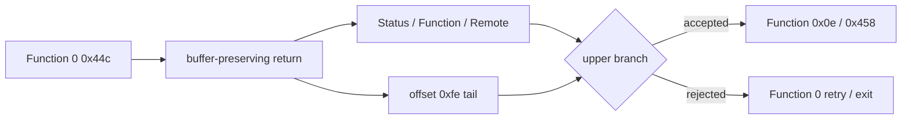

# ez2dj3rd Hardlock 0x9c40244c descriptor 응답 경계 설계

## 목적

Task 109의 synthetic `0x450` replay로 원본이 256바이트 in-place `0x9c40244c` Function 0 descriptor까지 진행합니다. 이번 작업은 반환 직후 descriptor 소비와 과거 Function 6/`0x458` 진행 실행의 bounded 필드를 비교해 다음 응답 조건을 복원합니다.

*Task 109's synthetic `0x450` replay advances the original to a 256-byte in-place `0x9c40244c` Function-0 descriptor. This task reconstructs the next response condition by tracing the post-return descriptor consumer and comparing bounded fields with the historical run that reached Function 6 and `0x458`.*

## 확인 상태

- **확인됨:** 현재 replay 실행은 Function 0, Status 0인 `0x44c`에 두 번 도달하지만 `0x458`에는 도달하지 않습니다.
- **확인됨:** 과거 synthetic buffer-preserving 실행은 Function 0 `0x44c` 뒤 Function `0x0e` `0x458`, 이어 Function 6 `0x44c` 순서로 진행했습니다.
- **확인됨:** 복원된 outer caller는 descriptor `Status` word, `Function` word, `Remote` flag와 byte offset `0xfe`를 분기 입력으로 사용합니다.
- **확인됨:** 현재 Function 0 request의 tail word는 `0x0000`이며, 반환 뒤 `0x00a4ed17`이 descriptor byte `+0xfe`를 읽고 `0x00a4ed1d`에서 0인지 검사합니다. 0이면 handle을 닫고 전역 handle을 invalid로 되돌립니다.
- **확인됨:** 명시적 synthetic `tail=0x0001`은 handle-retention 분기를 선택하고 Function 6 `0x44c`와 Function `0x0e` `0x458`에 도달합니다.
- **미확정:** `0x0001`은 실제 driver 응답이 아니며, Function `0x0e`의 유효 8바이트 응답과 실제 dongle seed는 계속 미확정입니다.

*Confirmed: the current replay run reaches Function-0, Status-0 `0x44c` but not `0x458`. Its tail word is `0x0000`; after return, `0x00a4ed17` loads descriptor byte `+0xfe` and `0x00a4ed1d` tests it. Zero closes the handle and resets the global handle to invalid. An explicit synthetic `tail=0x0001` selects the handle-retention branch and reaches Function-6 `0x44c` and Function-`0x0e` `0x458`. The value is not a physical-driver response; the valid Function-`0x0e` eight-byte response and physical-dongle seeds remain unresolved.*

## 진단 설계

1. 기존 descriptor marker에 전체 packet 대신 offset `0xfe` byte와 `0xfe`부터의 tail word만 추가합니다.
2. parser는 최소 256바이트에서만 tail을 읽고 guest pointer나 reserved 영역 전체를 기록하지 않습니다.
3. 전용 probe가 tail 값을 검증합니다.
4. active-session HLE, full-size 정책과 Task 109 `0x450` replay를 유지한 채 기존 `--lptdi-post-ioctl-trace`를 `0x9c40244c`에 제한합니다.
5. 반환 직후 256 step에서 Status/Function/tail 소비와 첫 상위 분기를 주소·register로 확인합니다.
6. trace가 부족하면 step 한도만 늘리며 descriptor output을 추측해 수정하지 않습니다.
7. 과거 full packet은 raw bytes를 새 문서에 복제하지 않고 필요한 offset 값만 계산해 비교합니다.
8. trace가 offset `0xfe`의 handle 유지 분기를 확인하면, 명시적 분석 옵션에서만 exact Function 0 `0x44c` output의 tail word를 user-supplied 16-bit 값으로 patch합니다. 나머지 254바이트는 보존합니다.
9. `tail=1`은 consumer 분기 인과성을 시험하는 추정값이며 실제 driver response로 간주하지 않습니다. Function 6 또는 `0x458` 도달 여부로만 판정합니다.

*Extend the existing descriptor marker with only byte `0xfe` and the tail word beginning there, requiring the full 256-byte descriptor and recording neither the complete packet nor dereferenced guest data. Verify the tail in the dedicated probe. Under active-session HLE, full-size policy, and Task 109's `0x450` replay, filter the existing post-IOCTL trace to `0x9c40244c` and follow Status/Function/tail consumption plus the first upper branch for 256 steps. If the trace confirms the offset-`0xfe` handle-retention branch, add an explicit analysis option that patches only the final word of an exact Function-0 `0x44c` output with a user-supplied 16-bit value, preserving the other 254 bytes. Tail value 1 is an inferred branch experiment, not a physical-driver response, and is judged only by Function-6 or `0x458` reachability.*

## 안전 경계

진단은 descriptor의 이미 알려진 고정 field와 마지막 2바이트만 기록합니다. 전체 descriptor, reserved bytes, block payload와 원본 파일은 저장소에 추가하지 않습니다. Task 109 replay와 full-size buffer preservation은 synthetic oracle이며 실제 driver 응답으로 승격하지 않습니다.

*Diagnostics record only known fixed descriptor fields and its final two bytes. The complete descriptor, reserved bytes, block payload, and original files are not added to the repository. Task 109 replay and full-size buffer preservation remain synthetic oracles rather than physical-driver responses.*

## 검증 기준

- 전용 probe가 exact 256-byte descriptor tail marker와 기존 필드를 검증합니다.
- 동일 실행에서 `0x450` replay, Function 0 `0x44c`, synthetic tail patch, Function 6 `0x44c`와 `0x458` 도달이 연결됩니다.
- `tail=0x0001`을 실제 driver 응답이나 제품 기본값으로 주장하지 않습니다.
- Windows x86 Debug build, CTest 4/4와 `git diff --check`를 통과합니다.

*The dedicated probe verifies the exact 256-byte tail marker and existing fields; one run ties together `0x450` replay, Function-0 `0x44c`, the synthetic tail patch, Function-6 `0x44c`, and `0x458` reachability; `tail=0x0001` is not claimed as a physical-driver response or product default; and Windows x86 Debug build, CTest 4/4, and `git diff --check` pass.*
