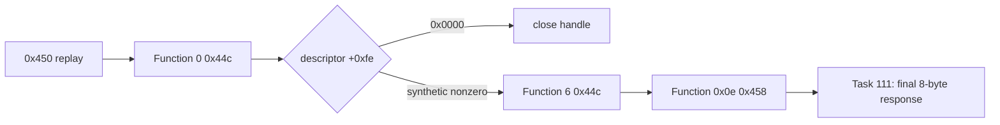

# 3rd Hardlock 보류 체크포인트 설계

## 목적

사용자 요청에 따라 3rd Hardlock 분석을 잠시 중단하되, 다음 작업자가 원본 자산이나 이전 대화에 의존하지 않고 동일한 분석 경계에서 재개할 수 있도록 현재 확인 상태와 금지선을 고정합니다.

*At the user's request, pause the 3rd Hardlock investigation while freezing the current evidence boundary and prohibitions so the next task can resume without relying on original assets or prior conversation.*

## 현재 확인 상태

- `task-097-music-select-z-order`의 마지막 구현 커밋은 `71cc67e`이며 직전 `0x450` 경계 커밋은 `30d30b6`입니다.
- `20260901-003431-926` trace에서 exact 256바이트 Function 0 `0x9c40244c` descriptor의 `+0xfe` tail word는 `0x0000`이었습니다. 반환 뒤 `0x00a4ed17`이 해당 byte를 읽고 `0x00a4ed1d`에서 검사하며, 0 경로는 handle close와 전역 handle invalid화를 수행합니다.
- 기본 비활성 `--device-mock-hardlock-44c-tail <4-hex-digits>`는 exact-size Function 0 `0x44c` output 마지막 word만 patch하고 나머지 254바이트를 보존합니다.
- `20260901-004347-276`에서 Task 109의 synthetic `0x450` replay `0100fafa0010`과 `tail=0x0001`을 함께 적용하자 Function 6 `0x44c`와 Function `0x0e` `0x458`에 각각 30회 도달했습니다.
- `tail=0x0001`은 소비 분기 인과성 검증용 합성값입니다. 실제 driver/dongle 응답, 제품 기본값, 유효한 Function `0x0e` 마지막 8바이트로 취급하지 않습니다.

*The last implementation commit on `task-097-music-select-z-order` is `71cc67e`, preceded by `30d30b6` for the `0x450` boundary. Run `20260901-003431-926` observed tail word `0x0000` at `+0xfe` in an exact 256-byte Function-0 `0x9c40244c`; after return, `0x00a4ed17` loads the byte and `0x00a4ed1d` tests it, with zero closing the handle and invalidating the global handle. The default-off `--device-mock-hardlock-44c-tail <4-hex-digits>` patches only the final word of an exact-size Function-0 `0x44c`, preserving the other 254 bytes. Run `20260901-004347-276`, combining Task 109's synthetic `0x450` replay `0100fafa0010` with `tail=0x0001`, reached thirty Function-6 `0x44c` calls and thirty Function-`0x0e` `0x458` calls. Value `0x0001` is a synthetic causality test only, not a physical driver/dongle response, product default, or valid Function-`0x0e` final eight-byte output.*

## 재개 조건과 금지선

재개 시 [Hardlock Function 0e 분석](../analysis/ez2dj3rd-hardlock-function-0e.md), Task 109/110 설계·작업 로그와 실행 ID를 먼저 읽습니다. 다음 단계는 264바이트 `0x458` in-place response의 마지막 8바이트 소비를 추적하는 Task 111입니다. 합성 tail/response는 명시적 진단 옵션에서만 사용하며, 실제 seed나 driver contract로 승격하기 전에 독립적인 원본 실행 oracle이 필요합니다. 원본 HDD와 overlay는 계속 저장소 밖에 둡니다.

*On resume, first read the Hardlock Function-0e analysis, Task 109/110 designs and work logs, and the run IDs above. The next step is Task 111: trace consumption of the final eight bytes of the 264-byte `0x458` in-place response. Synthetic tail/responses remain explicit diagnostic options only; an independent original-execution oracle is required before promoting any value to a physical seed or driver contract. Original HDD contents and overlays remain outside the repository.*
